# Test Case - Activity Logs

## UC10 - Xem Activity Log

### Kỹ thuật thiết kế test áp dụng

- **Phân vùng tương đương**: kiểm tra danh sách có dữ liệu/không có dữ liệu; User hợp lệ; Action hợp lệ; khoảng thời gian có/không có nhật ký; Admin/non-Admin.
- **Bảng quyết định**: kiểm tra riêng từng điều kiện User, Action, thời gian và kết hợp nhiều điều kiện lọc.
- **Phân quyền**: kiểm tra chỉ Admin được phép truy cập Activity Log.

| Mã TC | Chức năng / UC | Mục tiêu | Tiền điều kiện | Dữ liệu đầu vào | Các bước thực hiện | Kết quả mong đợi | Kết quả thực tế | Trạng thái |
|---|---|---|---|---|---|---|---|---|
| TC-ACTIVITY-LOGS-001 | UC10 - Xem Activity Log | Kiểm tra Admin xem được danh sách Activity Log | Admin đã đăng nhập; hệ thống đã có nhật ký hoạt động | Không | 1. Đăng nhập bằng tài khoản Admin; 2. Chọn `Activity Log` trên menu | Trang Activity Log được mở; hiển thị danh sách nhật ký hoạt động của hệ thống | Đã kiểm thử | PASS |
| TC-ACTIVITY-LOGS-002 | UC10 - Xem Activity Log | Kiểm tra thông tin của một Activity Log được hiển thị đúng | Admin đã đăng nhập; hệ thống có Activity Log | Chọn một log đang tồn tại | 1. Mở trang Activity Log; 2. Quan sát một bản ghi nhật ký; 3. Đối chiếu với dữ liệu đã phát sinh | Log thể hiện đúng người thực hiện, Action, đối tượng/bảng hoặc record liên quan và thời gian thực hiện; các thông tin chi tiết có trong hệ thống được hiển thị đúng | Đã kiểm thử | PASS |
| TC-ACTIVITY-LOGS-003 | UC10 - Lọc theo User | Kiểm tra lọc Activity Log theo người thực hiện | Admin đã đăng nhập; User được chọn đã phát sinh Activity Log | Chọn một User có Activity Log | 1. Mở trang Activity Log; 2. Chọn User cần lọc; 3. Thực hiện lọc | Chỉ hiển thị các Activity Log thuộc User đã chọn | Đã kiểm thử | PASS |
| TC-ACTIVITY-LOGS-004 | UC10 - Lọc theo Action | Kiểm tra lọc Activity Log theo hành động Create | Admin đã đăng nhập; hệ thống có log `Create` | Action `Create` | 1. Mở trang Activity Log; 2. Chọn Action `Create`; 3. Thực hiện lọc | Chỉ hiển thị các Activity Log có Action `Create` | Đã kiểm thử | PASS |
| TC-ACTIVITY-LOGS-005 | UC10 - Lọc theo Action | Kiểm tra lọc Activity Log theo hành động Update | Admin đã đăng nhập; hệ thống có log `Update` | Action `Update` | 1. Mở trang Activity Log; 2. Chọn Action `Update`; 3. Thực hiện lọc | Chỉ hiển thị các Activity Log có Action `Update` | Đã kiểm thử | PASS |
| TC-ACTIVITY-LOGS-006 | UC10 - Lọc theo Action | Kiểm tra lọc Activity Log theo hành động Delete | Admin đã đăng nhập; hệ thống có log `Delete` | Action `Delete` | 1. Mở trang Activity Log; 2. Chọn Action `Delete`; 3. Thực hiện lọc | Chỉ hiển thị các Activity Log có Action `Delete` | Đã kiểm thử | PASS |
| TC-ACTIVITY-LOGS-007 | UC10 - Lọc theo thời gian | Kiểm tra lọc Activity Log trong khoảng thời gian có dữ liệu | Admin đã đăng nhập; có log trong khoảng thời gian cần kiểm tra | Từ ngày và đến ngày bao phủ một số log đang tồn tại | 1. Mở trang Activity Log; 2. Chọn khoảng thời gian; 3. Thực hiện lọc | Chỉ hiển thị các Activity Log có thời gian nằm trong khoảng đã chọn | Đã kiểm thử | PASS |
| TC-ACTIVITY-LOGS-008 | UC10 - Lọc Activity Log | Kiểm tra kết hợp lọc theo User, Action và thời gian | Admin đã đăng nhập; có log thỏa mãn đồng thời các điều kiện | Một User; Action `Create`; khoảng thời gian chứa log tương ứng | 1. Mở trang Activity Log; 2. Chọn User; 3. Chọn `Create`; 4. Chọn khoảng thời gian; 5. Thực hiện lọc | Chỉ hiển thị các Activity Log thỏa mãn đồng thời User, Action và khoảng thời gian đã chọn | Đã kiểm thử | PASS |
| TC-ACTIVITY-LOGS-009 | UC10 - Lọc Activity Log | Kiểm tra trường hợp không có Activity Log phù hợp | Admin đã đăng nhập | Chọn điều kiện lọc không khớp bất kỳ log nào | 1. Mở trang Activity Log; 2. Chọn bộ lọc không có dữ liệu phù hợp; 3. Thực hiện lọc | Hệ thống không hiển thị log sai điều kiện và hiển thị trạng thái danh sách trống/không có dữ liệu phù hợp | Đã kiểm thử | PASS |
| TC-ACTIVITY-LOGS-010 | UC10 - Ghi tạo Product | Kiểm tra thao tác tạo dữ liệu được ghi Activity Log | Admin đã đăng nhập; có quyền tạo Product | Tạo một Product mới | 1. Mở Quản lý sản phẩm; 2. Tạo một Product mới; 3. Ghi lại Product ID; 4. Mở Activity Log; 5. Lọc/tìm log mới tạo | Có Activity Log `Create`; người thực hiện là đúng Admin; đối tượng là Product vừa tạo; `recordId` tương ứng Product ID vừa tạo | Đã kiểm thử | PASS |
| TC-ACTIVITY-LOGS-011 | UC10 - Ghi cập nhật | Kiểm tra thao tác cập nhật dữ liệu được ghi Activity Log | Admin đã đăng nhập; có Product tồn tại | Thay đổi thông tin một Product | 1. Mở Quản lý sản phẩm; 2. Sửa một Product và lưu; 3. Mở Activity Log; 4. Tìm log tương ứng | Có Activity Log `Update`; đúng Admin thực hiện; đúng Product được sửa; dữ liệu nhật ký phản ánh thao tác cập nhật | Đã kiểm thử | PASS |
| TC-ACTIVITY-LOGS-012 | UC10 - Ghi xóa | Kiểm tra thao tác xóa/ngừng hoạt động được ghi Activity Log | Admin đã đăng nhập; có Product có thể thực hiện xóa | Xóa một Product phù hợp | 1. Thực hiện xóa Product; 2. Xác nhận thao tác thành công; 3. Mở Activity Log; 4. Tìm log tương ứng | Có Activity Log `Delete`; đúng Admin thực hiện; đúng `recordId` của Product đã thao tác | Đã kiểm thử | PASS |
| TC-ACTIVITY-LOGS-013 | UC10 - Ghi chuyển đổi | Kiểm tra chuyển Lead thành Customer được ghi Activity Log | Có Sales đăng nhập; có Lead đủ điều kiện chuyển đổi | Một Lead `Qualified` đủ điều kiện chuyển đổi | 1. Sales chuyển Lead thành Customer thành công; 2. Đăng nhập lại bằng Admin; 3. Mở Activity Log; 4. Lọc/tìm log của thao tác vừa thực hiện | Có Activity Log của hành động `Convert`; đúng Sales thực hiện và đúng Lead liên quan | Đã kiểm thử | PASS |
| TC-ACTIVITY-LOGS-014 | UC10 - Ghi chuyển đổi giai đoạn | Kiểm tra thay đổi Pipeline Stage của Deal được ghi Activity Log | Có Sales đăng nhập; có Deal thuộc quyền Sales và có thể đổi Stage | Chuyển Deal sang Stage hợp lệ khác | 1. Sales mở Pipeline; 2. Chuyển Deal sang Stage khác thành công; 3. Đăng nhập bằng Admin; 4. Mở Activity Log; 5. Tìm log vừa phát sinh | Có Activity Log `Change Stage`; đúng Sales thực hiện; đúng Deal; thông tin thay đổi Stage được ghi nhận | Đã kiểm thử | PASS |
| TC-ACTIVITY-LOGS-015 | UC10 - BR18 | Kiểm tra đăng nhập thành công được ghi Activity Log | Có một tài khoản đang hoạt động | Email và mật khẩu hợp lệ | 1. Đăng xuất khỏi hệ thống; 2. Đăng nhập thành công bằng tài khoản cần kiểm tra; 3. Đăng nhập Admin; 4. Mở Activity Log; 5. Tìm log của tài khoản vừa đăng nhập | Có Activity Log `Login`; đúng User vừa đăng nhập và thời gian phù hợp với thời điểm đăng nhập | Chưa kiểm thử | NOT RUN |
| TC-ACTIVITY-LOGS-016 | UC10 - Tính toàn vẹn nhật ký | Kiểm tra Activity Log chỉ dùng để xem, không cho sửa hoặc xóa từ giao diện | Admin đã đăng nhập | Một Activity Log đang tồn tại | 1. Mở trang Activity Log; 2. Quan sát các thao tác được cung cấp đối với từng log | Không có chức năng thêm, sửa hoặc xóa Activity Log; Admin chỉ được xem/tìm kiếm/lọc nhật ký | Đã kiểm thử | PASS |
| TC-ACTIVITY-LOGS-017 | UC10 - Xử lý lỗi giao diện | Kiểm tra giao diện xử lý khi không tải được Activity Log | Admin đang đăng nhập | Backend/API Activity Log tạm thời không khả dụng | 1. Tạm dừng backend; 2. Mở hoặc tải lại trang Activity Log; 3. Quan sát giao diện; 4. Khởi động lại backend sau khi kiểm tra | Giao diện hiển thị thông báo lỗi `Không thể tải Activity Log`; không treo trang và không hiển thị dữ liệu sai | Đã kiểm thử | PASS |
| TC-ACTIVITY-LOGS-018 | UC10 - Phân quyền | Kiểm tra Sales không được gọi API xem Activity Log | Sales có token hợp lệ | `GET /api/v1/activity-logs` | 1. Mở Swagger; 2. Authorize bằng token Sales; 3. Gọi `GET /api/v1/activity-logs`; 4. Execute | HTTP 403; không trả danh sách Activity Log; hiển thị `Bạn không có quyền truy cập chức năng này` | Đã kiểm thử | PASS |
| TC-ACTIVITY-LOGS-019 | UC10 - Phân quyền | Kiểm tra Sales Manager không được gọi API xem Activity Log | Sales Manager có token hợp lệ | `GET /api/v1/activity-logs` | 1. Mở Swagger; 2. Authorize bằng token Sales Manager; 3. Gọi `GET /api/v1/activity-logs`; 4. Execute | HTTP 403; không trả danh sách Activity Log; hiển thị `Bạn không có quyền truy cập chức năng này` | Đã kiểm thử | PASS |
| TC-ACTIVITY-LOGS-020 | UC10 - Phân quyền | Kiểm tra Marketing không được gọi API xem Activity Log | Marketing có token hợp lệ | `GET /api/v1/activity-logs` | 1. Mở Swagger; 2. Authorize bằng token Marketing; 3. Gọi `GET /api/v1/activity-logs`; 4. Execute | HTTP 403; không trả danh sách Activity Log; hiển thị `Bạn không có quyền truy cập chức năng này` | Đã kiểm thử | PASS |
| TC-ACTIVITY-LOGS-021 | UC10 - Phân quyền | Kiểm tra Customer Care không được gọi API xem Activity Log | Customer Care có token hợp lệ | `GET /api/v1/activity-logs` | 1. Mở Swagger; 2. Authorize bằng token Customer Care; 3. Gọi `GET /api/v1/activity-logs`; 4. Execute | HTTP 403; không trả danh sách Activity Log; hiển thị `Bạn không có quyền truy cập chức năng này` | Đã kiểm thử | PASS |
| TC-ACTIVITY-LOGS-022 | UC10 - Xác thực | Kiểm tra gọi API Activity Log khi chưa đăng nhập | Không có access token | `GET /api/v1/activity-logs` | 1. Mở Swagger; 2. Xóa token khỏi Authorize; 3. Gọi `GET /api/v1/activity-logs`; 4. Execute | HTTP 401; không trả danh sách Activity Log; hiển thị `Bạn chưa đăng nhập hoặc phiên đăng nhập đã hết hạn` | Đã kiểm thử | PASS |
| TC-ACTIVITY-LOGS-023 | UC1 - Đăng nhập| Kiểm tra hệ thống ghi Activity Log khi người dùng đăng nhập thành công | 1. Tài khoản tồn tại và `status = true`. 2. Mật khẩu đúng. | Không có dữ liệu ban đầu | 1. Mở prisma studio  2. Kiểm tra dòng login được ghi log | Login được ghi log | Đã kiểm thử | PASS |
| TC-ACTIVITY-LOGS-024 | UC1 - Đăng xuất  | Kiểm tra hệ thống ghi Activity Log khi người dùng chủ động đăng xuất | 1. Người dùng đã đăng nhập thành công. 2. Có `accessToken` hợp lệ. |  Không có dữ liệu ban đầu | 1. Mở prisma studio  2. Kiểm tra dòng logout được ghi log | Logout được ghi log | Đã kiểm thử | PASS |

### Minh chứng TC-ACTIVITY-LOGS-001

### Minh chứng TC-ACTIVITY-LOGS-002
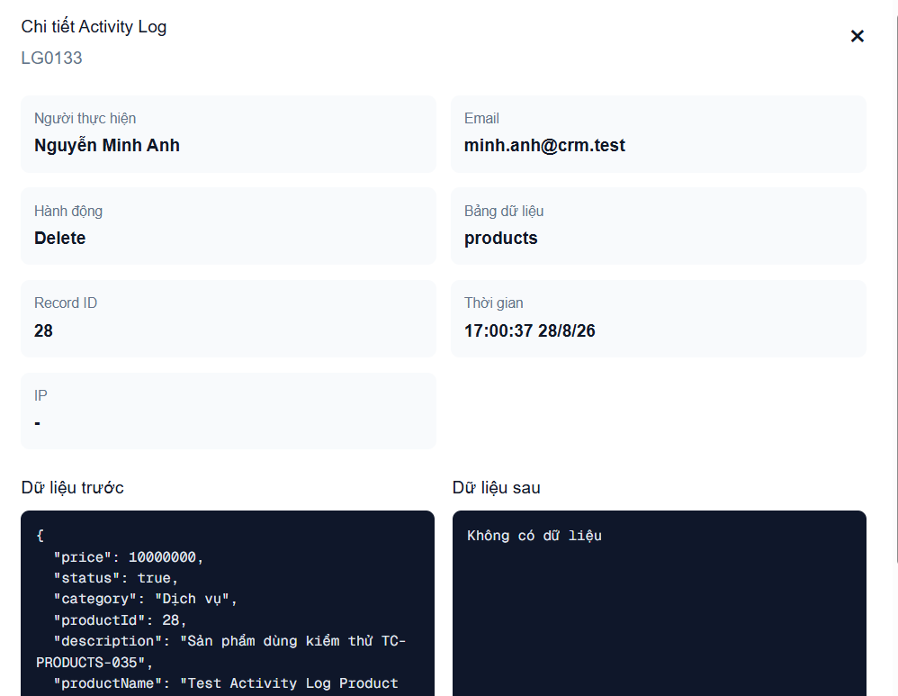

### Minh chứng TC-ACTIVITY-LOGS-003
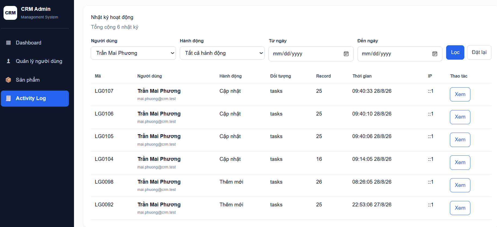

### Minh chứng TC-ACTIVITY-LOGS-004
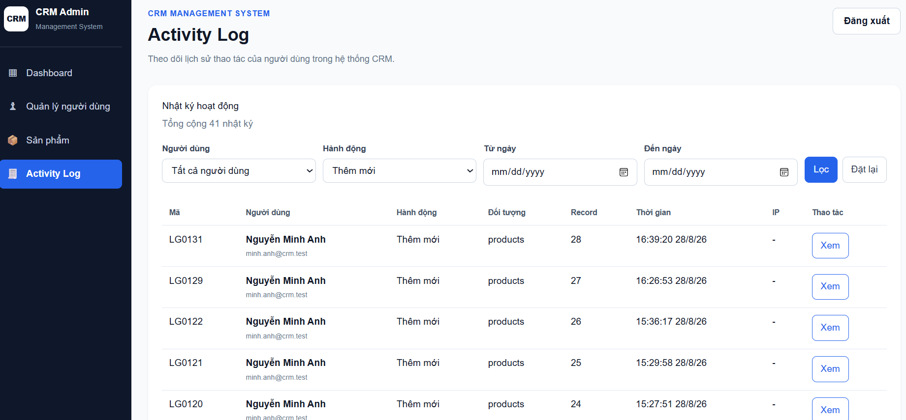

### Minh chứng TC-ACTIVITY-LOGS-005
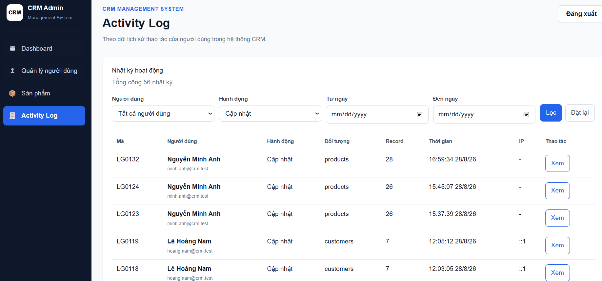

### Minh chứng TC-ACTIVITY-LOGS-006
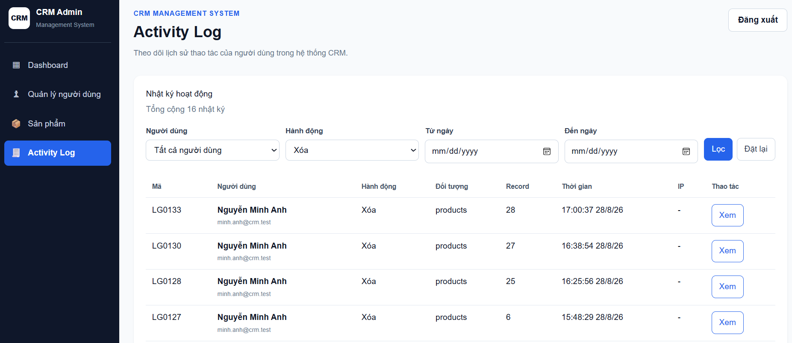

### Minh chứng TC-ACTIVITY-LOGS-007
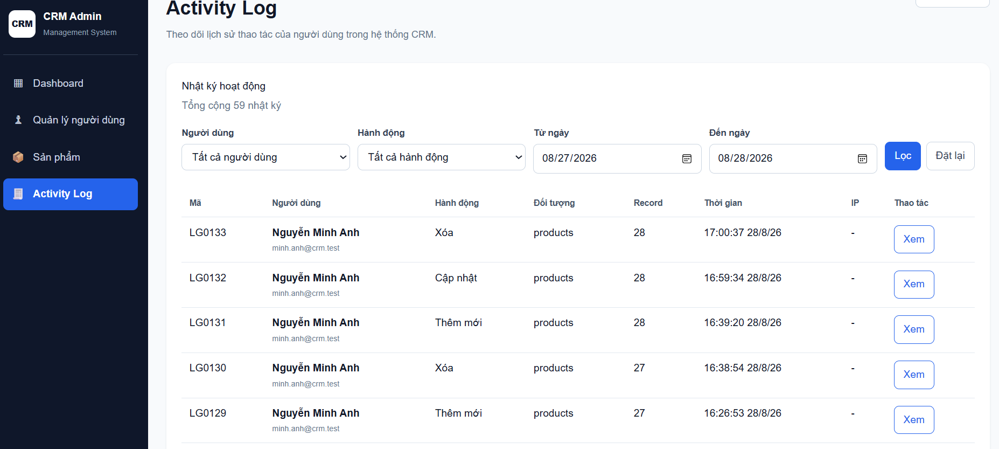

### Minh chứng TC-ACTIVITY-LOGS-008
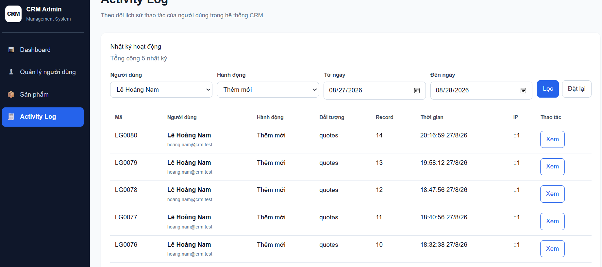

### Minh chứng TC-ACTIVITY-LOGS-009
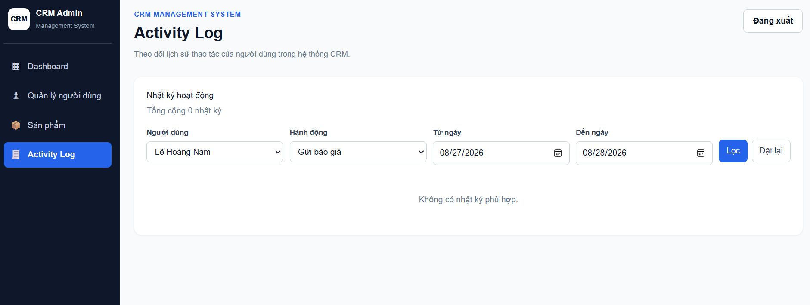

### Minh chứng TC-ACTIVITY-LOGS-010
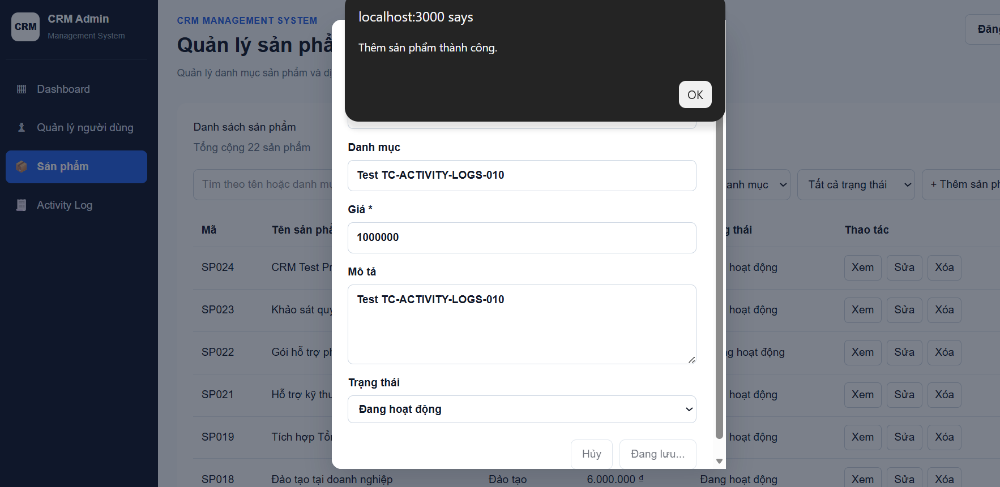
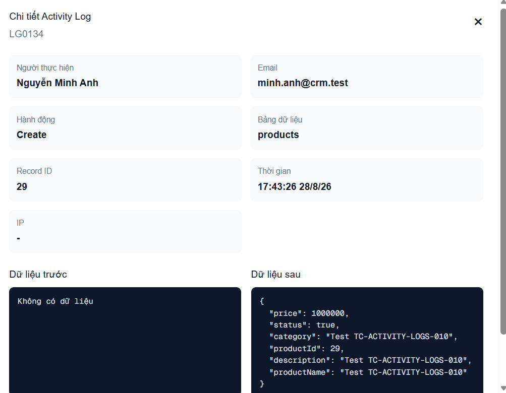

### Minh chứng TC-ACTIVITY-LOGS-011
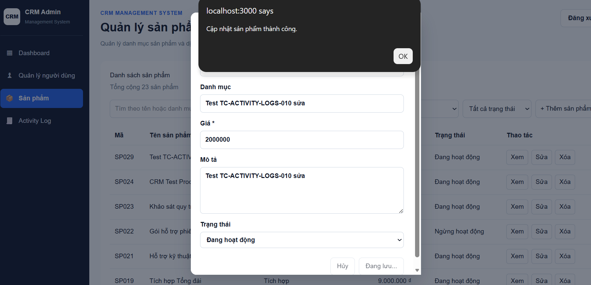
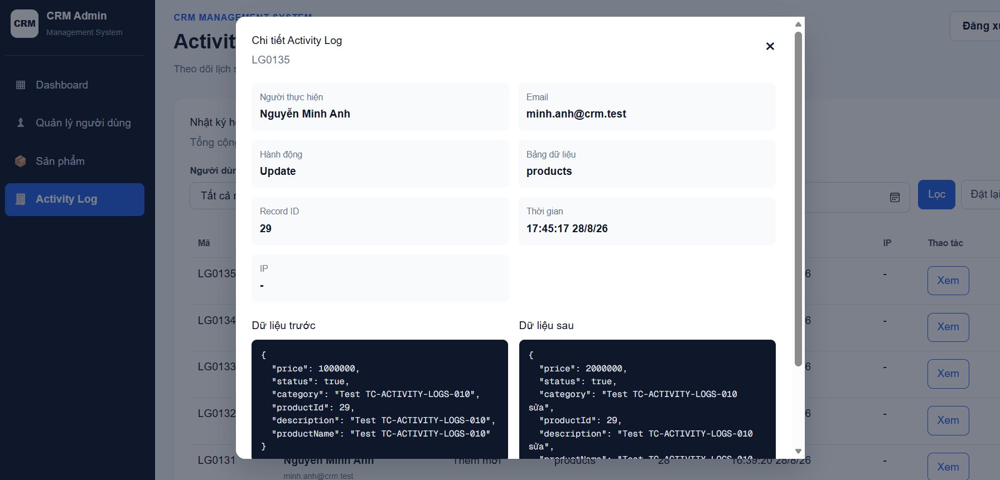

### Minh chứng TC-ACTIVITY-LOGS-012
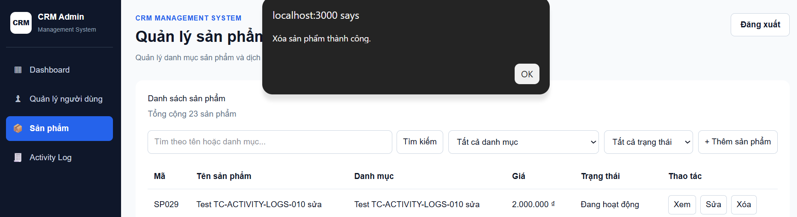
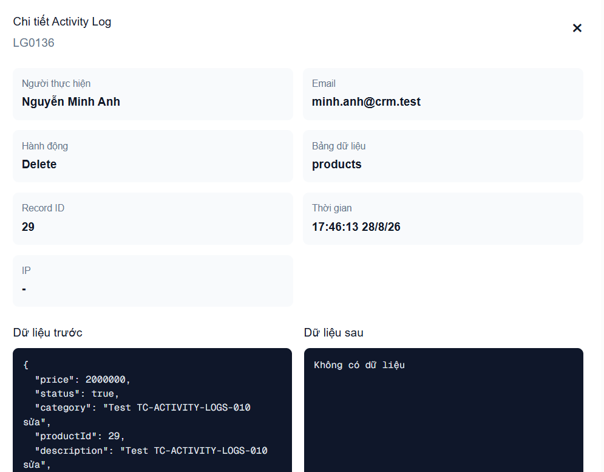

### Minh chứng TC-ACTIVITY-LOGS-013
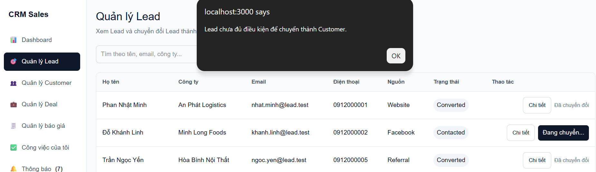
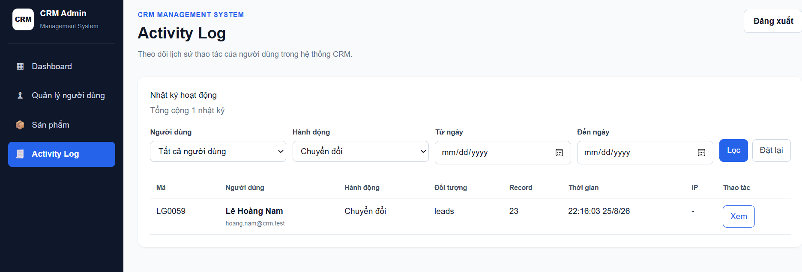

### Minh chứng TC-ACTIVITY-LOGS-014
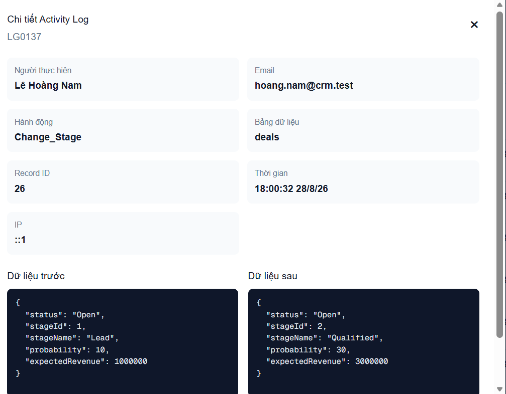

### Minh chứng TC-ACTIVITY-LOGS-015
![TC-ACTIVITY-LOGS-015 - Đăng nhập thành công được ghi Activity Log]

### Minh chứng TC-ACTIVITY-LOGS-016
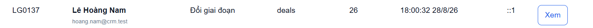

### Minh chứng TC-ACTIVITY-LOGS-017
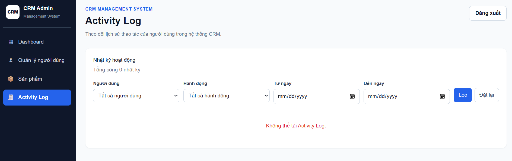

### Minh chứng TC-ACTIVITY-LOGS-018
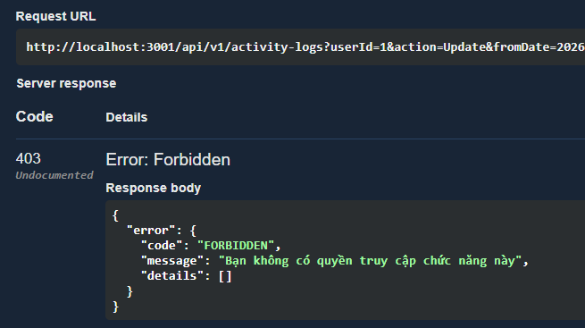

### Minh chứng TC-ACTIVITY-LOGS-019
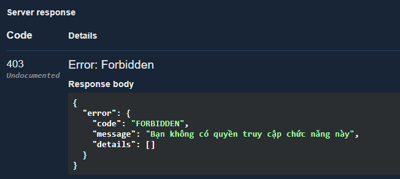

### Minh chứng TC-ACTIVITY-LOGS-020
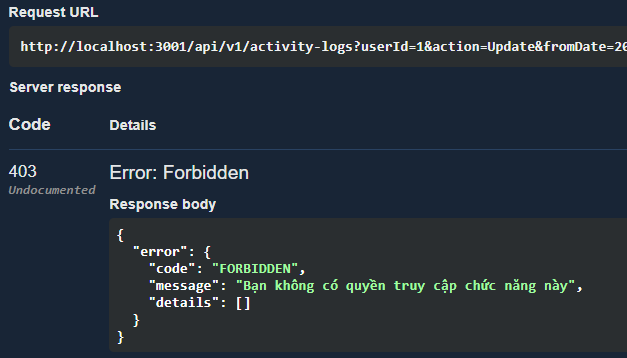

### Minh chứng TC-ACTIVITY-LOGS-021
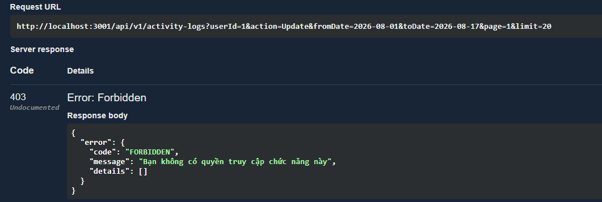

### Minh chứng TC-ACTIVITY-LOGS-022
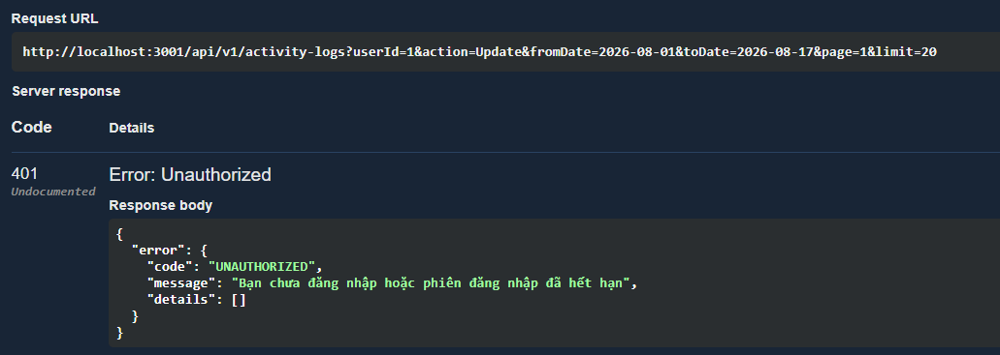

### Minh chứng TC-ACTIVITY-LOGS-023
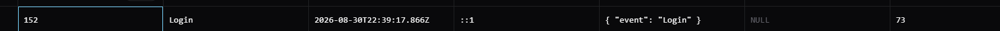

### Minh chứng TC-ACTIVITY-LOGS-024
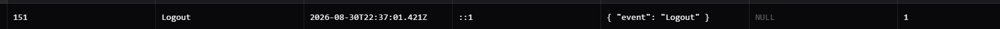