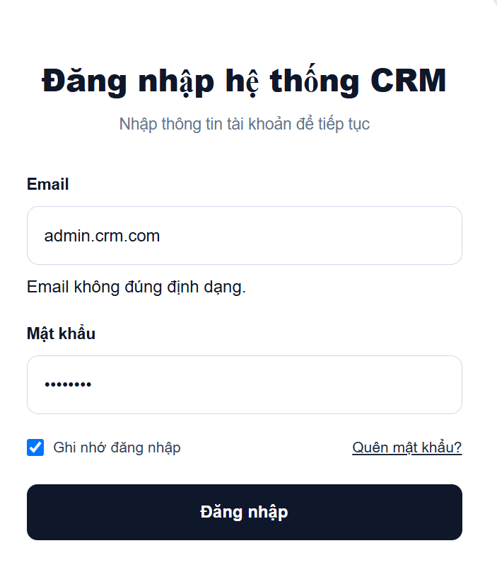
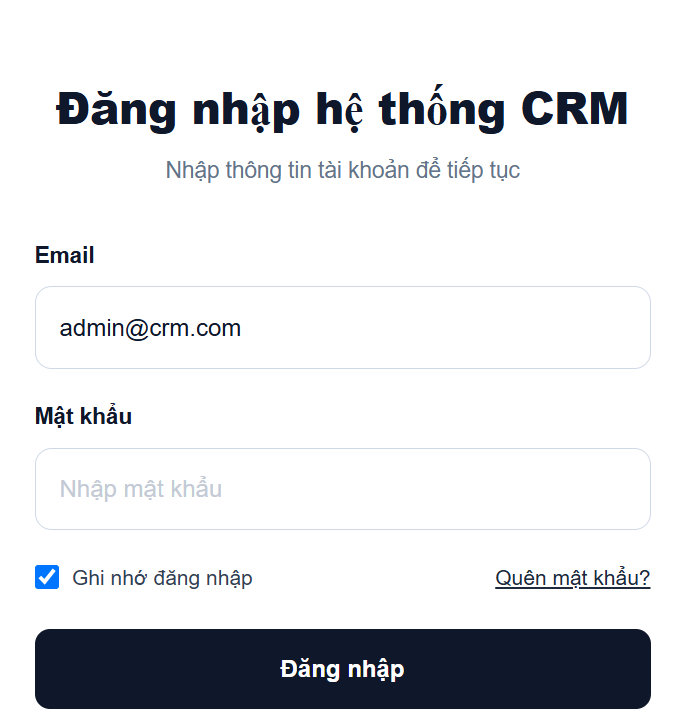
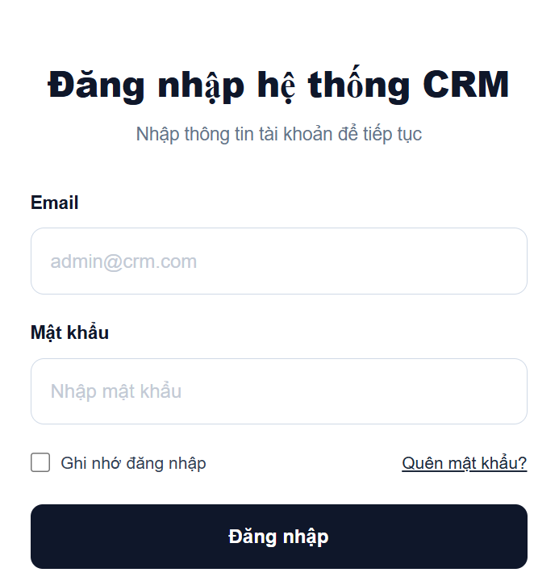
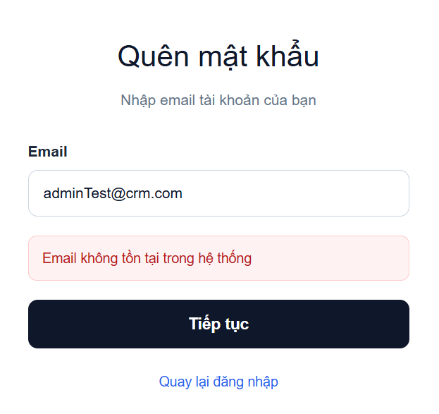
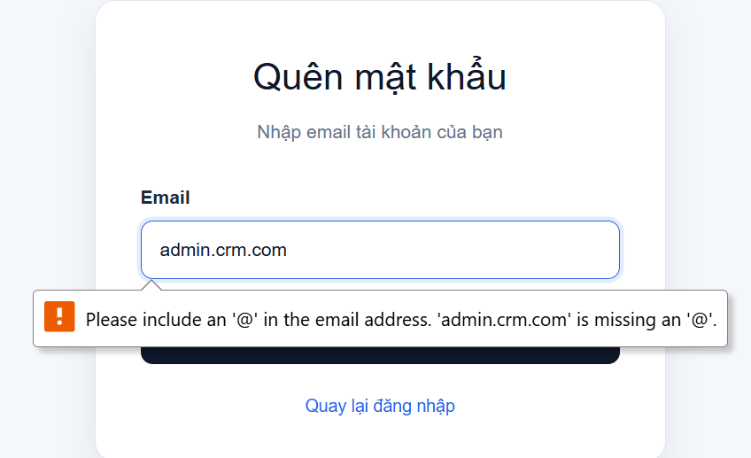
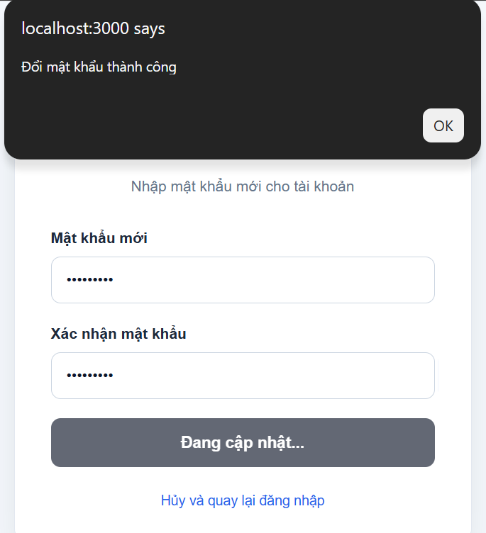
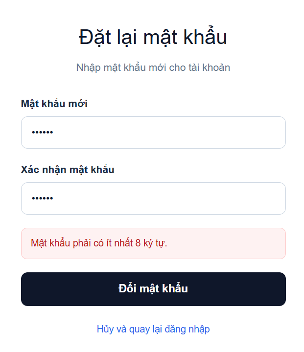
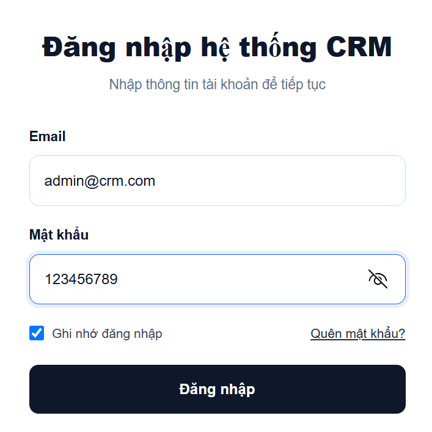
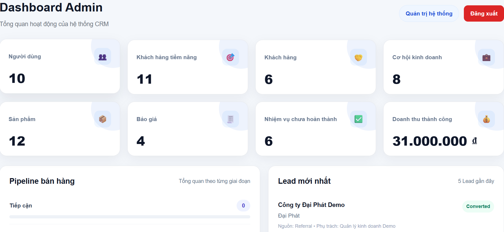
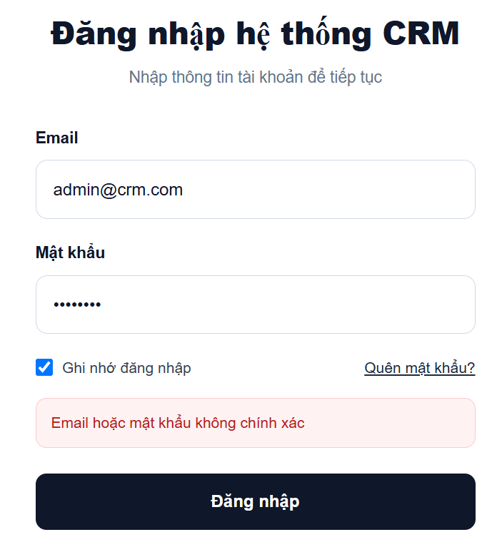

# Test Case - Authentication

## 1. Đăng nhập

| TC ID | Mô tả | Dữ liệu đầu vào | Kết quả mong đợi | Kết quả thực tế | Trạng thái |
|---|---|---|---|---|---|
| AUTH-LOGIN-001 | Đăng nhập với thông tin hợp lệ | Email hợp lệ, mật khẩu đúng | Đăng nhập thành công và chuyển đến dashboard phù hợp với vai trò | Đã kiểm thử | PASS |
| AUTH-LOGIN-002 | Đăng nhập sai mật khẩu | Email hợp lệ, mật khẩu sai | Không đăng nhập, hiển thị thông báo lỗi | Đã kiểm thử | PASS |
| AUTH-LOGIN-003 | Đăng nhập bằng email không tồn tại | Email chưa có trong hệ thống | Không đăng nhập, hiển thị thông báo lỗi | Đã kiểm thử | PASS |
| AUTH-LOGIN-004 | Bỏ trống email hoặc password | Email hoặc password rỗng | Hiển thị lỗi yêu cầu nhập email hoặc password| Đã kiểm thử | PASS |
| AUTH-LOGIN-005 | Email sai định dạng | admin.crm.com | Hiển thị lỗi email không hợp lệ | Đã kiểm thử | PASS |
| AUTH-LOGIN-006 | Đăng nhập bằng tài khoản bị khóa | Tài khoản có status = false | Hệ thống từ chối đăng nhập | Chưa kiểm thử | NOT RUN |

### Minh chứng AUTH-LOGIN-001

### Minh chứng AUTH-LOGIN-002

### Minh chứng AUTH-LOGIN-003

### Minh chứng AUTH-LOGIN-004

### Minh chứng AUTH-LOGIN-005

## 2. Ghi nhớ đăng nhập

| TC ID | Mô tả | Dữ liệu đầu vào | Kết quả mong đợi | Kết quả thực tế | Trạng thái |
|---|---|---|---|---|---|
| AUTH-REMEMBER-001 | Chọn ghi nhớ đăng nhập | Checkbox được chọn | Phiên đăng nhập được lưu và email được ghi nhớ | Đã kiểm thử | PASS |
| AUTH-REMEMBER-002 | Không chọn ghi nhớ đăng nhập | Checkbox không được chọn | Phiên chỉ được lưu trong session hiện tại | Đã kiểm thử | PASS |

### Minh chứng AUTH-REMEMBER-001

### Minh chứng AUTH-REMEMBER-002

## 3. Quên mật khẩu

| TC ID | Mô tả | Dữ liệu đầu vào | Kết quả mong đợi | Kết quả thực tế | Trạng thái |
|---|---|---|---|---|---|
| AUTH-FORGOT-001 | Nhập email tồn tại | Email có trong hệ thống | Hệ thống cho phép chuyển sang bước đặt lại mật khẩu | Đã kiểm thử | PASS |
| AUTH-FORGOT-002 | Nhập email không tồn tại | Email chưa đăng ký | Hệ thống từ chối yêu cầu | Đã kiểm thử | PASS |
| AUTH-FORGOT-003 | Nhập email sai định dạng | admin.crm.com | Hiển thị lỗi validation | Đã kiểm thử | PASS |
| AUTH-FORGOT-004 | Không nhập email | Email rỗng | Hiển thị lỗi yêu cầu nhập email | Đã kiểm thử | PASS |

### Minh chứng AUTH-FORGOT-PASSWORD-LOGIN-001

### Minh chứng AUTH-FORGOT-PASSWORD-LOGIN-002

### Minh chứng AUTH-FORGOT-PASSWORD-LOGIN-003

### Minh chứng AUTH-FORGOT-PASSWORD-LOGIN-004

## 4. Đặt lại mật khẩu

| TC ID | Mô tả | Dữ liệu đầu vào | Kết quả mong đợi | Kết quả thực tế | Trạng thái |
|---|---|---|---|---|---|
| AUTH-RESET-001 | Đổi mật khẩu hợp lệ | Hai mật khẩu mới giống nhau và đủ độ dài: 123456789 | Đổi mật khẩu thành công và chuyển về trang đăng nhập | Đã kiểm thử | PASS |
| AUTH-RESET-002 | Mật khẩu xác nhận không khớp | Hai mật khẩu khác nhau | Hiển thị lỗi mật khẩu không khớp | Đã kiểm thử | PASS |
| AUTH-RESET-003 | Mật khẩu quá ngắn | Dưới 8 ký tự | Không cho phép đổi mật khẩu | Đã kiểm thử | PASS |
| AUTH-RESET-004 | Đăng nhập bằng mật khẩu mới | Đã đổi mật khẩu thành công | Đăng nhập thành công | Đã kiểm thử | PASS |
| AUTH-RESET-005 | Đăng nhập bằng mật khẩu cũ | Đã đổi mật khẩu thành công | Hệ thống từ chối đăng nhập | Đã kiểm thử | PASS |

### Minh chứng AUTH-RESET-001

### Minh chứng AUTH-RESET-002

### Minh chứng AUTH-RESET-003

### Minh chứng AUTH-RESET-004

### Minh chứng AUTH-RESET-005

---

## Lịch sử cập nhật

| Ngày | Nội dung |
|---|---|
| 10/08/2026 | Tạo test case cho module Authentication |