# Test Case - Authentication

### Kỹ thuật thiết kế test áp dụng

- **Phân hoạch tương đương (Equivalence Partitioning):** chia dữ liệu đăng nhập thành các nhóm hợp lệ và không hợp lệ như email tồn tại/không tồn tại, mật khẩu đúng/sai, tài khoản hoạt động/bị khóa.
- **Phân tích giá trị biên (Boundary Value Analysis):** áp dụng cho độ dài mật khẩu, đặc biệt kiểm tra quanh ngưỡng tối thiểu 8 ký tự.
- **Chuyển trạng thái (State Transition Testing):** áp dụng cho luồng quên mật khẩu → xác thực email → đặt mật khẩu mới → mật khẩu cũ hết hiệu lực → đăng nhập bằng mật khẩu mới.

## 1. Đăng nhập

| TC ID | Mô tả | Dữ liệu đầu vào | Kết quả mong đợi | Kết quả thực tế | Trạng thái |
|---|---|---|---|---|---|
| TC-AUTH-001 | Đăng nhập với thông tin hợp lệ | Email hợp lệ, mật khẩu đúng | Đăng nhập thành công và chuyển đến dashboard phù hợp với vai trò | Đăng nhập thành công, hệ thống tạo phiên đăng nhập và chuyển người dùng đến dashboard đúng với vai trò | PASS |
| TC-AUTH-002 | Đăng nhập sai mật khẩu | Email hợp lệ, mật khẩu sai | Không đăng nhập, hiển thị thông báo lỗi | Hệ thống từ chối đăng nhập và hiển thị thông báo thông tin đăng nhập không hợp lệ | PASS |
| TC-AUTH-003 | Đăng nhập bằng email không tồn tại | Email chưa có trong hệ thống | Không đăng nhập, hiển thị thông báo lỗi | Hệ thống không tạo phiên đăng nhập và hiển thị thông báo lỗi đăng nhập | PASS |
| TC-AUTH-004 | Bỏ trống email hoặc password | Email hoặc password rỗng | Hiển thị lỗi yêu cầu nhập email hoặc password | Form không được gửi khi thiếu email hoặc mật khẩu và hiển thị lỗi trường bắt buộc | PASS |
| TC-AUTH-005 | Email sai định dạng | admin.crm.com | Hiển thị lỗi email không hợp lệ | Form từ chối email `admin.crm.com` và hiển thị lỗi email không đúng định dạng | PASS |
| TC-AUTH-006 | Đăng nhập bằng tài khoản bị khóa | Tài khoản có status = false | Hệ thống từ chối đăng nhập | Hệ thống không cho đăng nhập và hiển thị thông báo `Tài khoản đã bị khóa` | PASS |

### Minh chứng TC-AUTH-001

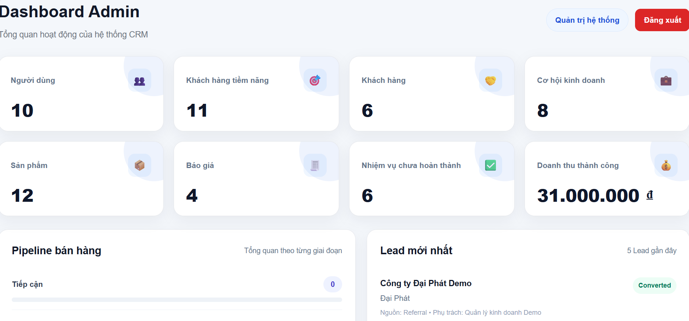

### Minh chứng TC-AUTH-002

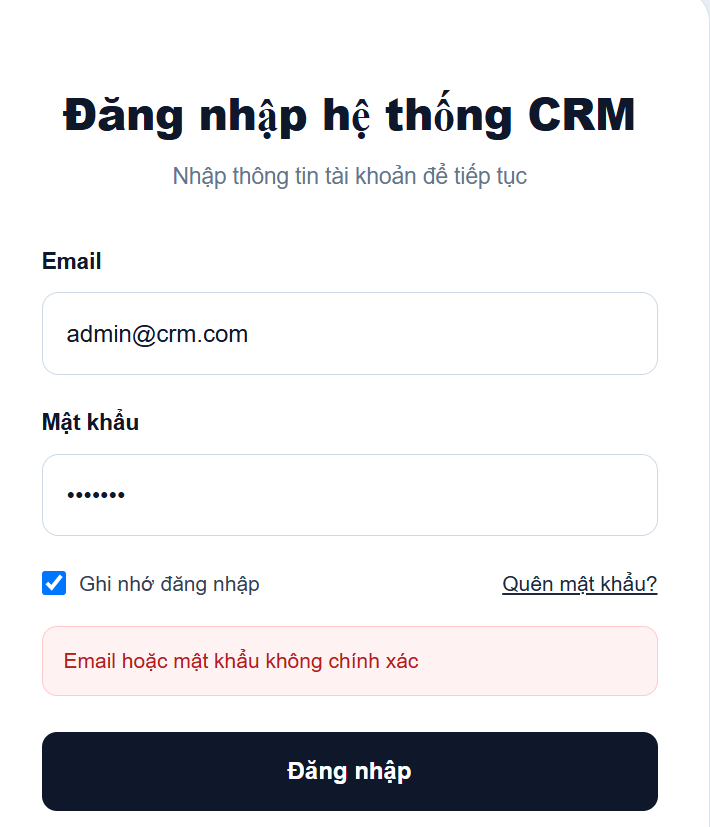

### Minh chứng TC-AUTH-003

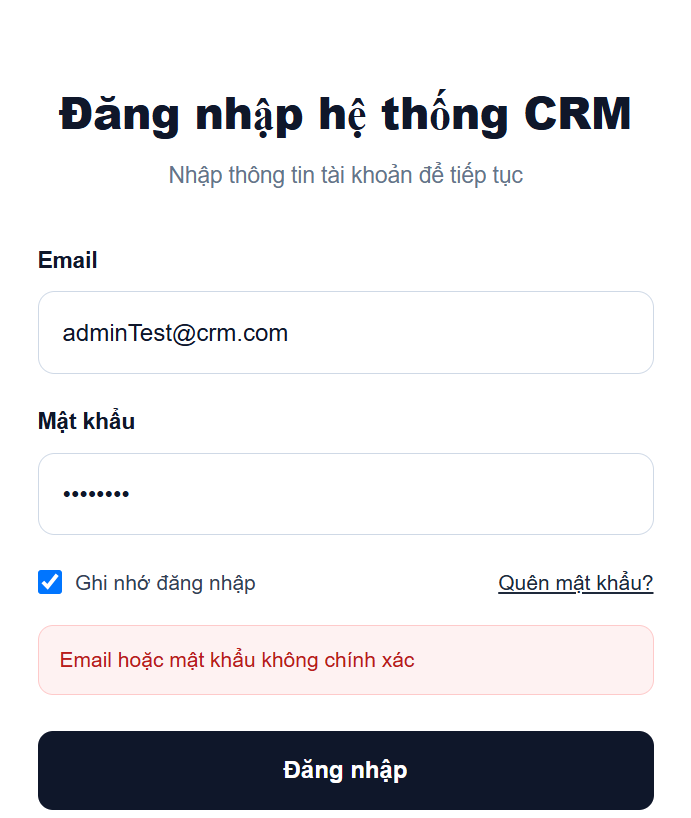

### Minh chứng TC-AUTH-004

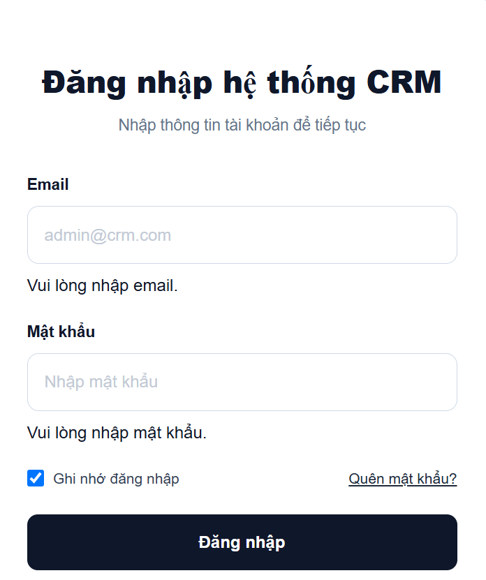

### Minh chứng TC-AUTH-005

### Minh chứng TC-AUTH-006

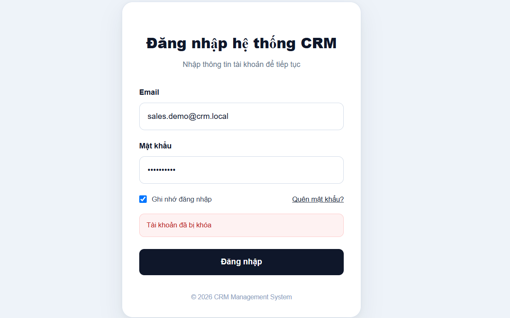

## 2. Ghi nhớ đăng nhập

| TC ID | Mô tả | Dữ liệu đầu vào | Kết quả mong đợi | Kết quả thực tế | Trạng thái |
|---|---|---|---|---|---|
| TC-AUTH-007 | Chọn ghi nhớ đăng nhập | Checkbox được chọn | Phiên đăng nhập được lưu và email được ghi nhớ | Sau khi đăng nhập với tùy chọn ghi nhớ, email được lưu và hiển thị lại theo chức năng ghi nhớ đăng nhập | PASS |
| TC-AUTH-008 | Không chọn ghi nhớ đăng nhập | Checkbox không được chọn | Phiên chỉ được lưu trong session hiện tại | Đăng nhập thành công nhưng thông tin ghi nhớ không được lưu khi không chọn checkbox | PASS |

### Minh chứng TC-AUTH-007

### Minh chứng TC-AUTH-008

## 3. Quên mật khẩu

| TC ID | Mô tả | Dữ liệu đầu vào | Kết quả mong đợi | Kết quả thực tế | Trạng thái |
|---|---|---|---|---|---|
| TC-AUTH-009 | Gửi yêu cầu quên mật khẩu với email tồn tại | Email có trong hệ thống | Hệ thống trả thông báo trung lập rằng yêu cầu đặt lại mật khẩu đã được tạo, không làm lộ trạng thái tồn tại của email | Request được xử lý thành công và trả thông báo trung lập về yêu cầu đặt lại mật khẩu, không tiết lộ email tồn tại trong hệ thống | PASS |
| TC-AUTH-010 | Gửi yêu cầu quên mật khẩu với email không tồn tại | Email chưa đăng ký | Hệ thống trả cùng thông báo như email tồn tại, không tiết lộ email có tồn tại hay không | Request trả cùng thông báo trung lập như trường hợp email tồn tại và không làm lộ trạng thái đăng ký của email | PASS |
| TC-AUTH-011 | Nhập email sai định dạng | admin.crm.com | Hiển thị lỗi validation | Hệ thống từ chối dữ liệu `admin.crm.com` do không đúng định dạng email và không tạo yêu cầu đặt lại mật khẩu | PASS |
| TC-AUTH-012 | Không nhập email | Email rỗng | Hiển thị lỗi yêu cầu nhập email | Form không gửi yêu cầu khi email để trống và hiển thị lỗi yêu cầu nhập email | PASS |

### Minh chứng TC-AUTH-009
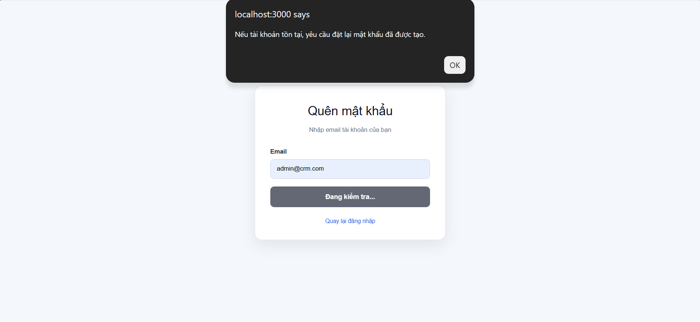

### Minh chứng TC-AUTH-010
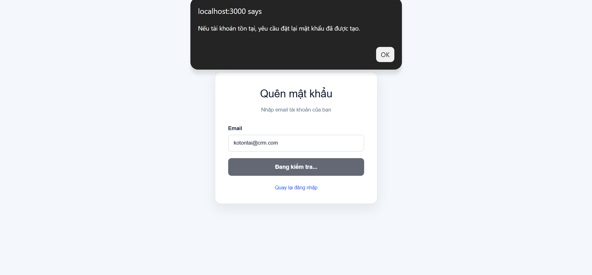

### Minh chứng TC-AUTH-011
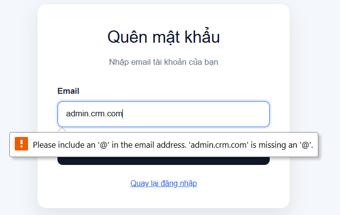

### Minh chứng TC-AUTH-012
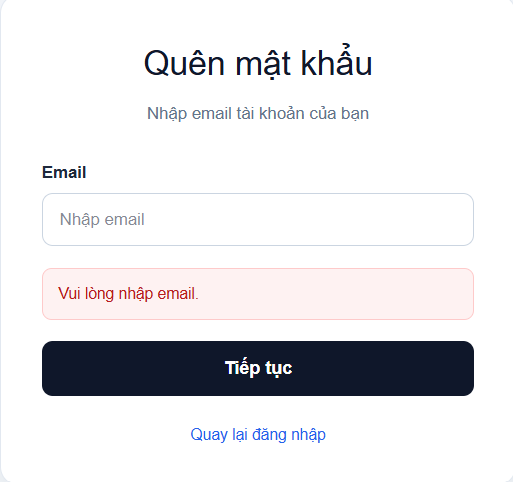

## 4. Đặt lại mật khẩu

| TC ID | Mô tả | Dữ liệu đầu vào | Kết quả mong đợi | Kết quả thực tế | Trạng thái |
|---|---|---|---|---|---|
| TC-AUTH-013 | Đổi mật khẩu bằng reset token hợp lệ | Reset token hợp lệ, mật khẩu mới và xác nhận giống nhau, tối thiểu 8 ký tự | Đổi mật khẩu thành công và chuyển về trang đăng nhập | Reset token hợp lệ được chấp nhận, mật khẩu mới được cập nhật thành công và người dùng được chuyển về trang đăng nhập | PASS |
| TC-AUTH-014 | Mật khẩu xác nhận không khớp | Reset token hợp lệ, hai mật khẩu khác nhau | Hiển thị lỗi mật khẩu xác nhận không khớp, không đổi mật khẩu | Form phát hiện hai mật khẩu không khớp, hiển thị lỗi và không gửi yêu cầu đổi mật khẩu | PASS |
| TC-AUTH-015 | Mật khẩu quá ngắn | Reset token hợp lệ, mật khẩu dưới 8 ký tự | Không cho phép đổi mật khẩu | Mật khẩu dưới 8 ký tự bị validation từ chối và mật khẩu hiện tại không bị thay đổi | PASS |
| TC-AUTH-016 | Đăng nhập bằng mật khẩu mới | Đã đổi mật khẩu thành công | Đăng nhập thành công | Sau khi reset thành công, hệ thống chấp nhận mật khẩu mới và đăng nhập thành công | PASS |
| TC-AUTH-017 | Đăng nhập bằng mật khẩu cũ | Đã đổi mật khẩu thành công | Hệ thống từ chối đăng nhập | Sau khi reset, mật khẩu cũ không còn đăng nhập được và hệ thống từ chối tạo phiên đăng nhập | PASS |
| TC-AUTH-018 | Dùng lại reset token đã sử dụng | Reset token đã dùng thành công trước đó | Hệ thống từ chối và hiển thị thông báo reset token không hợp lệ hoặc đã hết hạn | Reset token đã sử dụng bị backend từ chối với HTTP 400 và không thể dùng lại để đổi mật khẩu | PASS |
| TC-AUTH-019 | Reset password với token không hợp lệ | Chuỗi token không tồn tại hoặc sai | Hệ thống từ chối đổi mật khẩu | Reset token không tồn tại hoặc không hợp lệ bị hệ thống từ chối và mật khẩu không bị cập nhật | PASS |
| TC-AUTH-020 | Giới hạn yêu cầu forgot-password | Gửi quá 3 yêu cầu trong 60 giây | Yêu cầu vượt giới hạn bị từ chối với HTTP 429 | Sau khi vượt quá 3 request forgot-password trong 60 giây, request tiếp theo bị từ chối với HTTP 429 | PASS |

### Minh chứng TC-AUTH-013

### Minh chứng TC-AUTH-014
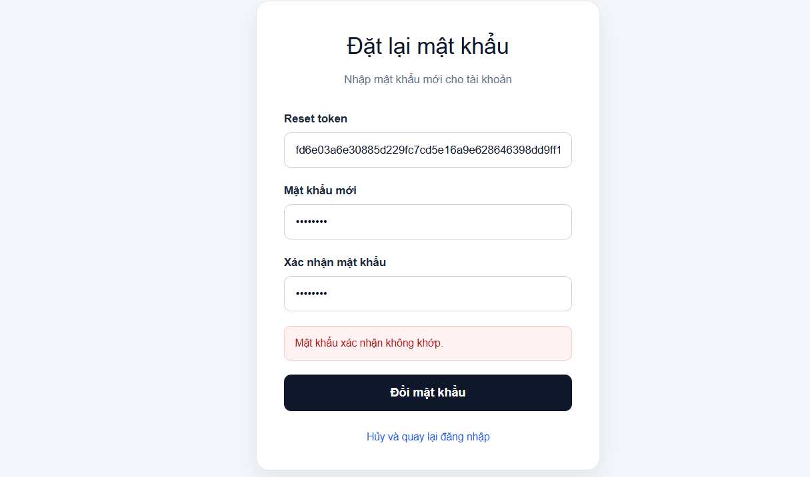

### Minh chứng TC-AUTH-015
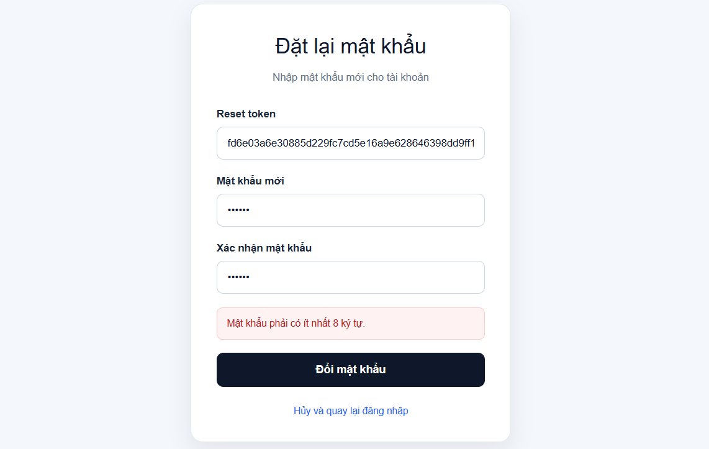

### Minh chứng TC-AUTH-016
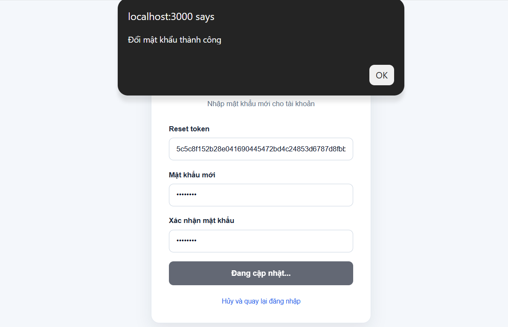
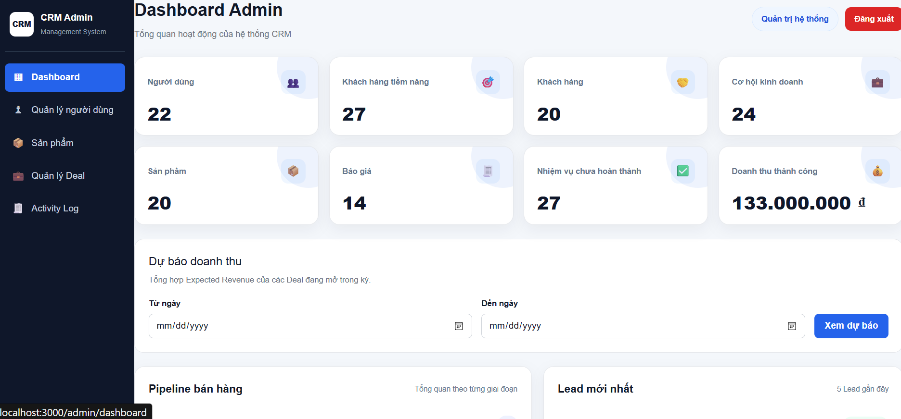

### Minh chứng TC-AUTH-017
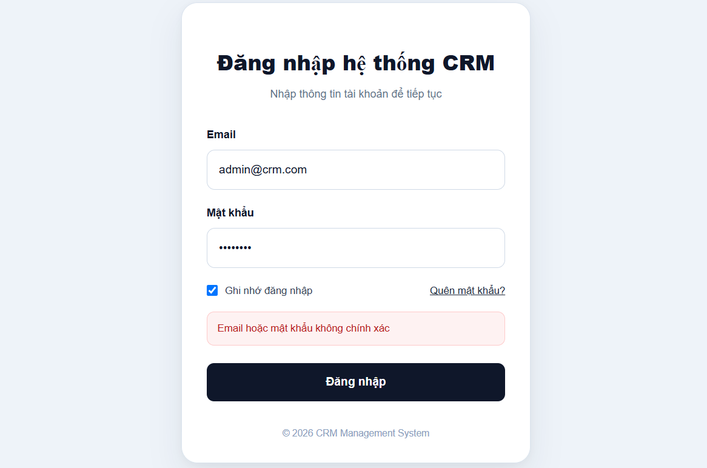

### Minh chứng TC-AUTH-018
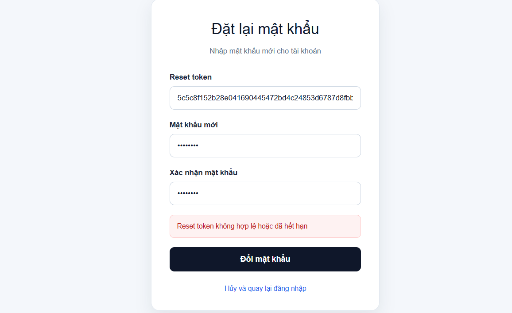

### Minh chứng TC-AUTH-019
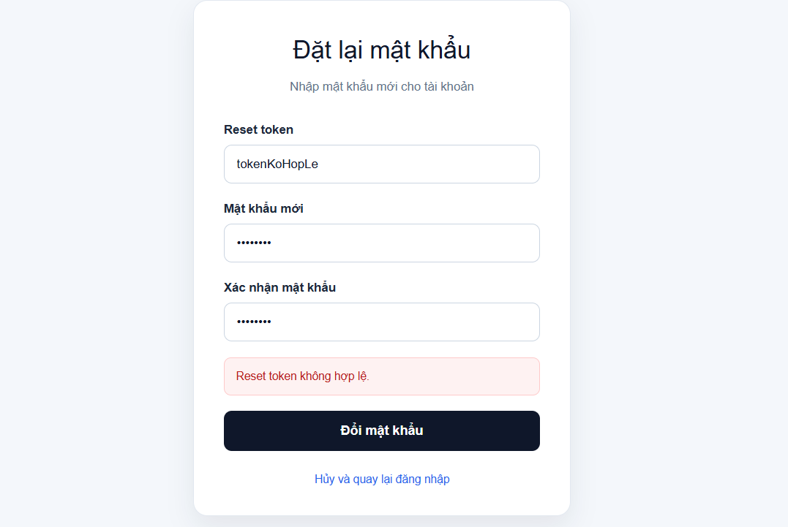

### Minh chứng TC-AUTH-020
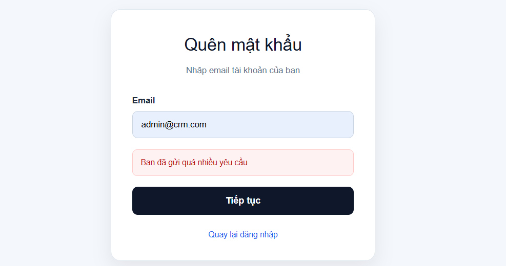

---

## Lịch sử cập nhật

| Ngày | Nội dung |
|---|---|
| 10/08/2026 | Tạo test case cho module Authentication |
| 15/09/2026 | Cập nhật test case Authentication sau khi chỉnh sửa chức năng quên mật khẩu, reset token và giới hạn request |