# Test Case - Dashboard

## UC9 - Dashboard

### Kỹ thuật thiết kế test áp dụng

- **Phân hoạch tương đương (Equivalence Partitioning):** chia các trường hợp người dùng có quyền và không có quyền truy cập Dashboard; Dashboard có dữ liệu và không có dữ liệu.
- **Phân tích giá trị biên (Boundary Value Analysis):** kiểm tra trường hợp số lượng Lead, Customer, Deal và doanh thu bằng 0.
- **Bảng quyết định (Decision Table Testing):** kiểm tra quyền truy cập Dashboard theo tổ hợp Role × Dashboard được phép truy cập.

| Mã TC | Chức năng / UC | Mục tiêu | Tiền điều kiện | Dữ liệu đầu vào | Các bước thực hiện | Kết quả mong đợi | Kết quả thực tế | Trạng thái |
|---|---|---|---|---|---|---|---|---|
| TC-DASHBOARD-001 | UC9 - Dashboard Admin | Kiểm tra Admin xem Dashboard thành công | Admin đã đăng nhập; hệ thống có dữ liệu Lead, Customer, Deal và Pipeline Stage | Không có dữ liệu nhập | 1. Đăng nhập bằng tài khoản Admin. 2. Mở Dashboard Admin. 3. Chờ hệ thống tải dữ liệu. 4. Quan sát các số liệu tổng quan. 5. Quan sát biểu đồ Pipeline. | `GET /api/v1/dashboard/admin` trả HTTP `200 OK`; Dashboard hiển thị các số liệu tổng quan; số lượng Lead, Customer, Deal và doanh thu được hiển thị; Pipeline hiển thị số Deal theo từng Stage; không xuất hiện lỗi tải dữ liệu | Đã kiểm thử | PASS |
| TC-DASHBOARD-002 | UC9 - Dashboard Sales Manager | Kiểm tra Sales Manager xem Dashboard thành công | Sales Manager đã đăng nhập; hệ thống có Sales đang hoạt động và có Deal được phân công | Không có dữ liệu nhập | 1. Đăng nhập bằng tài khoản Sales Manager. 2. Mở Dashboard Sales Manager. 3. Chờ hệ thống tải dữ liệu. 4. Quan sát số liệu tổng quan. 5. Quan sát hiệu suất của từng Sales. 6. Quan sát danh sách Deal cần chú ý. | Dashboard hiển thị dữ liệu dành cho Sales Manager; hiển thị số liệu Deal, doanh thu, Expected Revenue và hiệu suất Sales; không xuất hiện dữ liệu lỗi hoặc undefined | Đã kiểm thử | PASS |
| TC-DASHBOARD-003 | UC9 - Thống kê Dashboard Admin | Kiểm tra số lượng Lead, Customer và Deal trên Dashboard Admin khớp dữ liệu trong database | Admin đã đăng nhập; database test có `29` Lead, `19` Customer và `22` Deal | Không có dữ liệu ban đầu | 1. Kiểm tra số lượng Lead trong database. 2. Kiểm tra số lượng Customer trong database. 3. Kiểm tra số lượng Deal trong database. 4. Mở Dashboard Admin. 5. Đối chiếu các số liệu hiển thị. | Dashboard hiển thị số Lead = `29`; Customer = `19`; Deal = `22`; các giá trị khớp dữ liệu trong database | Đã kiểm thử | PASS |
| TC-DASHBOARD-004 | UC9 - Expected Revenue | Kiểm tra Expected Revenue trên Dashboard được tổng hợp đúng | Sales Manager đã đăng nhập | Không có dữ liệu ban đầu | 1. Viết lệnh truy vấn tính Expected Revenue. 2. Mở Dashboard. 3. Quan sát tổng Expected Revenue. | Dashboard tổng hợp Expected Revenue = `188.300.000` | Đã kiểm thử | PASS |
| TC-DASHBOARD-005 | UC9 - Hiệu suất Sales | Kiểm tra Sales Manager xem đúng hiệu suất của từng Sales | Sales Manager đã đăng nhập | Không có dữ liệu ban đầu | 1. Mở Dashboard Sales Manager. 2. Quan sát bảng hiệu suất Sales. 3. Đối chiếu kết quả. | Sales ID 75 hiển thị `totalDeals = 9`, `totalDealValue = 230.000.000`; Sales ID 76 hiển thị `totalDeals = 6`, `totalDealValue = 214.000.000` | Đã kiểm thử | PASS |
| TC-DASHBOARD-006 | UC9 - Pipeline | Kiểm tra Dashboard thống kê đúng số Deal theo từng Pipeline Stage | Admin đã đăng nhập; database test có 4 Deal ở Proposal, 4 Deal ở Negotiation và 4 Deal ở Won | Proposal = 4; Negotiation = 4; Won = 4 | 1. Viết truy vấn tính số deal mỗi pipeline stage. 2. Đăng nhập Admin. 3. Mở Dashboard. 4. Quan sát biểu đồ Pipeline. 5. Đối chiếu số Deal của từng Stage. | Pipeline hiển thị Proposal = `4` Deal; Negotiation = `4` Deal; Won = `4` Deal; các Stage được hiển thị theo đúng thứ tự Pipeline | Đã kiểm thử | PASS |
| TC-DASHBOARD-007 | UC9 - Phân quyền | Kiểm tra Sales Manager không được truy cập Dashboard Admin | Sales Manager đã đăng nhập và có access token hợp lệ | Method: `GET`; URL: `/api/v1/dashboard/admin` | 1. Đăng nhập bằng Sales Manager. 2. Lấy access token. 3. Gửi `GET /api/v1/dashboard/admin`. | HTTP `403 Forbidden`; thông báo `Bạn không có quyền truy cập chức năng này` | Đã kiểm thử | PASS |
| TC-DASHBOARD-008 | UC9 - Phân quyền | Kiểm tra Sales không được truy cập Dashboard Sales Manager | Sales đã đăng nhập và có access token hợp lệ | Method: `GET`; URL: `/api/v1/dashboard/sales-manager`;  | 1. Đăng nhập bằng Sales. 2. Lấy access token. 3. Gửi `GET /api/v1/dashboard/sales-manager`.  | HTTP `403 Forbidden`; thông báo `Bạn không có quyền truy cập chức năng này` | Đã kiểm thử | PASS |
| TC-DASHBOARD-009 | UC9 - Phân quyền | Kiểm tra Marketing không được truy cập Dashboard Admin | Marketing đã đăng nhập và có access token hợp lệ | Method: `GET`; URL: `/api/v1/dashboard/admin` | 1. Đăng nhập bằng Marketing. 2. Lấy access token. 3. Gửi `GET /api/v1/dashboard/admin`. | HTTP `403 Forbidden`; thông báo `Bạn không có quyền truy cập chức năng này` | Đã kiểm thử | PASS |
| TC-DASHBOARD-010 | UC9 - Phân quyền | Kiểm tra Customer Care không được truy cập Dashboard Admin | Customer Care đã đăng nhập và có access token hợp lệ | Method: `GET`; URL: `/api/v1/dashboard/admin`; Authorization: Bearer token của Customer Care | 1. Đăng nhập bằng Customer Care. 2. Lấy access token. 3. Gửi `GET /api/v1/dashboard/admin`. | HTTP `403 Forbidden`; thông báo `Bạn không có quyền truy cập chức năng này` | Đã kiểm thử | PASS |
| TC-DASHBOARD-011 | UC9 - Xác thực | Kiểm tra không thể lấy Dashboard khi chưa đăng nhập | Không có phiên đăng nhập; không có access token | Method: `GET`; URL: `/api/v1/dashboard/admin`; Không gửi Authorization header | 1. Mở Swagger. 2. Không thực hiện Authorize. 3. Gửi `GET /api/v1/dashboard/admin`. | HTTP `401 Unauthorized`; thông báo `Bạn chưa đăng nhập hoặc phiên đăng nhập đã hết hạn` | Đã kiểm thử | PASS |
| TC-DASHBOARD-012 | UC9 - Xử lý lỗi | Kiểm tra giao diện xử lý khi không thể tải dữ liệu Dashboard | Admin đã đăng nhập; frontend đang hoạt động; backend được dừng sau khi đã đăng nhập | Backend không khả dụng khi Dashboard gửi request | 1. Đăng nhập Admin khi backend đang hoạt động. 2. Dừng backend. 3. Refresh trang Dashboard Admin. 4. Quan sát giao diện. | Giao diện không crash; không hiển thị số liệu Dashboard sai; hiển thị thông báo `Đã xảy ra lỗi khi tải Dashboard` | Đã kiểm thử | PASS |

### Minh chứng TC-DASHBOARD-001
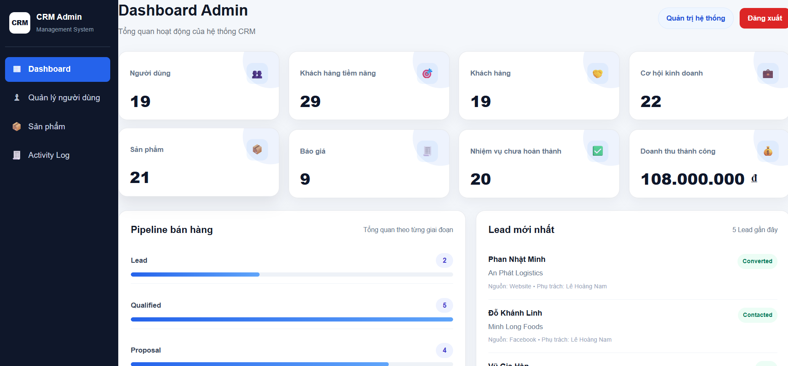

### Minh chứng TC-DASHBOARD-002
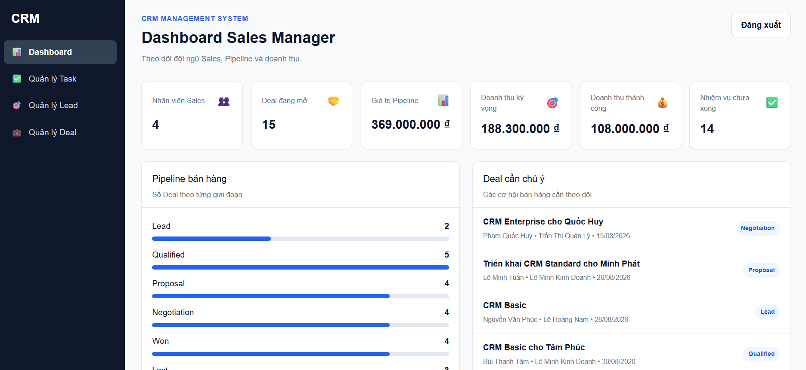

### Minh chứng TC-DASHBOARD-003
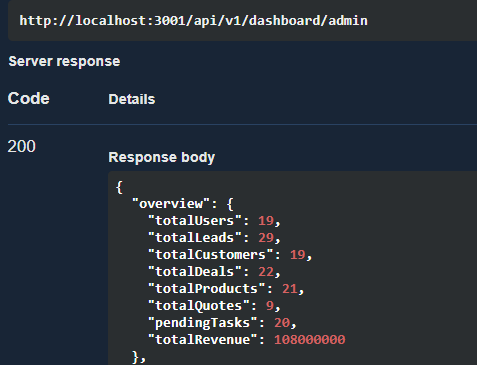

### Minh chứng TC-DASHBOARD-004
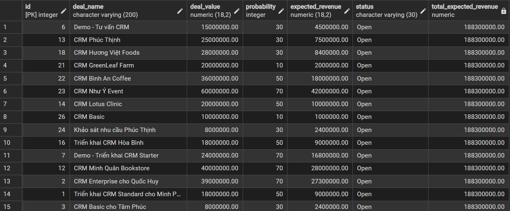

### Minh chứng TC-DASHBOARD-005
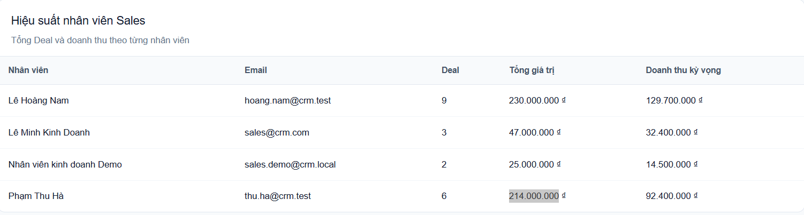

### Minh chứng TC-DASHBOARD-006
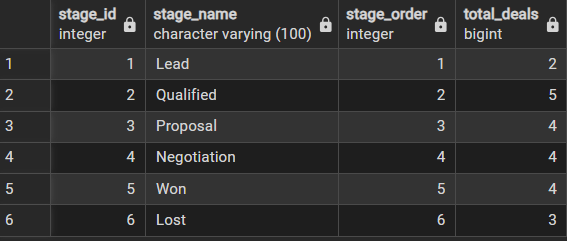
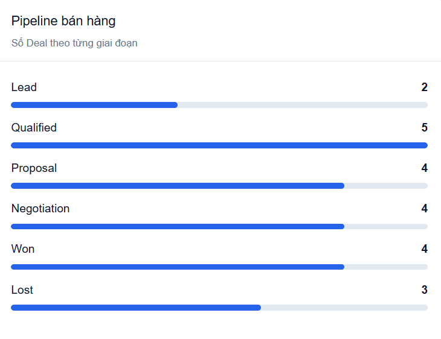

### Minh chứng TC-DASHBOARD-007
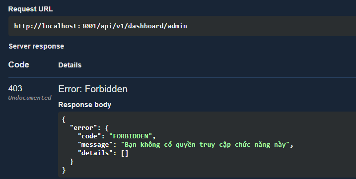

### Minh chứng TC-DASHBOARD-008
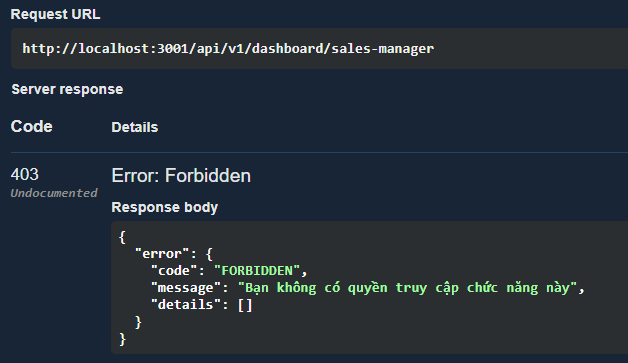

### Minh chứng TC-DASHBOARD-009
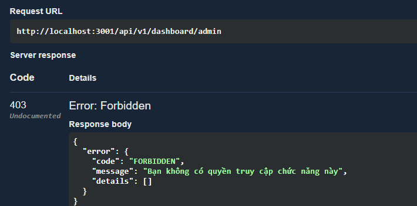

### Minh chứng TC-DASHBOARD-010
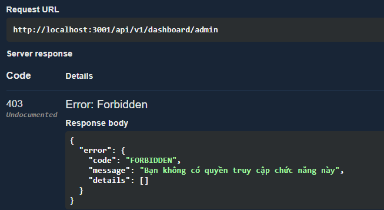

### Minh chứng TC-DASHBOARD-011
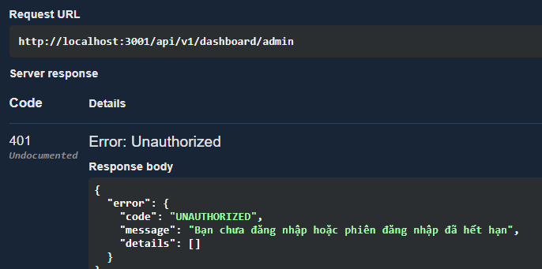

### Minh chứng TC-DASHBOARD-012
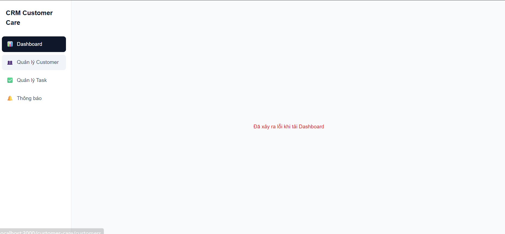

### Kỹ thuật thiết kế test áp dụng
- **Phân hoạch tương đương (Equivalence Partitioning):** kiểm tra kỳ Forecast hợp lệ, kỳ không có Deal và người dùng có/không có quyền xem Forecast.
- **Phân tích giá trị biên (Boundary Value Analysis):** kiểm tra `fromDate = toDate` và trường hợp `fromDate > toDate`.
- **Bảng quyết định (Decision Table Testing):** kiểm tra quyền xem Forecast theo Role: Admin và Sales Manager được phép; Sales không được phép.

| Mã TC | Chức năng / UC | Mục tiêu | Tiền điều kiện | Dữ liệu đầu vào | Các bước thực hiện | Kết quả mong đợi | Kết quả thực tế | Trạng thái |
|---|---|---|---|---|---|---|---|---|
| TC-DASHBOARD-013 | UC9 - Forecast doanh thu | Kiểm tra Sales Manager xem Forecast theo kỳ trên giao diện | Sales Manager đã đăng nhập; hệ thống có Deal đang mở có Expected Close Date trong tháng 09/2026| Từ ngày: `01/09/2026`; Đến ngày: `30/09/2026` | 1. Đăng nhập bằng tài khoản Sales Manager. 2. Mở Dashboard Sales Manager. 3. Tại khu vực `Dự báo doanh thu`, chọn Từ ngày `01/09/2026`. 4. Chọn Đến ngày `30/09/2026`. 5. Nhấn `Xem dự báo`. 6. Quan sát kết quả hiển thị. | Giao diện hiển thị `Deal đang mở trong kỳ = 7`; `Giá trị Pipeline = 203.000.000 ₫`; `Doanh thu dự báo = 109.700.000 ₫`; không xuất hiện lỗi tải dữ liệu | Đã kiểm thử | PASS |
| TC-DASHBOARD-014 | UC9 - Forecast doanh thu | Kiểm tra Admin xem Forecast theo kỳ trên giao diện | Admin đã đăng nhập; hệ thống có Deal đang mở có Expected Close Date trong tháng 09/2026 | Từ ngày: `01/09/2026`; Đến ngày: `30/09/2026` | 1. Đăng nhập bằng tài khoản Admin. 2. Mở Dashboard Admin. 3. Tại khu vực `Dự báo doanh thu`, chọn Từ ngày `01/09/2026`. 4. Chọn Đến ngày `30/09/2026`. 5. Nhấn `Xem dự báo`. 6. Quan sát kết quả hiển thị. | Giao diện hiển thị `Deal đang mở trong kỳ = 7`; `Giá trị Pipeline = 203.000.000 ₫`; `Doanh thu dự báo = 109.700.000 ₫`; không xuất hiện lỗi tải dữ liệu | Đã kiểm thử | PASS |
| TC-DASHBOARD-015 | UC9 - Forecast phân quyền | Kiểm tra Sales không được xem Forecast toàn hệ thống | Sales đã đăng nhập và có access token hợp lệ | `GET /api/v1/dashboard/forecast?fromDate=2026-09-01&toDate=2026-09-30` | 1. Đăng nhập Sales. 2. Gửi request Forecast. 3. Quan sát response. | HTTP `403 Forbidden`; thông báo `Bạn không có quyền truy cập chức năng này` | Đã kiểm thử | PASS |
| TC-DASHBOARD-016 | UC9 - Forecast kiểm tra kỳ | Kiểm tra từ chối khi ngày bắt đầu sau ngày kết thúc | Sales Manager đã đăng nhập | `fromDate = 2026-10-01`; `toDate = 2026-09-30` | 1. Gửi request Forecast với khoảng ngày không hợp lệ. 2. Quan sát response. | HTTP `422 Unprocessable Entity`; thông báo `Ngày bắt đầu không được sau ngày kết thúc.` | Đã kiểm thử | PASS |
| TC-DASHBOARD-017 | UC9 - Forecast BR34 | Kiểm tra số liệu Forecast khớp dữ liệu database | Sales Manager đã đăng nhập; database có Deal test trong tháng 09/2026 | Kỳ `01/09/2026 - 30/09/2026` | 1. Truy vấn các Deal có `status NOT IN ('Won','Lost')` và `expected_close_date` nằm trong kỳ. 2. Tính `COUNT`, `SUM(deal_value)`, `SUM(expected_revenue)`. 3. Gọi API Forecast. 4. Đối chiếu kết quả. | Database và API cùng trả `7` Deal; Pipeline = `203.000.000`; Forecast Revenue = `109.700.000`; Deal Won/Lost và Deal ngoài kỳ không được tính | Đã kiểm thử | PASS |

### Minh chứng TC-DASHBOARD-013
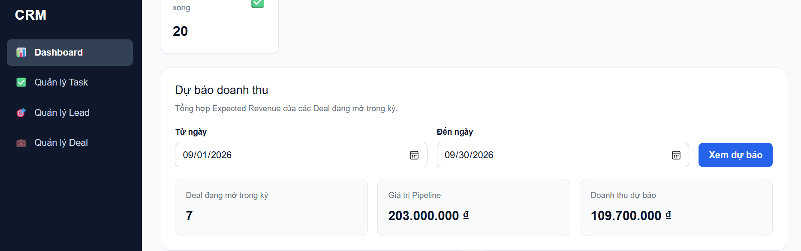

### Minh chứng TC-DASHBOARD-014
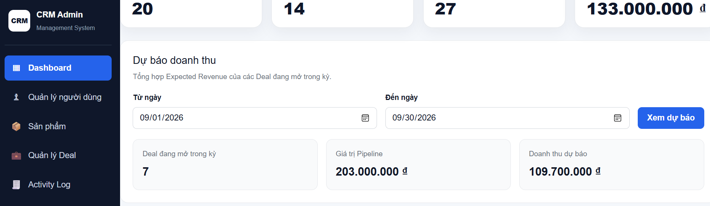

### Minh chứng TC-DASHBOARD-015
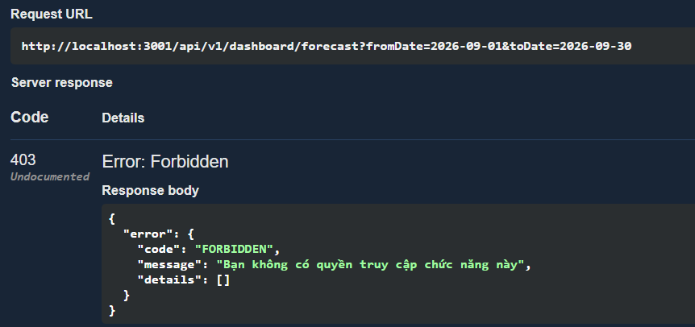

### Minh chứng TC-DASHBOARD-016
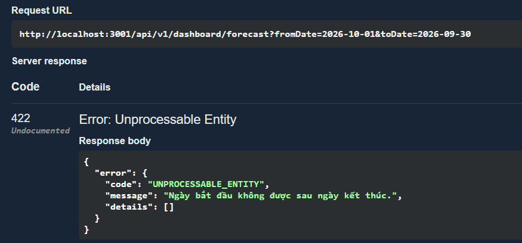

### Minh chứng TC-DASHBOARD-017
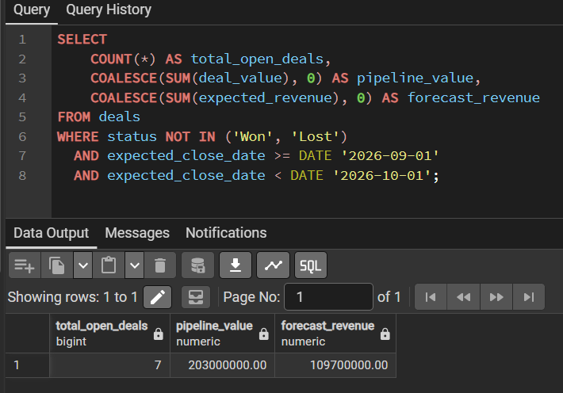
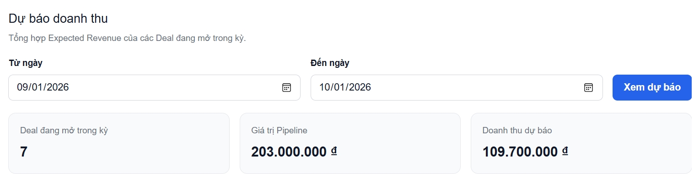