# Test Case - Quản lý Deal và Pipeline

### Kỹ thuật thiết kế test áp dụng

- **Phân hoạch tương đương (Equivalence Partitioning):** chia dữ liệu tạo/cập nhật Deal thành các nhóm hợp lệ và không hợp lệ như Customer hợp lệ/không thuộc quyền, tên Deal có/không có, Deal Value hợp lệ/không hợp lệ, Stage hợp lệ/không hợp lệ.
- **Phân tích giá trị biên (Boundary Value Analysis):** áp dụng cho giới hạn độ dài tên Deal, giá trị Deal và số chữ số thập phân.
- **Bảng quyết định (Decision Table Testing):** áp dụng cho các trường hợp quyền thao tác phụ thuộc vào vai trò người dùng và quyền sở hữu Customer/Deal.

## UC4 - Quản lý Deal

| Mã TC | Chức năng / UC | Mục tiêu | Tiền điều kiện | Dữ liệu đầu vào | Các bước thực hiện | Kết quả mong đợi | Kết quả thực tế | Trạng thái |
|---|---|---|---|---|---|---|---|---|
| TC-DEALS-001 | UC4 - Xem danh sách Deal | Kiểm tra Sales xem được danh sách Deal thuộc quyền quản lý | Sales đã đăng nhập; có Deal được phân cho Sales hiện tại | Không có dữ liệu nhập | 1. Đăng nhập Sales; 2. Mở Dashboard Sales; 3. Chọn **Quản lý Deal** | Hiển thị danh sách Deal được phân cho Sales hiện tại; không hiển thị Deal của Sales khác | Đã kiểm thử | PASS |
| TC-DEALS-002 | UC4 - Tạo Deal | Kiểm tra tạo Deal hợp lệ | Sales đã đăng nhập; Customer thuộc quyền Sales; Pipeline có giai đoạn đầu tiên | Customer ID: 18; Deal name: `CRM Basic`; Deal value: `10000000`; Stage: giai đoạn đầu tiên | 1. Mở Quản lý Deal; 2. Nhấn **Thêm Deal**; 3. Chọn Customer; 4. Nhập tên Deal; 5. Nhập giá trị; 6. Chọn giai đoạn đầu; 7. Nhấn **Lưu** | Tạo Deal thành công; Deal tự gán cho Sales hiện tại; Probability lấy từ Pipeline Stage; Expected Revenue = Deal Value × Probability; ghi Activity Log; hiển thị `Tạo Deal thành công.` | Đã kiểm thử | PASS |
| TC-DEALS-003 | UC4 - Tạo Deal | Kiểm tra không cho tạo Deal khi chưa chọn Customer | Sales đã đăng nhập | Customer: trống; Deal name: `CRM Basic`; Deal value: `10000000`; Stage: giai đoạn đầu | 1. Nhấn **Thêm Deal**; 2. Không chọn Customer; 3. Nhập các trường còn lại; 4. Nhấn **Lưu** | Không tạo Deal; trường Customer báo bắt buộc | Đã kiểm thử | PASS |
| TC-DEALS-004 | UC4 - Tạo Deal | Kiểm tra Sales không tạo Deal cho Customer ngoài quyền quản lý | Sales đã đăng nhập; Customer ID 999 không thuộc Sales hiện tại | Customer ID: 999; Deal name: `CRM Basic`; Deal value: `10000000`; Stage: giai đoạn đầu | 1. Mở form thêm Deal; 2. Chọn Customer không thuộc quyền; 3. Nhập dữ liệu; 4. Nhấn **Lưu** | Không hiển thị deal trong danh sách | Đã kiểm thử | PASS |
| TC-DEALS-005 | UC4 - Tạo Deal | Kiểm tra Deal mới không được bắt đầu ở Stage khác giai đoạn đầu tiên | Sales đã đăng nhập; Customer hợp lệ | Customer ID: 3; Deal name: `CRM Basic`; Deal value: `10000000`; Stage: Negotiation | 1. Mở form thêm Deal; 2. Nhập dữ liệu hợp lệ; 3. Chọn Stage không phải giai đoạn đầu; 4. Nhấn **Lưu** | Không tạo Deal; hiển thị `Deal mới phải bắt đầu ở giai đoạn đầu tiên của Pipeline.` | Đã kiểm thử | PASS |
| TC-DEALS-006 | UC4 - Tạo Deal | Kiểm tra không cho tạo Deal thiếu tên | Sales đã đăng nhập; Customer hợp lệ | Deal name: trống; Deal value: `10000000` | 1. Mở form thêm Deal; 2. Chọn Customer; 3. Để trống tên Deal; 4. Nhập các trường còn lại; 5. Nhấn **Lưu** | Không tạo Deal; hiển thị lỗi tên Deal bắt buộc | Đã kiểm thử | PASS |
| TC-DEALS-007 | UC4 - Tạo Deal | Kiểm tra giới hạn độ dài tên Deal | Sales đã đăng nhập | Deal name: chuỗi 201 ký tự; Deal value: `10000000` | 1. Mở form thêm Deal; 2. Nhập tên dài 201 ký tự; 3. Nhập dữ liệu còn lại; 4. Nhấn **Lưu** | Không tạo Deal; tên Deal vượt giới hạn tối đa 200 ký tự | Đã kiểm thử | PASS |
| TC-DEALS-008 | UC4 - Tạo Deal | Kiểm tra không cho nhập giá trị Deal âm | Sales đã đăng nhập; Customer hợp lệ | Deal name: `CRM Basic`; Deal value: `-1` | 1. Mở form thêm Deal; 2. Nhập Deal value âm; 3. Nhập các trường còn lại; 4. Nhấn **Lưu** | Không tạo Deal; giá trị Deal không hợp lệ | Đã kiểm thử | PASS |
| TC-DEALS-009 | UC4 - Tạo Deal | Kiểm tra Deal value không được có quá 2 chữ số thập phân | Sales đã đăng nhập; Customer hợp lệ | Deal value: `1000000.123` | 1. Mở form thêm Deal; 2. Nhập giá trị `1000000.123`; 3. Nhập các trường còn lại; 4. Nhấn **Lưu** | Không tạo Deal; hệ thống từ chối giá trị có quá 2 chữ số thập phân | Đã kiểm thử | PASS |
| TC-DEALS-010 | UC4 - Tạo Deal | Kiểm tra định dạng ngày dự kiến đóng Deal | Sales đã đăng nhập | Expected Close Date: dữ liệu ngày không hợp lệ | 1. Mở form thêm Deal; 2. Nhập các trường hợp lệ; 3. Nhập ngày không hợp lệ; 4. Nhấn **Lưu** | hệ thống tự động đưa về giá trị ngày lớn nhất | Đã kiểm thử | PASS |
| TC-DEALS-011 | UC4 - Cập nhật Deal | Kiểm tra cập nhật Deal value và tính lại Expected Revenue | Sales đã đăng nhập; Deal ID 14 thuộc Sales; Probability hiện tại = 50% | Deal ID: 7; Deal value mới: `20000000`; Expected Close Date: `2026-10-15` | 1. Mở Deal ID 7; 2. Nhấn **Chỉnh sửa**; 3. Đổi Deal value thành `20000000`; 4. Nhấn **Lưu** | Deal value = `20000000`; Expected Revenue = `10000000`; lưu ngày `2026-10-15`; ghi Activity Log; hiển thị `Cập nhật Deal thành công.` | Đã kiểm thử | PASS |
| TC-DEALS-012 | UC4 - Cập nhật Deal | Kiểm tra không cập nhật khi không có dữ liệu thay đổi | Sales đã đăng nhập; Deal ID 14 thuộc Sales | Không thay đổi trường nào | 1. Mở Deal; 2. Chọn chỉnh sửa; 3. Không thay đổi dữ liệu; 4. Gửi yêu cầu cập nhật | Vẫn cập nhật dữ liệu bình thường | Đã kiểm thử | PASS |
| TC-DEALS-013 | UC4 - Phân quyền record | Kiểm tra Sales không sửa Deal của Sales khác | Sales đã đăng nhập; Deal ID 999 không thuộc Sales hiện tại | Không có dữ liệu đầu vào | Truy cập danh sách Deal | Không hiển thị Deal không được phân | Đã kiểm thử | PASS |
| TC-DEALS-014 | UC4  - Xóa Deal | Kiểm tra xóa Deal chưa phát sinh dữ liệu liên quan | Sales đã đăng nhập; Deal ID 7 thuộc Sales; Deal chưa có Quote, Activity hoặc Task | Deal ID: 7 | 1. Mở Deal; 2. Nhấn **Xóa**; 3. Xác nhận | Deal bị xóa; record không còn trong danh sách; thao tác xóa được ghi Activity Log | Đã kiểm thử | PASS |
| TC-DEALS-015 | UC4 - Xóa Deal | Kiểm tra không xóa vật lý Deal đã phát sinh liên kết | Sales đã đăng nhập; Deal có ít nhất một Quote, Activity hoặc Task | Deal có dữ liệu liên quan | 1. Mở Deal đã có dữ liệu liên kết; 2. Nhấn **Xóa**; 3. Xác nhận | Không xóa Deal; dữ liệu liên quan vẫn tồn tại; hiển thị `Deal đã phát sinh dữ liệu liên quan nên không thể xóa.` | Đã kiểm thử | PASS |
| TC-DEALS-016 | UC4 - Tạo Deal | Kiểm tra Sales Manager tạo Deal thành công | Sales Manager đã đăng nhập | Customer ID: 18; Deal name: CRM Basic; Deal value: 10000000; Stage: giai đoạn đầu tiên | 1. Mở Quản lý Deal; 2. Nhấn **Thêm Deal**; 3. Chọn Customer; 4. Nhập tên Deal; 5. Nhập giá trị; 6. Chọn giai đoạn đầu; 7. Nhấn **Lưu** | Tạo Deal thành công; Deal tự gán cho Sales hiện tại; Probability lấy từ Pipeline Stage; Expected Revenue = Deal Value × Probability; ghi Activity Log; hiển thị `Tạo Deal thành công.` | Đã kiểm thử | PASS |

---

### Minh chứng TC-DEALS-001

### Minh chứng TC-DEALS-002
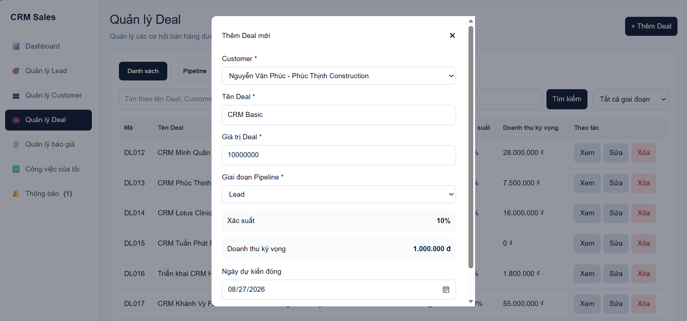
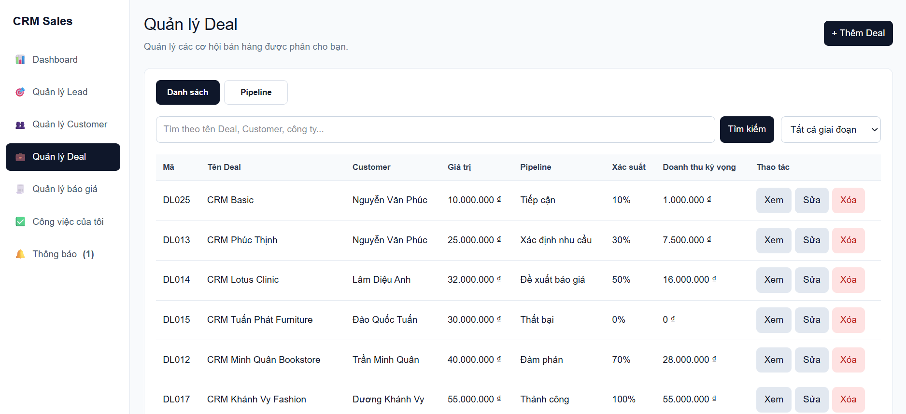

### Minh chứng TC-DEALS-003
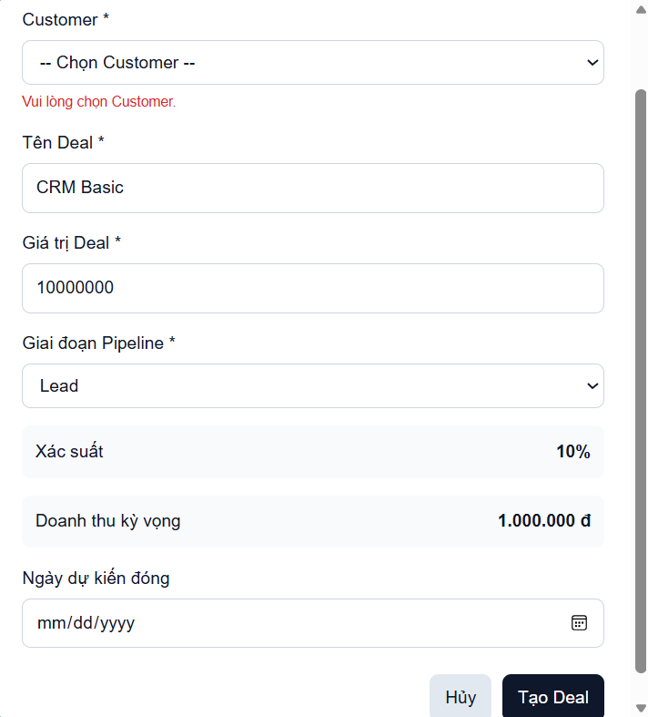

### Minh chứng TC-DEALS-004
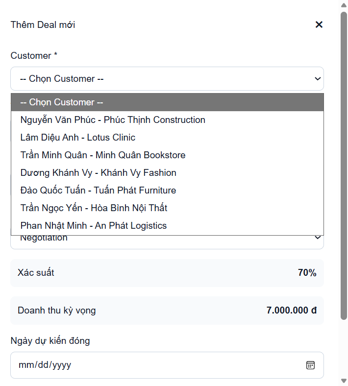

### Minh chứng TC-DEALS-005
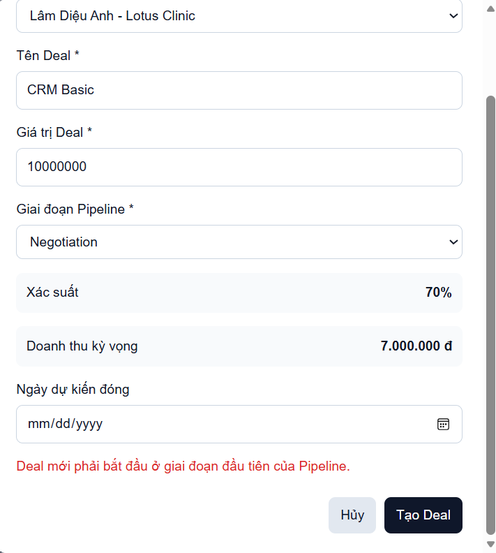

### Minh chứng TC-DEALS-006
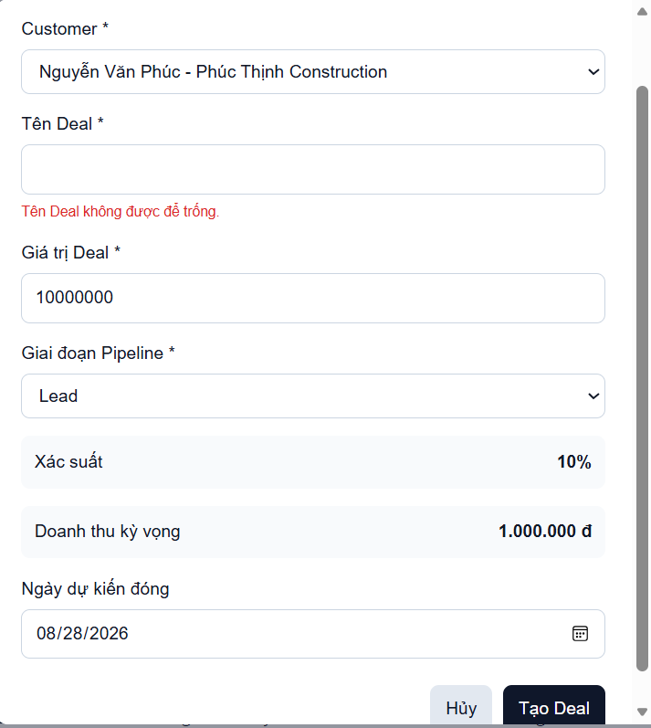

### Minh chứng TC-DEALS-007
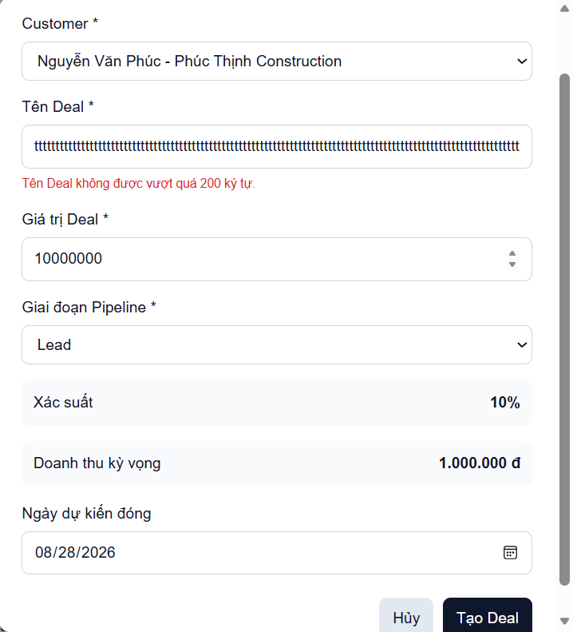

### Minh chứng TC-DEALS-008
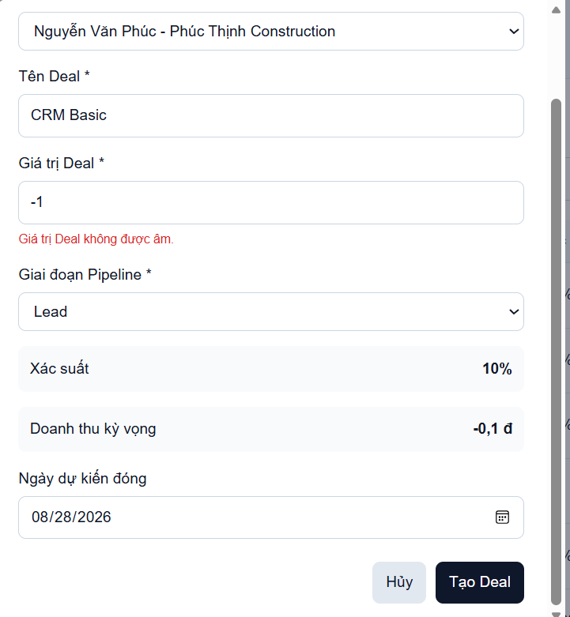

### Minh chứng TC-DEALS-009
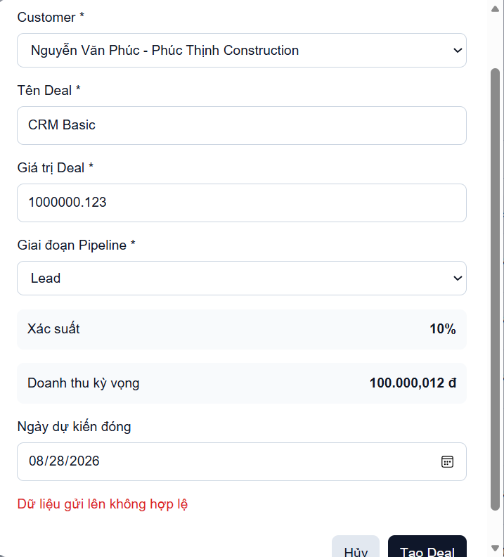

### Minh chứng TC-DEALS-010
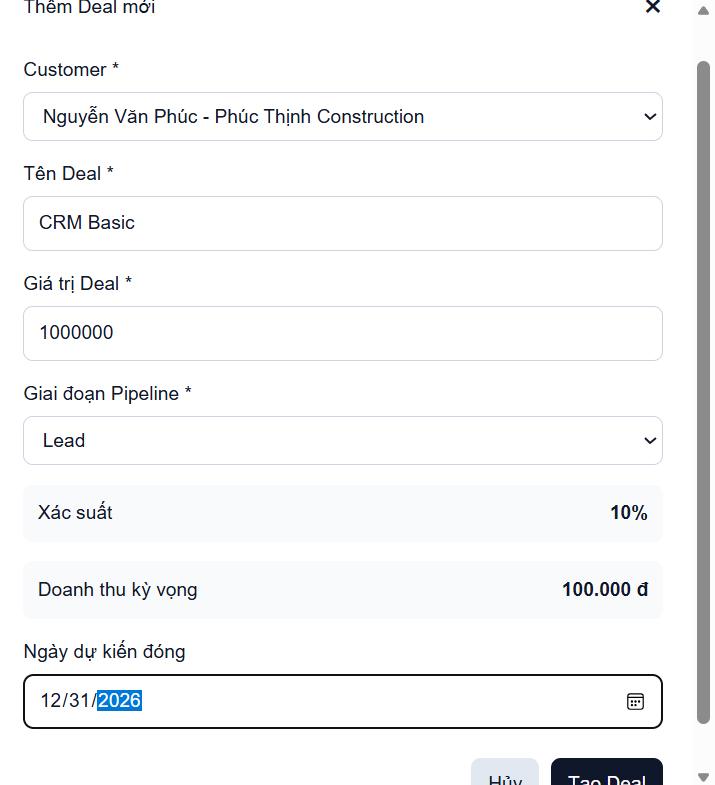

### Minh chứng TC-DEALS-011
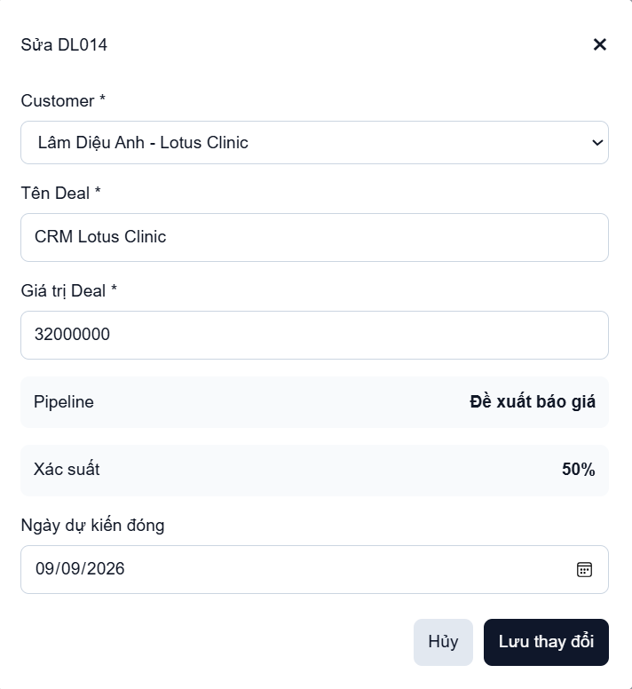
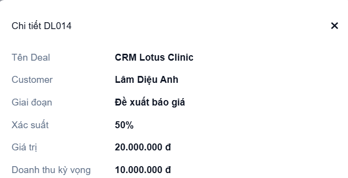

### Minh chứng TC-DEALS-012
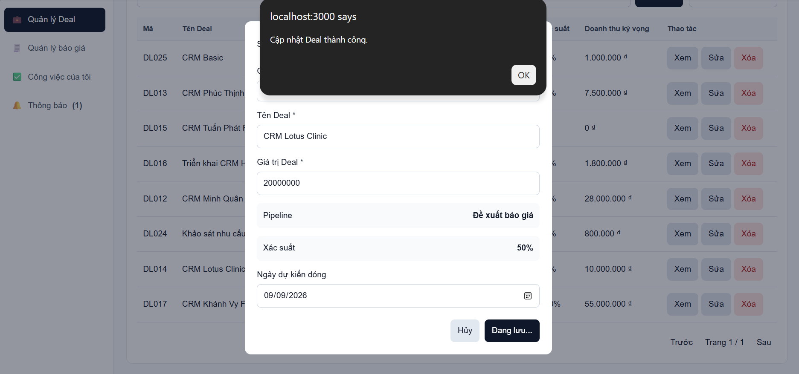

### Minh chứng TC-DEALS-014
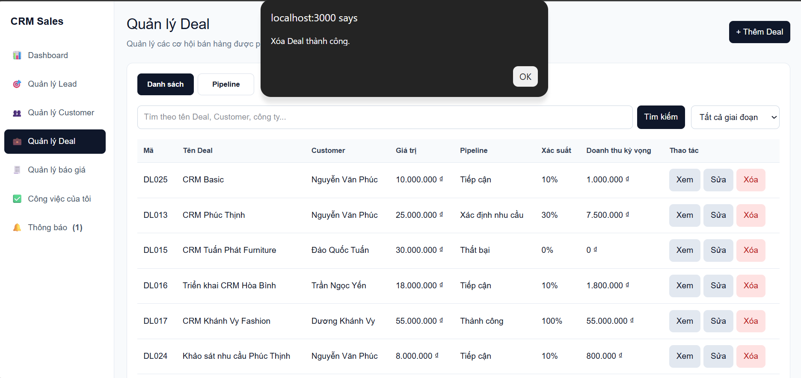

### Minh chứng TC-DEALS-015
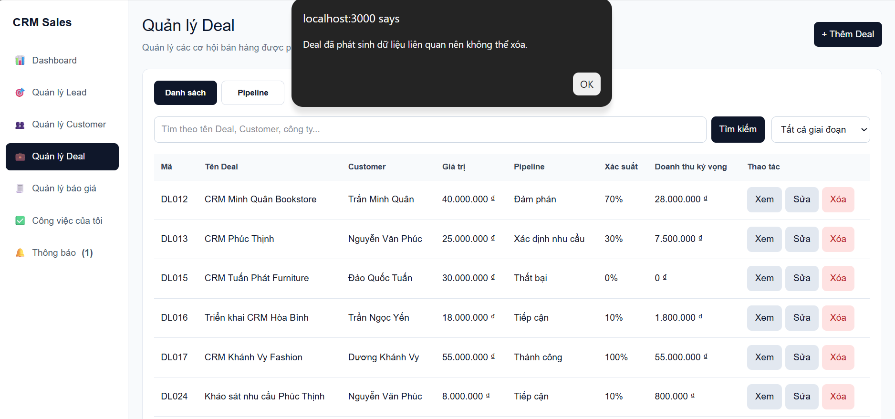

### Minh chứng TC-DEALS-016
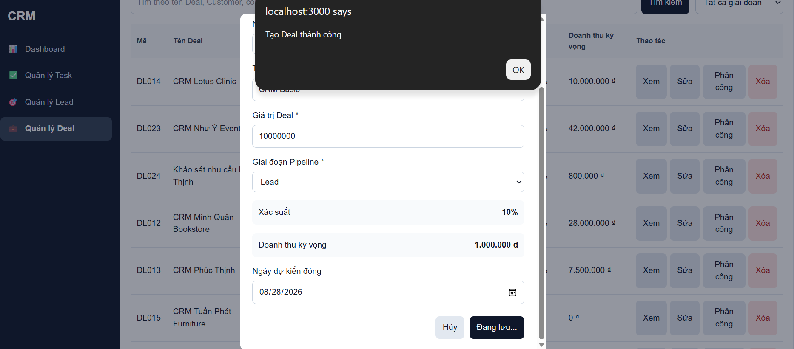

### Kỹ thuật thiết kế test áp dụng

- **Bảng quyết định (Decision Table Testing):** kiểm tra quyền phân công Deal dựa trên tổ hợp vai trò người thực hiện, vai trò người được phân công, trạng thái tài khoản và sự tồn tại của người dùng.
- **Phân hoạch tương đương (Equivalence Partitioning):** chia đối tượng được phân công thành các nhóm Sales hợp lệ, Sales bị khóa, người dùng không tồn tại và người dùng không có role Sales.

## UC5 - Phân công Deal

| Mã TC | Chức năng / UC | Mục tiêu | Tiền điều kiện | Dữ liệu đầu vào | Các bước thực hiện | Kết quả mong đợi | Kết quả thực tế | Trạng thái |
|---|---|---|---|---|---|---|---|---|
| TC-DEALS-017 | UC5 - Phân công Deal | Kiểm tra Sales Manager phân công Deal thành công từ Sales hiện tại sang Sales khác | Sales Manager đã đăng nhập; Deal ID 7 tồn tại và đang do Sales ID 5 phụ trách; Sales ID 6 tồn tại, có role Sales và đang hoạt động | Deal ID: 7; Sales hiện tại: ID 8; Sales mới: ID 6 | 1. Mở chức năng **Quản lý Deal**. 2. Tại Deal ID 7, nhấn **Phân công**. 3. Kiểm tra Sales ID 8 đang được hiển thị là người phụ trách hiện tại. 4. Chọn Sales ID 6 trong danh sách nhân viên Sales. 5. Nhấn **Phân công**. | Hệ thống hiển thị thông báo **"Phân công Deal thành công."**; `assignedUserId` của Deal ID 7 được đổi từ 5 thành 6; Sales ID 6 nhận Notification phân công Deal; Activity Log được tạo cho thao tác phân công; danh sách Deal hiển thị Sales ID 6 là người phụ trách mới | Đã kiểm thử | PASS |
| TC-DEALS-018 | UC5 - Phân quyền | Kiểm tra Sales không được phép tự phân công Deal cho người khác | Sales đã đăng nhập | Không có dữ liệu đầu vào | 1. Đăng nhập bằng tài khoản role Sales. 2. Mở quản lý Deal. | Không hiển thị nút phân công trong quản lý Deal của Sales | Đã kiểm thử | PASS |
| TC-DEALS-019 | UC5 - Phân công Deal | Kiểm tra không thể phân công Deal cho tài khoản Sales đã bị khóa | Sales Manager đã đăng nhập và có access token hợp lệ; Deal ID 7 tồn tại; Sales ID 6 tồn tại, có role Sales nhưng `status = false` | Chọn tài khoản vai trò Sales có `status = fales`, có `email = duc.huy@crm.test` | 1. Đăng nhập bằng tài khoản Sales Manager. 2. Vào Quản lý Deal. 3. Chọn **Phân công** | Không hiển thị Sales đã bị khóa | Đã kiểm thử | PASS |
| TC-DEALS-020 | UC5 - Phân công Deal | Kiểm tra không thể phân công Deal cho nhân viên Sales không tồn tại | Sales Manager đã đăng nhập và có access token hợp lệ; Deal ID 7 tồn tại | Không có dữ liệu đầu vào | 1. Đăng nhập bằng tài khoản Sales Manager. 2. Chọn quản lý Deal | Không hiển thị Sales không tồn tại trong danh sách. | Đã kiểm thử | PASS |
| TC-DEALS-021 | UC5 - Phân công Deal | Kiểm tra không thể phân công Deal cho người dùng không có role Sales | Sales Manager đã đăng nhập và có access token hợp lệ; Deal ID 7 tồn tại; User ID 1 tồn tại nhưng có role không phải Sales | Không có dữ liệu đầu vào. | 1. Đăng nhập bằng tài khoản Sales Manager. 2. Vào quản lý Deal. 3. Bấm **Phân công**  | Không hiển thị người dùng là các vai trò khác Sales. | Đã kiểm thử | PASS |

### Minh chứng TC-DEALS-017
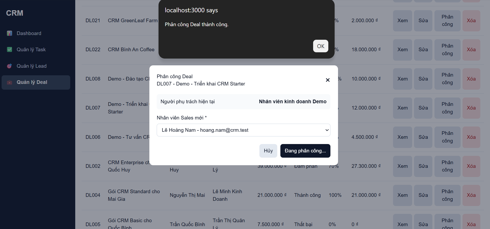

### Minh chứng TC-DEALS-018
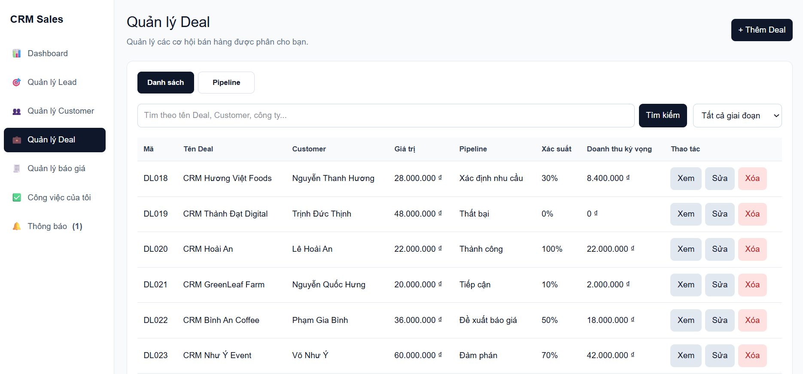

### Minh chứng TC-DEALS-019
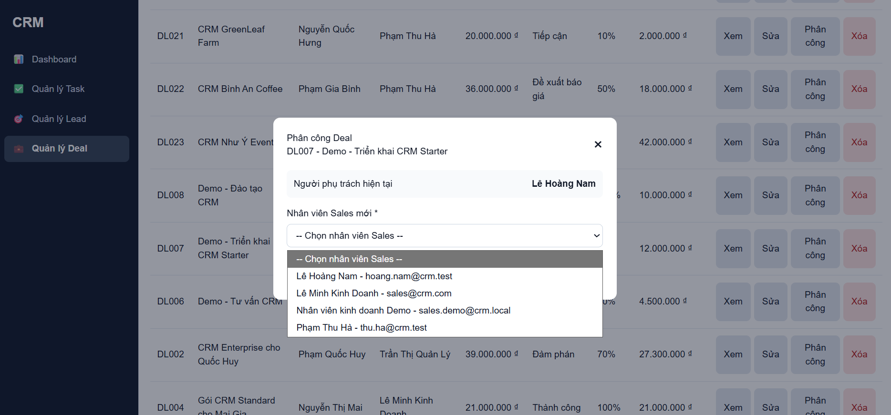

### Kỹ thuật thiết kế test áp dụng

- **Chuyển trạng thái (State Transition Testing):** kiểm tra việc Deal chuyển giữa các Pipeline Stage, chọn lại Stage hiện tại và giới hạn không cho Deal ở trạng thái kết thúc Won/Lost quay lại Stage trước.
- **Phân hoạch tương đương (Equivalence Partitioning):** chia Stage đích thành nhóm hợp lệ và không tồn tại.
- **Bảng quyết định (Decision Table Testing):** áp dụng cho quyền thay đổi Stage dựa trên quyền sở hữu Deal của Sales.

## UC6 - Thay đổi trạng thái Pipeline

| Mã TC | Chức năng / UC | Mục tiêu | Tiền điều kiện | Dữ liệu đầu vào | Các bước thực hiện | Kết quả mong đợi | Kết quả thực tế | Trạng thái |
|---|---|---|---|---|---|---|---|---|
| TC-DEALS-022 | UC6 - Đổi Pipeline Stage | Kiểm tra Sales chuyển Stage Deal hợp lệ | Sales đã đăng nhập; Deal ID 7 thuộc Sales; Deal value = `10000000`; Deal chưa ở Won/Lost | Deal ID: 7; Stage đích: Negotiation; Probability = 70% | 1. Mở Pipeline; 2. Chọn Deal ID 7; 3. Chuyển Deal sang Negotiation | Stage chuyển sang Negotiation; Probability = 70%; Expected Revenue = `7000000`; ghi Activity Log; hiển thị `Cập nhật giai đoạn Deal thành công.` | Đã kiểm thử | PASS |
| TC-DEALS-023 | UC6 - Đổi Pipeline Stage | Kiểm tra khi chọn đúng Stage hiện tại | Sales đã đăng nhập; Deal ID 7 đang ở Stage được chọn | Stage hiện tại = Stage đích | 1. Chọn Deal; 2. Chọn lại Stage hiện tại | Không cập nhật database; không tạo thay đổi Stage; hiển thị `Deal đang ở giai đoạn này.` | Đã kiểm thử | PASS |
| TC-DEALS-024 | UC6 - Phân quyền record | Kiểm tra Sales không được đổi Stage Deal của Sales khác | Sales đã đăng nhập; Deal ID 999 không thuộc Sales hiện tại | Deal ID: 999; Stage ID: 3 | 1. Đăng nhập Sales; 2. Gửi yêu cầu thay đổi Stage Deal ID 999 | Không hiển thị Deal trong danh sách giai đoạn Pipeline. | Đã kiểm thử | PASS |
| TC-DEALS-025 | UC6 - Chuyển trạng thái | Kiểm tra Deal ở Won không được chuyển ngược | Sales đã đăng nhập; Deal thuộc Sales; Stage hiện tại = Won | Stage hiện tại: Won; Stage đích: Negotiation | 1. Mở Deal đang Won; 2. Thực hiện chuyển về Negotiation | Không thay đổi Stage; Probability và Expected Revenue giữ nguyên. | Đã kiểm thử | PASS |
| TC-DEALS-026 | UC6 - Chuyển trạng thái | Kiểm tra Deal ở Lost không được chuyển ngược | Sales đã đăng nhập; Deal thuộc Sales; Stage hiện tại = Lost | Stage hiện tại: Lost; Stage đích: Negotiation | 1. Mở Deal đang Lost; 2. Thực hiện chuyển về Negotiation | Không thay đổi Stage; Probability và Expected Revenue giữ nguyên; hiển thị `Deal đang ở giai đoạn Won hoặc Lost nên không thể thay đổi giai đoạn.` | Đã kiểm thử | PASS |
| TC-DEALS-027 | UC6 - Đổi Pipeline Stage | Kiểm tra Stage đích không tồn tại | Sales đã đăng nhập; Deal thuộc Sales và chưa Won/Lost | Deal ID: 7; Stage ID: 999 | 1. Chọn Deal; 2. Gửi yêu cầu chuyển sang Stage ID 999 | Không cập nhật Deal; hiển thị `Giai đoạn Pipeline không hợp lệ.` | Đã kiểm thử | PASS |

### Minh chứng TC-DEALS-022
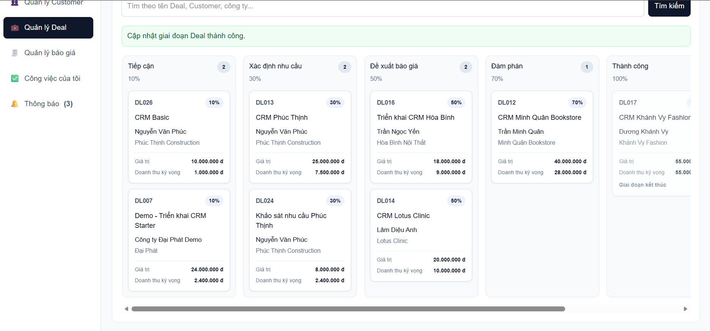
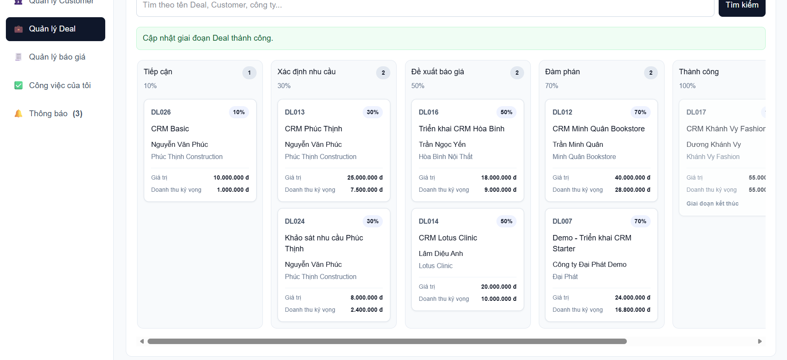

### Minh chứng TC-DEALS-023
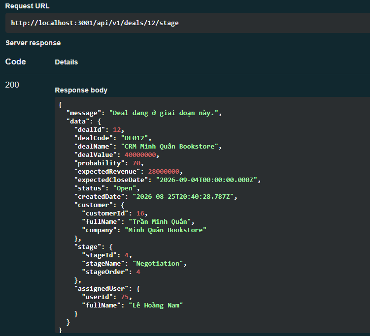

### Minh chứng TC-DEALS-024
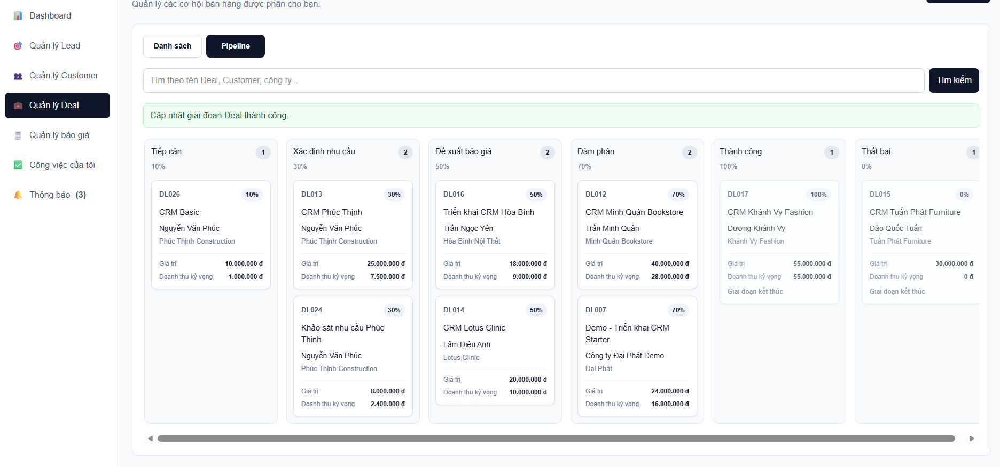

### Minh chứng TC-DEALS-025
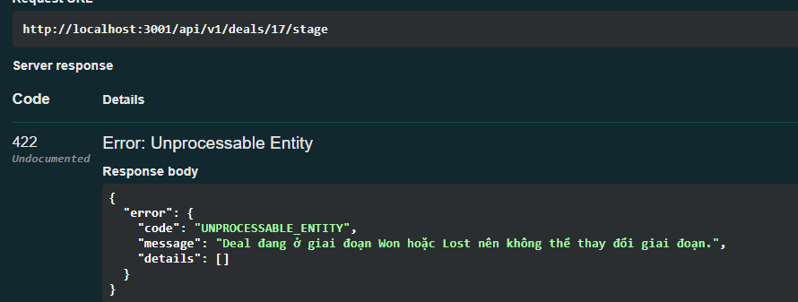

### Minh chứng TC-DEALS-026
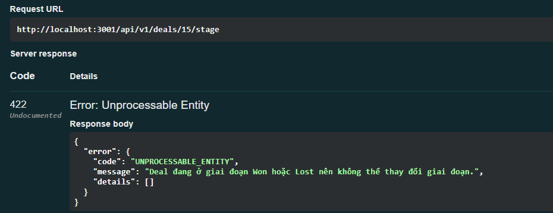

### Minh chứng TC-DEALS-027
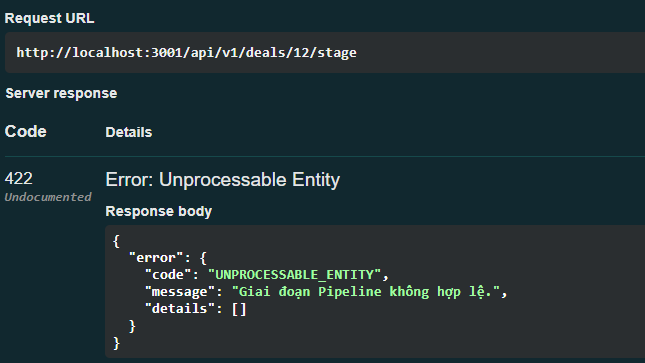