# Test Case - Quản lý Lead

### Kỹ thuật thiết kế test áp dụng

- **Phân hoạch tương đương (Equivalence Partitioning):** chia dữ liệu Lead thành các nhóm hợp lệ và không hợp lệ như họ tên có/không có, email đúng/sai định dạng, email/SĐT trùng hoặc không trùng, tìm kiếm có/không có kết quả.
- **Phân tích giá trị biên (Boundary Value Analysis):** áp dụng cho các trường có giới hạn độ dài hoặc miền giá trị khi kiểm tra validation dữ liệu Lead.
- **Bảng quyết định (Decision Table Testing):** áp dụng cho các trường hợp quyền thao tác phụ thuộc vào vai trò Marketing/Sales và quyền sở hữu Lead.

## UC2 - Quản lý Lead

| Mã TC | Chức năng / UC | Mục tiêu | Tiền điều kiện | Dữ liệu đầu vào | Các bước thực hiện | Kết quả mong đợi | Kết quả thực tế | Trạng thái |
|---|---|---|---|---|---|---|---|---|
| TC-LEADS-001 | UC2 - Xem danh sách Lead | Kiểm tra Marketing xem được danh sách Lead | Marketing đã đăng nhập; hệ thống có dữ liệu Lead | Không có dữ liệu nhập | 1. Đăng nhập Marketing; 2. Mở Dashboard Marketing; 3. Nhấn **Quản lý Lead** | Hiển thị danh sách Lead | Đã kiểm thử | PASS |
| TC-LEADS-002 | UC2 - Thêm Lead | Kiểm tra Marketing tạo Lead hợp lệ | Marketing đã đăng nhập; email và SĐT chưa tồn tại | Họ tên: Nguyễn Văn Tuấn; Email: `lead.tc002@example.com`; SĐT: `0909000002`; Trạng thái: New | 1. Mở Quản lý Lead; 2. Nhấn **Thêm Lead**; 3. Nhập dữ liệu; 4. Nhấn **Lưu** | Lead mới được tạo; Lead xuất hiện trong danh sách | Đã kiểm thử | PASS |
| TC-LEADS-003 | UC2 - Thêm Lead | Kiểm tra không cho tạo Lead thiếu họ tên | Marketing đã đăng nhập | Họ tên: trống; Email: `lead.tc003@example.com`; SĐT: `0909000003` | 1. Nhấn **Thêm Lead**; 2. Để trống họ tên; 3. Nhập các trường còn lại; 4. Nhấn **Lưu** | Hệ thống không bật nút **Thêm Lead** để tạo Lead | Đã kiểm thử | PASS |
| TC-LEADS-004 | UC2 - Thêm Lead | Kiểm tra email sai định dạng | Marketing đã đăng nhập | Họ tên: New Lead; Email: `abc`; SĐT: `0909000004` | 1. Nhấn **Thêm Lead**; 2. Nhập email sai; 3. Nhấn **Lưu** | Hiển thị lỗi email không hợp lệ; không tạo Lead | Đã kiểm thử | PASS |
| TC-LEADS-005 | UC2 / BR03 | Kiểm tra không cho tạo Lead trùng email | Marketing đã đăng nhập; đã tồn tại Lead có email dùng để test | Họ tên: New Lead; nam@namviet.vn; 0909000004 | 1. Nhấn **Thêm Lead**; 2. Nhập email đã tồn tại; 3. Nhấn **Lưu** | Hệ thống từ chối tạo; thông báo email đã tồn tại | Đã kiểm thử | PASS |
| TC-LEADS-006 | UC2 / BR03 | Kiểm tra không cho tạo Lead trùng số điện thoại | Marketing đã đăng nhập; đã tồn tại Lead có SĐT dùng để test | Họ tên: New Lead; lead.tc006@example.com; 0911000001 | 1. Nhấn **Thêm Lead**; 2. Nhập SĐT đã tồn tại; 3. Nhấn **Lưu** | Hệ thống từ chối tạo; không có record Lead mới; thông báo dữ liệu đã tồn tại | Đã kiểm thử | PASS |
| TC-LEADS-007 | UC2 - Tìm kiếm Lead | Tìm kiếm Lead có tồn tại | Marketing đã đăng nhập; có Lead phù hợp | Từ khóa: tên/email/công ty của Lead đang tồn tại | 1. Nhập từ khóa; 2. Nhấn **Tìm kiếm** | Danh sách chỉ hiển thị Lead phù hợp | Đã kiểm thử | PASS |
| TC-LEADS-008 | UC2 - Tìm kiếm Lead | Kiểm tra trường hợp tìm kiếm không có kết quả | Marketing đã đăng nhập | Từ khóa: `khongtontai999999` | 1. Nhập từ khóa; 2. Nhấn **Tìm kiếm** | Danh sách rỗng; giao diện thông báo không tìm thấy Lead phù hợp | Đã kiểm thử | PASS |
| TC-LEADS-009 | UC2 - Cập nhật Lead | Kiểm tra Marketing sửa Lead thành công | Marketing đã đăng nhập; Lead cần sửa tồn tại | Đổi công ty hoặc trạng thái của Lead | 1. Chọn Lead; 2. Nhấn **Sửa**; 3. Thay đổi thông tin; 4. Nhấn **Lưu** | Thông tin Lead được cập nhật; dữ liệu mới hiển thị trên danh sách | Đã kiểm thử | PASS |
| TC-LEADS-010 | UC2 - Xóa Lead | Kiểm tra Marketing xóa Lead chưa có liên kết | Marketing đã đăng nhập; Lead chưa có Customer liên kết | Lead hợp lệ để xóa | 1. Chọn Lead; 2. Nhấn **Xóa**; 3. Xác nhận | Lead bị xóa; Lead không còn xuất hiện trong danh sách | Đã kiểm thử | PASS |
| TC-LEADS-011 | UC2 / BR20 | Kiểm tra không cho xóa Lead đã phát sinh liên kết nghiệp vụ | Marketing đã đăng nhập; Lead đã có Customer liên kết | Lead đã được chuyển đổi | 1. Tìm Lead đã Converted; 2. Nhấn **Xóa**; 3. Xác nhận | Hệ thống từ chối xóa vật lý; Lead và Customer liên quan vẫn tồn tại; hiển thị thông báo lỗi | Đã kiểm thử | PASS |
| TC-LEADS-012 | Phân quyền Lead | Kiểm tra Sales được xem danh sách Lead đã phân công | Sales đã đăng nhập; có ít nhất một Lead được phân công cho Sales hiện tại. | Không có dữ liệu ban đầu | 1. Đăng nhập Sales; 2. Truy cập danh sách Lead | Sales xem được danh sách Lead | Đã kiểm thử | PASS |
| TC-LEADS-013 | Phân quyền Lead | Kiểm tra Sales được xem chi tiết Lead | Sales đã đăng nhập; có ít nhất một Lead được phân công cho Sales hiện tại. | Không có dữ liệu ban đầu | 1. Đăng nhập Sales; 2. Truy cập danh sách Lead; 3. Nhấn **Chi tiết** | Hiển thị chi tiết Lead | Đã kiểm thử | PASS |

### Minh chứng TC-LEADS-001
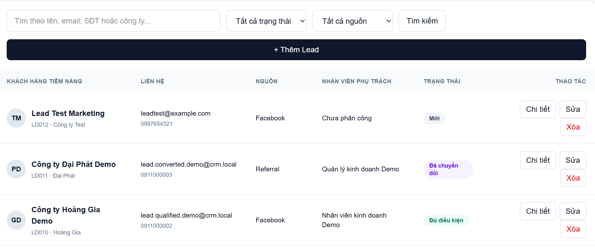

### Minh chứng TC-LEADS-002
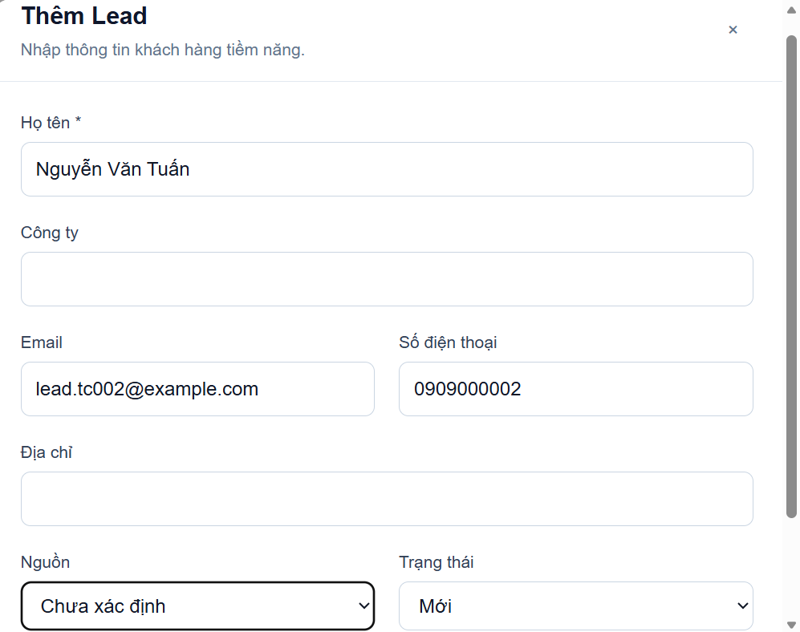
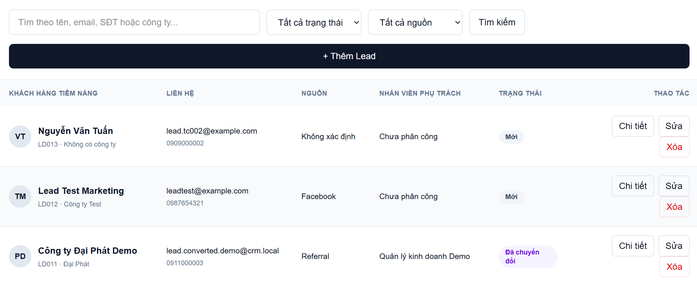

### Minh chứng TC-LEADS-003
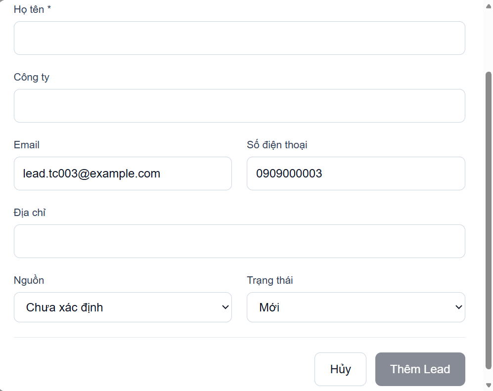

### Minh chứng TC-LEADS-004
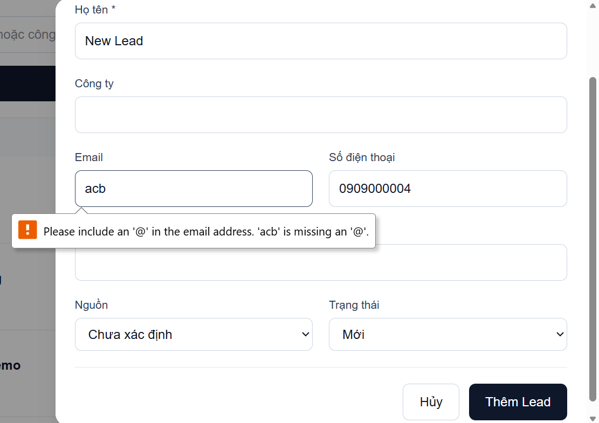

### Minh chứng TC-LEADS-005
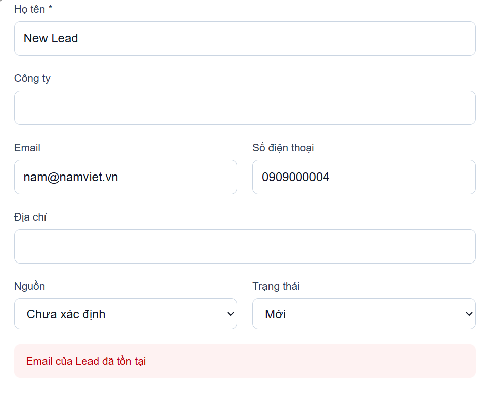

### Minh chứng TC-LEADS-006
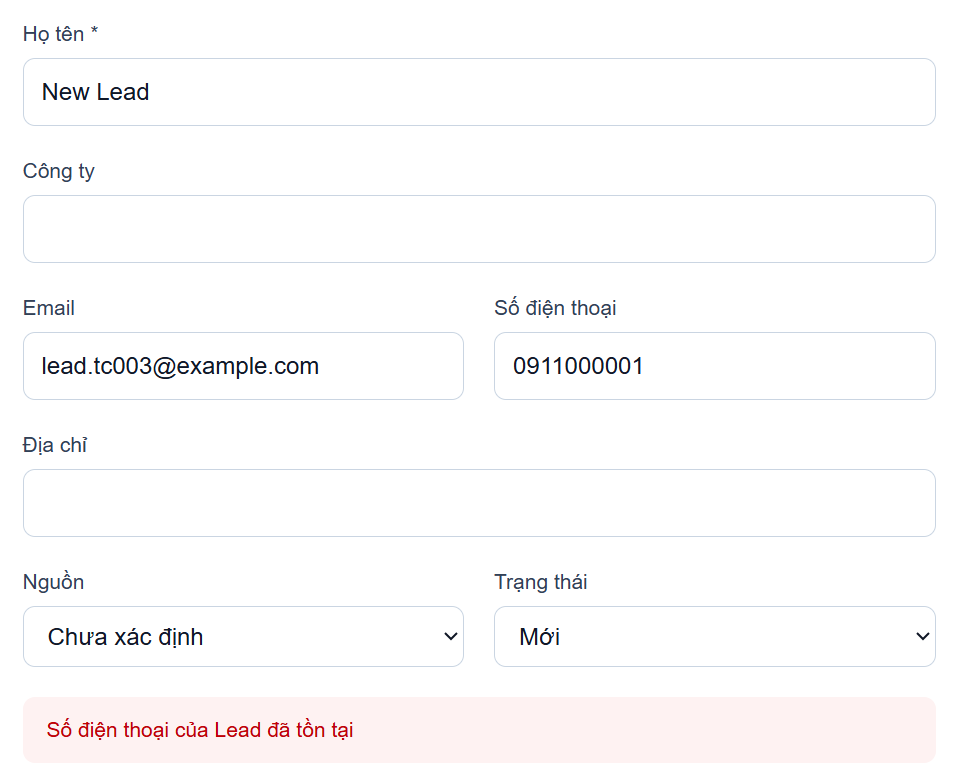

### Minh chứng TC-LEADS-007
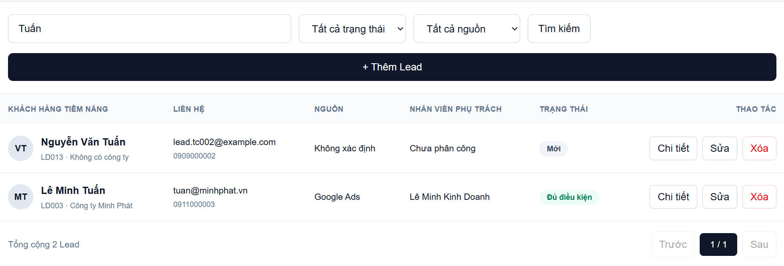

### Minh chứng TC-LEADS-008
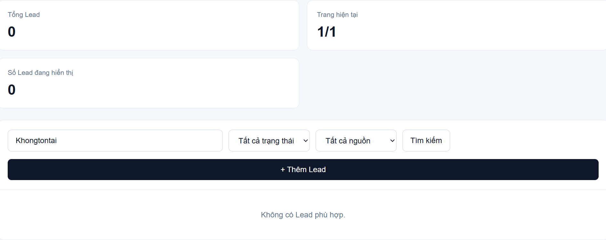

### Minh chứng TC-LEADS-009
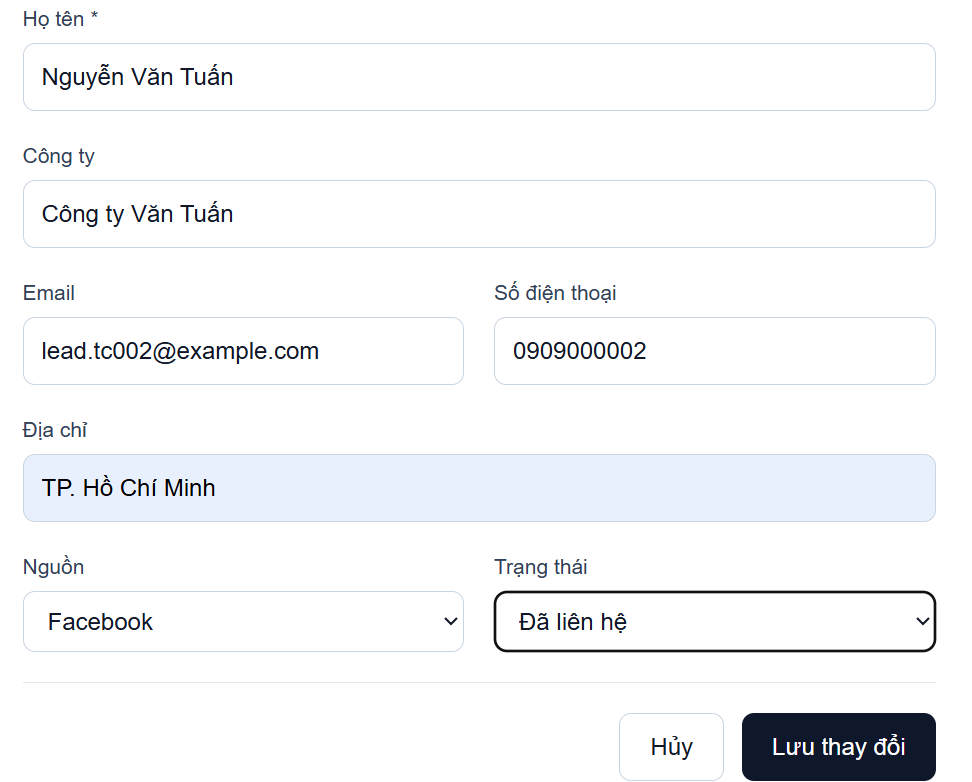
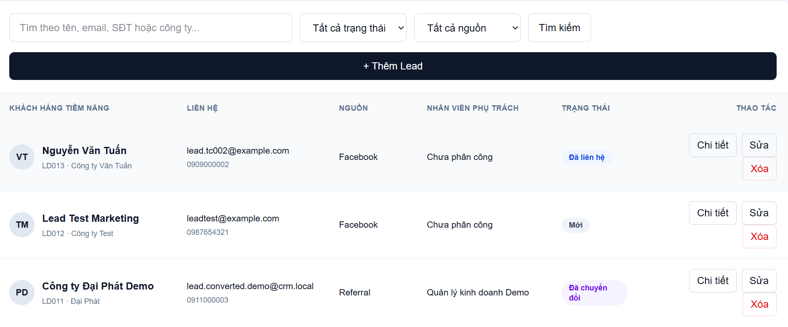

### Minh chứng TC-LEADS-010
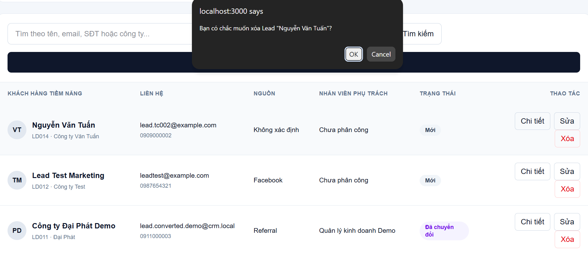
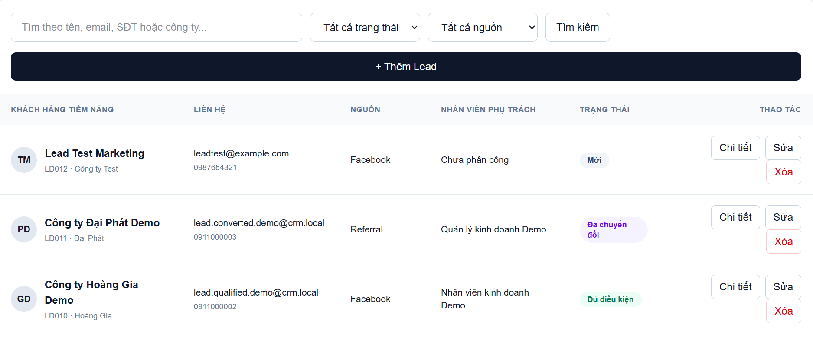

### Minh chứng TC-LEADS-011
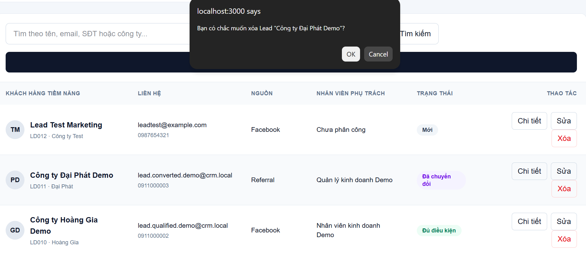
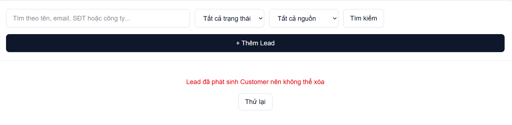

### Minh chứng TC-LEADS-012
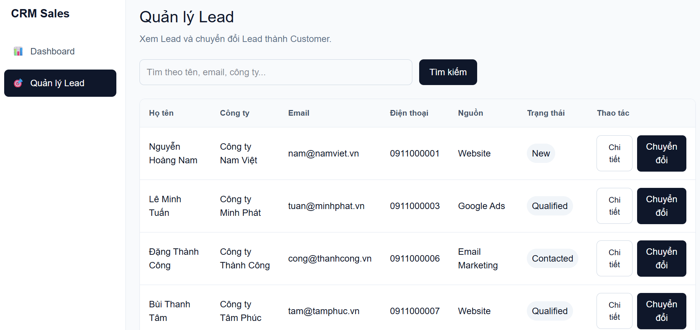

### Minh chứng TC-LEADS-013
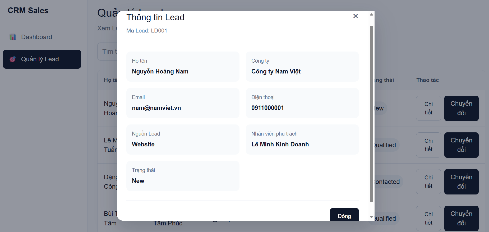

### Kỹ thuật thiết kế test áp dụng

- **Bảng quyết định (Decision Table Testing):** kiểm tra điều kiện chuyển đổi Lead dựa trên tổ hợp trạng thái Lead, quyền sở hữu Lead, dữ liệu phone/email và việc Lead đã được chuyển đổi hay chưa.
- **Phân hoạch tương đương (Equivalence Partitioning):** chia Lead thành các nhóm đủ điều kiện và không đủ điều kiện chuyển đổi.
- **Chuyển trạng thái (State Transition Testing):** kiểm tra việc Lead chuyển từ trạng thái `Qualified` sang `Converted` và không cho chuyển đổi lại Lead đã ở trạng thái `Converted`.

## UC3 - Chuyển đổi Lead thành Customer

| Mã TC | Chức năng / UC | Mục tiêu | Tiền điều kiện | Dữ liệu đầu vào | Các bước thực hiện | Kết quả mong đợi | Kết quả thực tế | Trạng thái |
|---|---|---|---|---|---|---|---|---|
| TC-LEADS-014 | UC3 - Chuyển Lead thành Customer | Kiểm tra chuyển đổi thành công khi Lead đủ điều kiện | Sales đã đăng nhập. Lead tồn tại. Lead được phân công cho Sales hiện tại. Trạng thái `Qualified`. Lead chưa có Customer. Có họ tên, phone và email. | Chọn Lead có đủ điều kiện chuyển đổi | 1. Sales mở danh sách Lead. 2. Chọn Lead đủ điều kiện. 3. Bấm `Chuyển đổi`. 4. Xác nhận thao tác. | Hệ thống tạo Customer mới. Lead được cập nhật thành `Converted`. Ghi Activity Log. Hiển thị `"Chuyển Lead thành Customer thành công."` | Đã kiểm thử | PASS |
| TC-LEADS-015 | UC3 - Chuyển Lead thành Customer | Kiểm tra Sales không được chuyển Lead của Sales khác | Sales đã đăng nhập. | Không có dữ liệu đầu vào | 1. Đăng nhập Sales. 2. Vào danh sách Leads | Không hiện Lead trong danh sách | Đã kiểm thử | PASS |
| TC-LEADS-016 | UC3 - Chuyển Lead thành Customer | Kiểm tra Lead trạng thái `New` không được chuyển đổi | Sales đã đăng nhập. Lead thuộc Sales hiện tại. Lead có trạng thái `New`. | Chọn Lead có trạng thái `New` | 1. Chọn Lead trạng thái `New`. 2. Bấm `Chuyển đổi`. 3. Xác nhận. | Hiển thị `"Lead chưa đủ điều kiện để chuyển thành Customer."`. Không tạo Customer. | Đã kiểm thử | PASS |
| TC-LEADS-017 | UC3 - Chuyển Lead thành Customer | Kiểm tra Lead trạng thái `Contacted` không được chuyển đổi | Sales đã đăng nhập. Lead thuộc Sales hiện tại. Lead có trạng thái `Contacted`. | Chọn Lead có trạng thái `Contacted` | 1. Chọn Lead `Contacted`. 2. Bấm `Chuyển đổi`. 3. Xác nhận. | Hiển thị `"Lead chưa đủ điều kiện để chuyển thành Customer."`. Không tạo Customer. | Đã kiểm thử | PASS |
| TC-LEADS-018 | UC3 - Chuyển Lead thành Customer | Kiểm tra Lead trạng thái `Unqualified` không được chuyển đổi | Sales đã đăng nhập. Lead thuộc Sales hiện tại. Lead có trạng thái `Unqualified`. | Chọn Lead có trạng thái `Unqualified` | 1. Chọn Lead `Unqualified`. 2. Bấm `Chuyển đổi`. 3. Xác nhận. | Hiển thị `"Lead chưa đủ điều kiện để chuyển thành Customer."`. Không tạo Customer. | Đã kiểm thử | PASS |
| TC-LEADS-019 | UC3 - Chuyển Lead thành Customer | Kiểm tra không cho chuyển Lead đã được chuyển đổi trước đó | Sales đã đăng nhập. Lead có trạng thái `Converted` hoặc đã tồn tại Customer liên kết với Lead. | Không có dữ liệu đầu vào | 1. Sales đăng nhập. 2. Xem danh sách lead. | Hiển thị thông báo `Đã chuyển đổi` | Đã kiểm thử | PASS |
| TC-LEADS-020 | UC3 - Chuyển Lead thành Customer | Kiểm tra Lead thiếu số điện thoại | Sales đã đăng nhập. Lead thuộc Sales hiện tại. Trạng thái `Qualified`. Có họ tên. `phone = null`. | Chọn Lead không có phone | 1. Chọn Lead `Qualified` nhưng thiếu phone. 2. Bấm `Chuyển đổi`. 3. Xác nhận. | Hiển thị `"Lead phải có đầy đủ số điện thoại và email trước khi chuyển đổi."`. Không tạo Customer. | Đã kiểm thử | PASS |
| TC-LEADS-021 | UC3 - Chuyển Lead thành Customer | Kiểm tra Lead thiếu email | Sales đã đăng nhập. Lead thuộc Sales hiện tại. Trạng thái `Qualified`. Có họ tên. `email = null`. | Chọn Lead không có email | 1. Chọn Lead `Qualified` nhưng thiếu email. 2. Bấm `Chuyển đổi`. 3. Xác nhận. | Hiển thị `"Lead phải có đầy đủ số điện thoại và email trước khi chuyển đổi."`. Không tạo Customer. | Đã kiểm thử | PASS |

### Minh chứng TC-LEADS-014
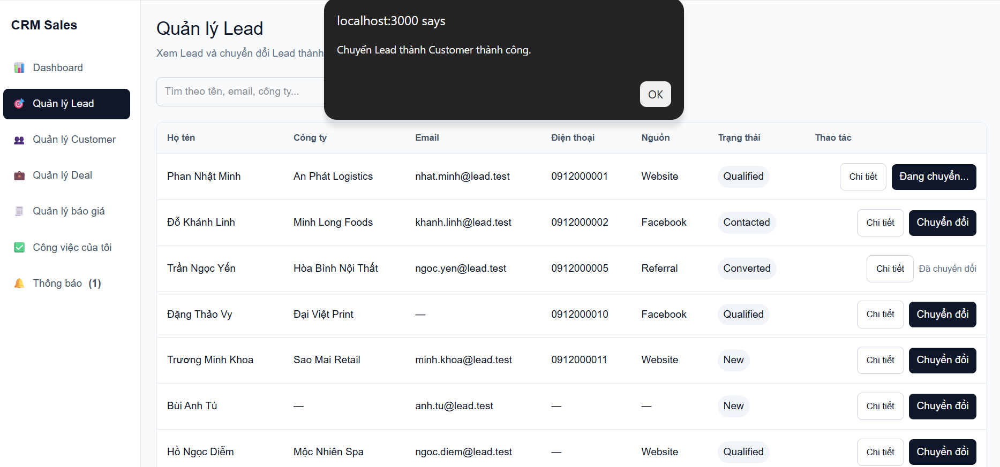

### Minh chứng TC-LEADS-015
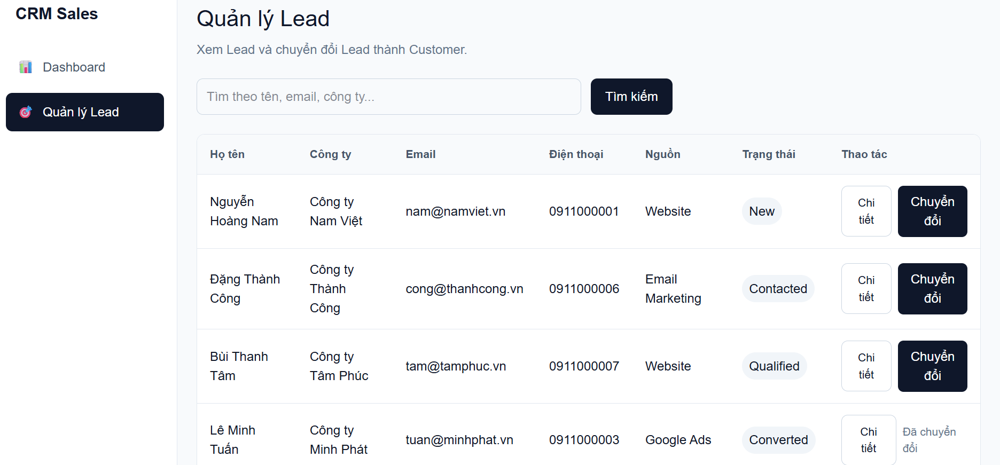

### Minh chứng TC-LEADS-016
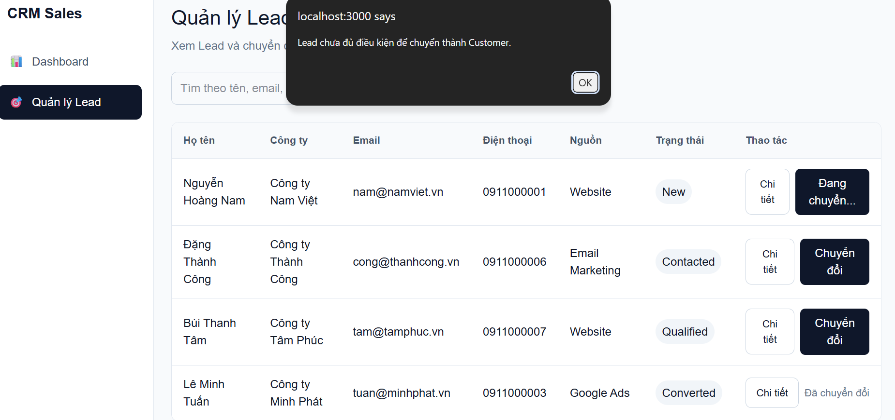

### Minh chứng TC-LEADS-017
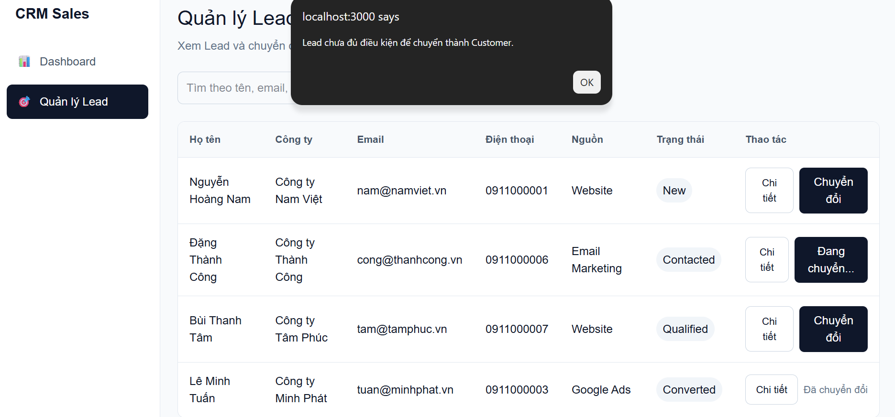

### Minh chứng TC-LEADS-018
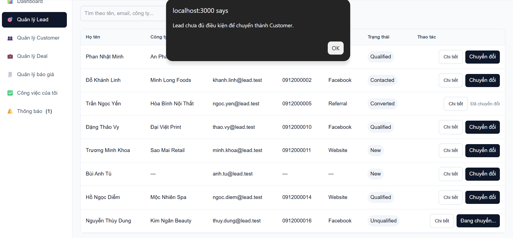

### Minh chứng TC-LEADS-019
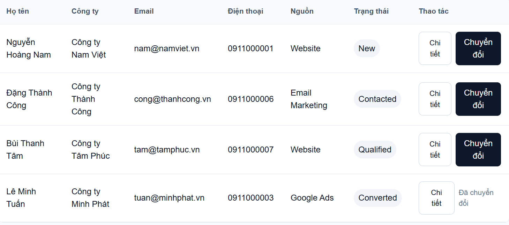

### Minh chứng TC-LEADS-020
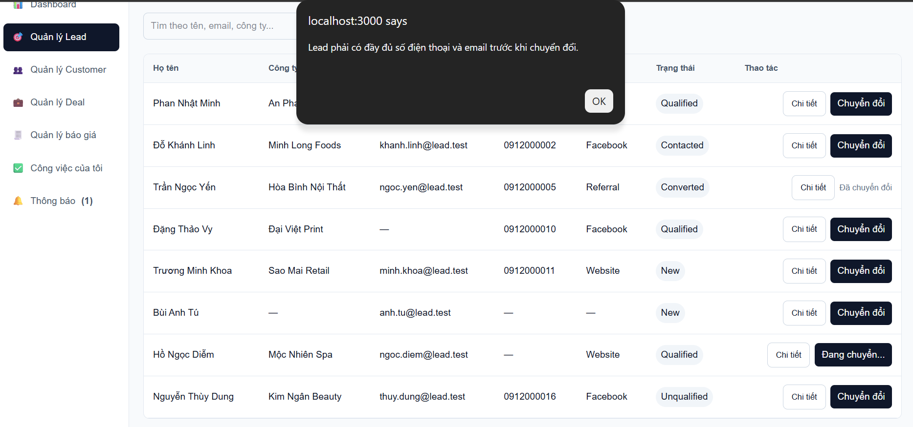

### Minh chứng TC-LEADS-021
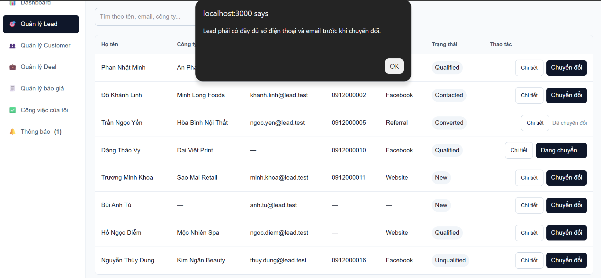

## UC15 - Phân công Lead

### Kỹ thuật thiết kế test áp dụng

- **Phân hoạch tương đương (Equivalence Partitioning):** chia các trường hợp Sales hợp lệ, Sales bị khóa, người dùng không phải Sales và Lead không hợp lệ.
- **Bảng quyết định (Decision Table):** kiểm tra kết hợp vai trò người thực hiện, trạng thái Sales và trạng thái Lead để quyết định có được phân công hay không.
- **Chuyển đổi trạng thái (State Transition):** kiểm tra Lead thay đổi từ chưa được phân công hoặc đang thuộc Sales A sang Sales B.
- **Phân tích giá trị biên (Boundary Value Analysis):** kiểm tra `assignedUserId` không hợp lệ tại biên `0`.

| Mã TC | Chức năng / UC | Mục tiêu | Tiền điều kiện | Dữ liệu đầu vào | Các bước thực hiện | Kết quả mong đợi | Kết quả thực tế | Trạng thái |
|---|---|---|---|---|---|---|---|---|
| TC-LEADS-022 | UC15 - Phân công Lead | Kiểm tra Sales Manager phân công Lead cho Sales đang hoạt động thành công | Sales Manager đã đăng nhập; Lead tồn tại và chưa Converted; Sales A tồn tại, role Sales và đang hoạt động | Chọn Lead cần phân công; chọn Sales A | 1. Sales Manager mở chức năng phân công Lead; 2. Chọn Lead; 3. Chọn Sales A; 4. Nhấn **Phân công** | Phân công thành công; Lead được cập nhật người phụ trách thành Sales A; hiển thị thông báo thành công | Đã kiểm thử | PASS |
| TC-LEADS-023 | UC15 - Phân công lại Lead | Kiểm tra Sales Manager phân công lại Lead từ Sales A sang Sales B | Sales Manager đã đăng nhập; Lead đang thuộc Sales A; Lead chưa Converted; Sales B đang hoạt động | Sales B | 1. Chọn Lead đang thuộc Sales A; 2. Chọn Sales B; 3. Nhấn **Phân công** | Lead đổi người phụ trách từ Sales A sang Sales B; dữ liệu phân công mới được lưu | Đã kiểm thử | PASS |
| TC-LEADS-024 | UC15 - Sales bị khóa | Kiểm tra API không cho phân công Lead cho Sales bị khóa | Sales Manager đã đăng nhập; có `accessToken` hợp lệ; Lead tồn tại và chưa Converted; tồn tại tài khoản Sales có `status = false` | **URL:** `/api/v1/lead-assignments/{leadId}` **Body:** `{ "assignedUserId": <ID Sales bị khóa> }` | 1. Mở Swagger. 2. Nhấn **Authorize** và nhập token Sales Manager. 3. Mở `PATCH /api/v1/lead-assignments/{leadId}`. 4. Nhập `leadId` của Lead chưa Converted. 5. Nhấn **Try it out**. 6. Nhập `assignedUserId` của Sales có `status = false`. 7. Nhấn **Execute**. | HTTP 422; Hiển thị `Chỉ được phân công Lead cho nhân viên Sales đang hoạt động` | Đã kiểm thử | PASS |
| TC-LEADS-025 | UC15 - Sai vai trò | Kiểm tra không cho phân công Lead cho người dùng không có role Sales | Sales Manager đã đăng nhập; Lead hợp lệ; tồn tại user role khác Sales | `assignedUserId` của Admin/Marketing/Customer Care | 1. Mở Swagger; 2. Gọi API phân công Lead; 3. Truyền ID user không phải Sales | HTTP 422; Hiển thị `Chỉ được phân công Lead cho nhân viên Sales đang hoạt động` | Đã kiểm thử | PASS |
| TC-LEADS-026 | UC15 - Lead Converted | Kiểm tra Lead đã chuyển thành Customer không được phân công lại | Sales Manager đã đăng nhập; Lead có trạng thái `Converted` | Lead Converted; Sales hợp lệ | 1. Chọn hoặc gọi API phân công Lead Converted; 2. Chọn Sales hợp lệ; 3. Thực hiện phân công | Hệ thống từ chối phân công; hiển thị `Lead đã chuyển đổi thành Customer nên không thể phân công` | Đã kiểm thử | PASS |
| TC-LEADS-027 | UC15 - Phân quyền | Kiểm tra Sales không được phép phân công Lead | Sales đã đăng nhập; Lead và Sales nhận phân công đều tồn tại | API phân công Lead | 1. Mở Swagger; 2. Authorize bằng token Sales; 3. Gọi API phân công Lead | HTTP 403; hiển thị `Bạn không có quyền truy cập chức năng này` | Đã kiểm thử | PASS |
| TC-LEADS-028 | UC15 - Lead không tồn tại | Kiểm tra không thể phân công Lead không tồn tại | Sales Manager đã đăng nhập; Sales nhận phân công hợp lệ | `leadId` không tồn tại | 1. Mở Swagger; 2. Gọi API phân công với `leadId` không tồn tại; 3. Execute | HTTP 404; `Lead không tồn tại` | Đã kiểm thử | PASS |
| TC-LEADS-029 | UC15 - Validate assignedUserId | Kiểm tra `assignedUserId` không hợp lệ tại giá trị biên | Sales Manager đã đăng nhập; Lead hợp lệ | `assignedUserId = 0` | 1. Mở Swagger; 2. Gọi API phân công Lead; 3. Gửi `assignedUserId = 0`; 4. Execute | HTTP 400; hệ thống báo dữ liệu không hợp lệ; Lead không bị thay đổi | Đã kiểm thử | PASS |
| TC-LEADS-030 | UC15 - Notification | Kiểm tra Sales nhận Notification khi được phân công Lead | Sales Manager đã đăng nhập; Lead hợp lệ; Sales A active | Phân công Lead cho Sales A | 1. Thực hiện phân công Lead thành công; 2. Mở Notification của Sales A hoặc kiểm tra bảng `notifications` | Tạo Notification cho đúng Sales A; nội dung liên quan đến Lead được giao; `isRead = false` | Đã kiểm thử | PASS |
| TC-LEADS-031 | UC15 - Activity Log | Kiểm tra thao tác phân công Lead được ghi Activity Log | Sales Manager đã đăng nhập; phân công Lead thành công | Lead được giao cho Sales A | 1. Thực hiện phân công Lead; 2. Mở Prisma Studio hoặc Activity Log; 3. Kiểm tra log vừa tạo | Có Activity Log cho thao tác phân công Lead | Đã kiểm thử | PASS |
| TC-LEADS-032 | UC15 / BR25 - Phân quyền phân công Lead | Kiểm tra Admin không được phép phân công Sales phụ trách Lead | Admin đã đăng nhập và có access token hợp lệ, Lead tồn tại và chưa Converted, Sales nhận phân công tồn tại và đang hoạt động | leadId = <ID Lead hợp lệ> assignedUserId = ID Sales active | 1. Đăng nhập bằng tài khoản Admin. 2. Mở Swagger. 3. Nhấn Authorize và nhập token Admin. 4. Mở PATCH /api/v1/lead-assignments/{leadId}. 5. Nhập leadId hợp lệ. 6. Nhập assignedUserId của Sales đang hoạt động. 7. Nhấn Execute. 8. Kiểm tra lại người phụ trách của Lead. | HTTP 403 Forbidden, hiển thị Bạn không có quyền truy cập chức năng này, Lead không bị thay đổi người phụ trách | Đã kiểm thử | PASS |
| TC-LEADS-033 | UC15 / BR25 - Phân quyền phân công Lead | Kiểm tra Marketing không được phép phân công Sales phụ trách Lead | Marketing đã đăng nhập và có access token hợp lệ, Lead tồn tại và chưa Converted, Sales nhận phân công tồn tại và đang hoạt động | leadId = <ID Lead hợp lệ> assignedUserId = ID Sales active | 1. Đăng nhập bằng tài khoản Marketing. 2. Mở Swagger. 3. Nhấn Authorize và nhập token Marketing. 4. Mở PATCH /api/v1/lead-assignments/{leadId}. 5. Nhập leadId hợp lệ. 6. Nhập assignedUserId của Sales đang hoạt động. 7. Nhấn Execute. 8. Kiểm tra lại người phụ trách của Lead. | HTTP 403 Forbidden, hiển thị Bạn không có quyền truy cập chức năng này, Lead không bị thay đổi người phụ trách | Đã kiểm thử | PASS |
| TC-LEADS-034 | UC15 / BR25 - Phân quyền phân công Lead | Kiểm tra Customer Care không được phép phân công Sales phụ trách Lead | Customer Care đã đăng nhập và có access token hợp lệ, Lead tồn tại và chưa Converted, Sales nhận phân công tồn tại và đang hoạt động | leadId = <ID Lead hợp lệ> assignedUserId = ID Sales active | 1. Đăng nhập bằng tài khoản Customer Care. 2. Mở Swagger. 3. Nhấn Authorize và nhập token Customer Care. 4. Mở PATCH /api/v1/lead-assignments/{leadId}. 5. Nhập leadId hợp lệ. 6. Nhập assignedUserId của Sales đang hoạt động. 7. Nhấn Execute. 8. Kiểm tra lại người phụ trách của Lead. | HTTP 403 Forbidden, hiển thị Bạn không có quyền truy cập chức năng này, Lead không bị thay đổi người phụ trách | Đã kiểm thử | PASS |

### Minh chứng TC-LEADS-022
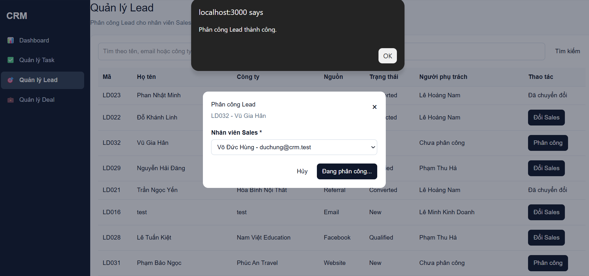

### Minh chứng TC-LEADS-023
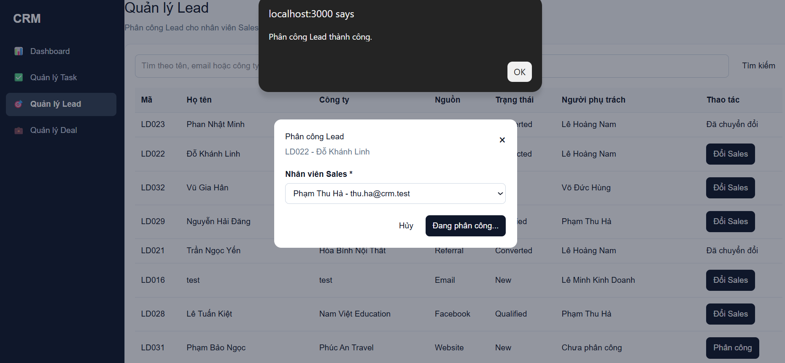

### Minh chứng TC-LEADS-024
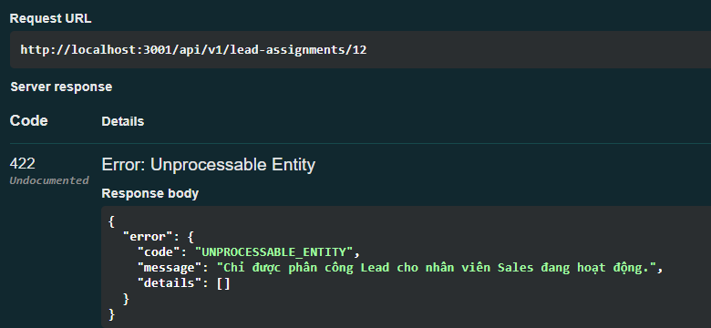

### Minh chứng TC-LEADS-025
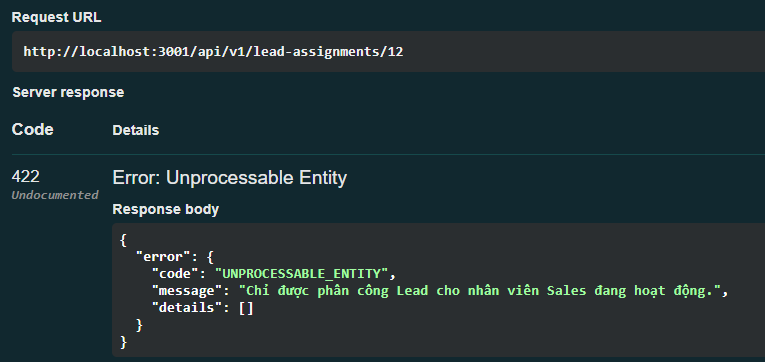

### Minh chứng TC-LEADS-026

### Minh chứng TC-LEADS-027
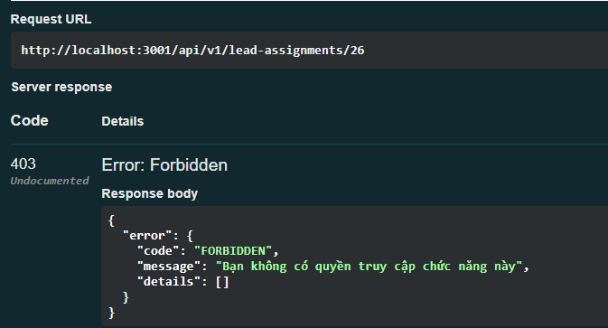

### Minh chứng TC-LEADS-028
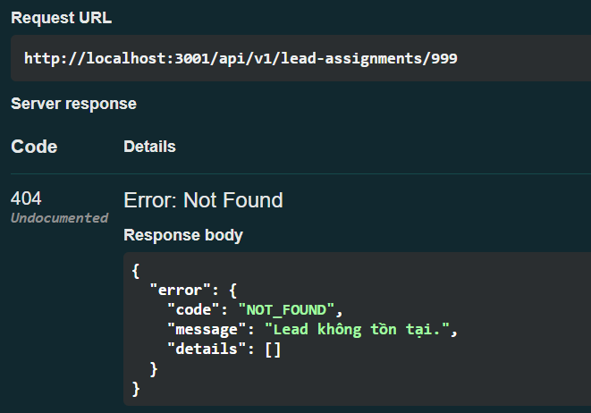

### Minh chứng TC-LEADS-029
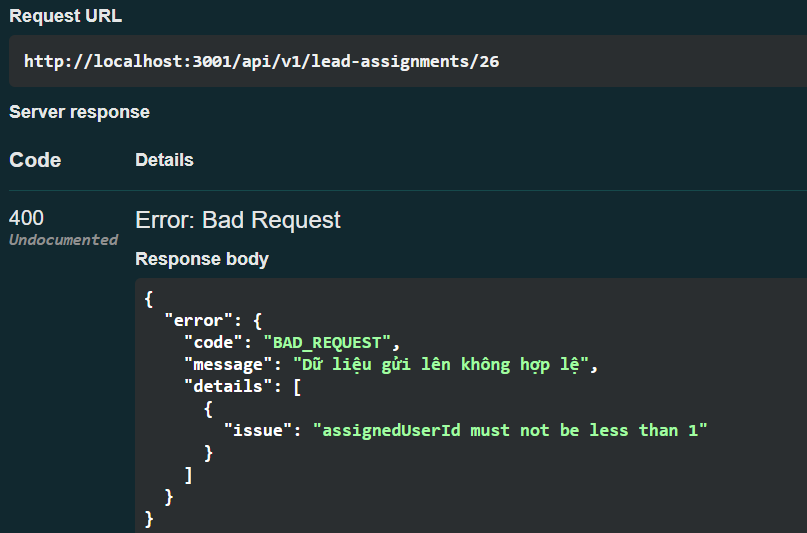

### Minh chứng TC-LEADS-030
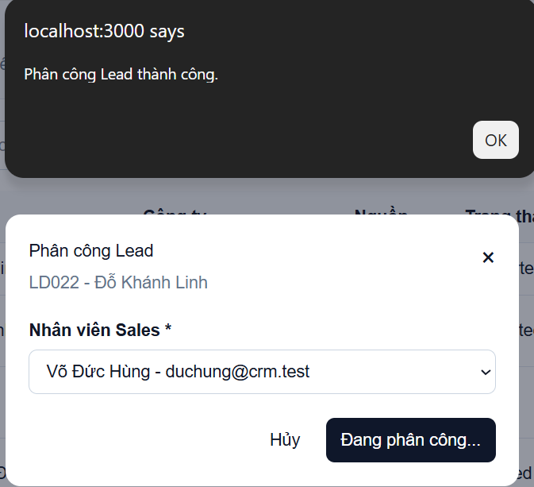
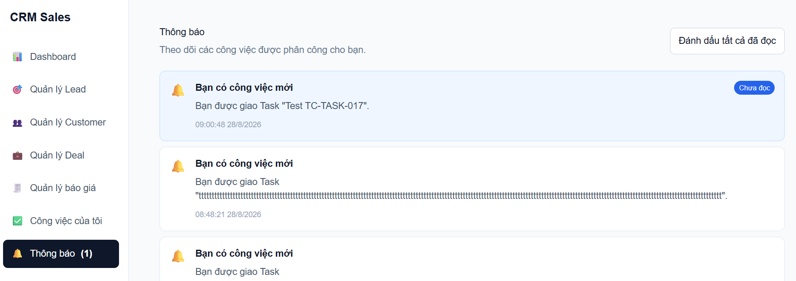

### Minh chứng TC-LEADS-031
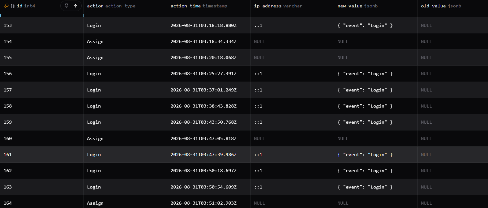

### Minh chứng TC-LEADS-032
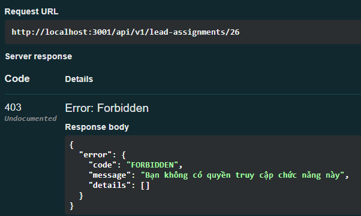

### Minh chứng TC-LEADS-033
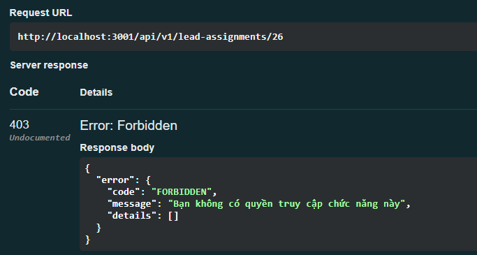

### Minh chứng TC-LEADS-034
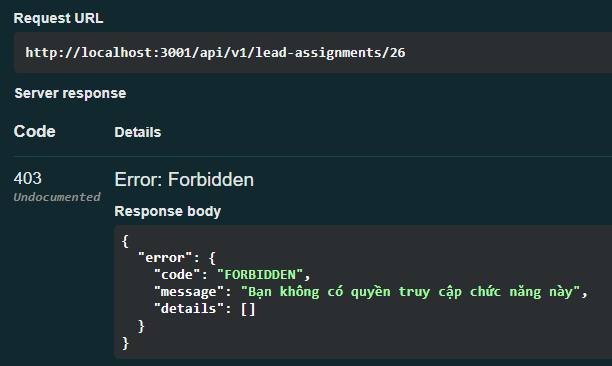