# Test Case - Notification

## FR05 / BR14 - Notification khi phân công công việc

### Kỹ thuật thiết kế test áp dụng

- **Phân hoạch tương đương (Equivalence Partitioning):** chia trường hợp phân công hợp lệ và không hợp lệ; giao cho người khác và tự giao cho chính mình.
- **Bảng quyết định (Decision Table):** áp dụng cho tổ hợp loại nghiệp vụ Deal/Task × người thực hiện × người được giao × trạng thái tài khoản.
- **Chuyển trạng thái (State Transition):** kiểm tra trạng thái ban đầu của Notification khi mới tạo là `isRead = false`.
- **Phân tích giá trị biên (Boundary Value Analysis):** không áp dụng trực tiếp cho nội dung chính của Notification vì chức năng không có dữ liệu số hoặc độ dài do người dùng nhập cần kiểm tra biên.

| Mã TC | Chức năng / UC | Mục tiêu | Tiền điều kiện | Dữ liệu đầu vào | Các bước thực hiện | Kết quả mong đợi | Kết quả thực tế | Trạng thái |
|---|---|---|---|---|---|---|---|---|
| TC-NOTIFICATION-001 | UC5 - Notification Deal | Kiểm tra Sales nhận Notification khi Sales Manager tạo Deal và phân công cho Sales | Sales Manager đã đăng nhập; Sales A tồn tại và đang hoạt động; dữ liệu tạo Deal hợp lệ | Người phụ trách = Sales A | 1. Sales Manager tạo Deal mới; 2. Chọn Sales A làm người phụ trách; 3. Lưu Deal; 4. Kiểm tra bảng `notifications` | Deal được tạo; tạo một Notification cho Sales A; `userId` là ID Sales A; `isRead = false` | Sau khi Sales Manager tạo Deal và giao cho Sales A, hệ thống tạo một Notification đúng cho Sales A với `isRead = false` | PASS |
| TC-NOTIFICATION-002 | UC5 - Notification Deal | Kiểm tra nội dung Notification khi Sales Manager giao Deal | Sales Manager đã tạo Deal thành công cho Sales A | Deal có tên xác định | 1. Tạo Deal và giao Sales A; 2. Kiểm tra Notification vừa sinh | Notification có title `"Bạn được phân công Deal mới"`; content chứa tên Deal; type = `DealAssignment`; `isRead = false` | Notification vừa tạo có title `Bạn được phân công Deal mới`, content chứa tên Deal, type `DealAssignment` và trạng thái chưa đọc | PASS |
| TC-NOTIFICATION-003 | UC5 - Notification Deal | Kiểm tra Sales mới nhận Notification khi Deal được phân công lại | Sales Manager đăng nhập; Deal đang thuộc Sales A; Sales B đang hoạt động | Chuyển người phụ trách từ Sales A sang Sales B | 1. Sales Manager mở Deal; 2. Phân công sang Sales B; 3. Xác nhận; 4. Kiểm tra Notification | Deal được chuyển sang Sales B; Sales B nhận Notification phân công Deal; Notification gắn với `userId` của Sales B | Sau khi phân công lại Deal từ Sales A sang Sales B, hệ thống tạo Notification mới gắn đúng `userId` của Sales B | PASS |
| TC-NOTIFICATION-004 | UC5 - Notification Deal | Kiểm tra Notification không gửi nhầm cho Sales cũ khi phân công lại Deal | Deal đang thuộc Sales A; Sales Manager phân công sang Sales B | Sales A → Sales B | 1. Ghi nhận số Notification của Sales A và Sales B; 2. Phân công Deal sang Sales B; 3. Kiểm tra dữ liệu | Notification mới được tạo cho Sales B; không tạo Notification phân công mới cho Sales A | Sau khi chuyển Deal sang Sales B, Notification mới chỉ được tạo cho Sales B, Sales A không nhận Notification phân công mới | PASS |
| TC-NOTIFICATION-005 | UC5 - Notification Deal | Kiểm tra Sales tự tạo Deal cho chính mình không phát sinh Notification phân công | Sales đã đăng nhập; có quyền tạo Deal; dữ liệu Deal hợp lệ | Sales A tự tạo Deal | 1. Sales A tạo Deal; 2. Kiểm tra bảng `notifications` | Deal được tự động gán cho Sales A; không tạo Notification `DealAssignment` do không có hành động Manager phân công cho người khác | Sales A tự tạo Deal thành công và Deal tự gán cho chính Sales A, không phát sinh Notification loại `DealAssignment` | PASS |
| TC-NOTIFICATION-006 | UC8 - Notification Task | Kiểm tra Sales nhận Notification khi Sales Manager tạo Task và giao cho Sales | Sales Manager đăng nhập; Sales A active; dữ liệu Task hợp lệ | Người phụ trách = Sales A | 1. Sales Manager tạo Task; 2. Chọn Sales A; 3. Lưu; 4. Kiểm tra Notification | Task được tạo; Sales A nhận một Notification mới; `userId` là Sales A; `isRead = false` | Khi Sales Manager tạo Task và giao Sales A, hệ thống tạo Notification cho đúng Sales A với `isRead = false` | PASS |
| TC-NOTIFICATION-007 | UC8 - Notification Task | Kiểm tra nội dung Notification khi Sales được giao Task | Task được tạo và giao cho Sales A | Task title = `"Gọi lại khách hàng ABC"` | 1. Tạo Task cho Sales A; 2. Kiểm tra Notification vừa tạo | Notification có title `"Bạn có công việc mới"`; content = `Test TC-NOTIFICATION-006".`; type là loại Notification phân công Task; `isRead = false` | Notification Task có title `Bạn có công việc mới`, nội dung đúng dữ liệu Task kiểm thử, đúng loại phân công Task và `isRead = false` | PASS |
| TC-NOTIFICATION-008 | UC8 - Notification Task | Kiểm tra Sales mới nhận Notification khi Task được phân công lại | Sales Manager đăng nhập; Task đang thuộc Sales A; Sales B active | Sales A → Sales B | 1. Chọn Task; 2. Phân công cho Sales B; 3. Lưu; 4. Kiểm tra Notification | Sales B nhận một Notification mới về Task; Notification có `userId` = Sales B | Sau khi Task được phân công lại từ Sales A sang Sales B, Sales B nhận Notification mới và `userId` của Notification đúng với Sales B | PASS |
| TC-NOTIFICATION-009 | UC8 - Notification Task | Kiểm tra cập nhật Task làm thay đổi người phụ trách sẽ tạo Notification | Sales Manager đăng nhập; Task thuộc Sales A; Sales B active | Cập nhật `assignedUserId` từ Sales A sang Sales B | 1. Cập nhật Task; 2. Đổi người phụ trách sang Sales B; 3. Lưu; 4. Kiểm tra Notification | Task cập nhật thành công; tạo Notification mới cho Sales B | Khi đổi `assignedUserId` từ Sales A sang Sales B, Task được cập nhật thành công và hệ thống tạo Notification mới cho Sales B | PASS |
| TC-NOTIFICATION-010 | UC8 - Notification Task | Kiểm tra cập nhật Task nhưng không đổi người phụ trách không tạo Notification trùng | Task thuộc Sales A; người phụ trách không thay đổi | Chỉ thay đổi title/description/priority | 1. Ghi nhận số Notification hiện tại; 2. Sửa nội dung Task nhưng giữ Sales A; 3. Lưu; 4. Kiểm tra Notification | Task cập nhật thành công; không tạo thêm Notification phân công vì người phụ trách không đổi | Task được cập nhật nội dung thành công nhưng do người phụ trách không thay đổi nên không phát sinh thêm Notification phân công trùng | PASS |
| TC-NOTIFICATION-011 | UC8 - Notification Task | Kiểm tra Customer Care tự tạo Task cho chính mình không tạo Notification phân công cho bản thân | Customer Care đã đăng nhập; dữ liệu Task hợp lệ | Customer Care tự tạo Task | 1. Customer Care tạo Task cho chính mình; 2. Lưu; 3. Kiểm tra Notification | Task được tạo; không tạo Notification phân công mới cho chính Customer Care | Customer Care tự tạo Task thành công và hệ thống không tạo Notification phân công mới cho chính tài khoản đó | PASS |
| TC-NOTIFICATION-012 | UC8 - Notification Task | Kiểm tra không tạo Notification khi phân công cho Sales bị khóa | Sales Manager đăng nhập; tồn tại Sales có `status = false` | `assignedUserId` của Sales bị khóa | 1. Mở Swagger; 2. Nhập `"assignedUserId": 77`; 3. Kiểm tra thông báo | Hệ thống từ chối phân công; hiển thị `Nhân viên Sales không tồn tại hoặc đã bị khóa`. | Phân công cho Sales bị khóa bị hệ thống từ chối, hiển thị `Nhân viên Sales không tồn tại hoặc đã bị khóa` và không tạo Notification | PASS |
| TC-NOTIFICATION-013 | UC8 - Notification Task | Kiểm tra không tạo Notification khi người được giao không có role Sales | Sales Manager đăng nhập; tồn tại User role khác Sales | `assignedUserId` của Admin/Marketing/Customer Care | 1. Mở Swagger; 2. Nhập `"assignedUserId": 77`; 3. Kiểm tra thông báo | Hệ thống từ chối phân công; hiển thị `Nhân viên Sales không tồn tại hoặc đã bị khóa`. | Khi `assignedUserId` thuộc user không có role Sales, hệ thống từ chối phân công và không phát sinh Notification | PASS |
| TC-NOTIFICATION-014 | BR14 - Trạng thái Notification | Kiểm tra Notification mới luôn ở trạng thái chưa đọc | Có thao tác phân công Deal hoặc Task thành công | Notification vừa được tạo | 1. Thực hiện phân công; 2. Truy vấn Notification vừa sinh | `isRead = false` ngay sau khi Notification được tạo | Notification mới sinh sau thao tác phân công có `isRead = false`, đúng trạng thái chưa đọc ban đầu | PASS |
| TC-NOTIFICATION-015 | BR14 - Thời gian Notification | Kiểm tra hệ thống lưu thời điểm tạo Notification | Có thao tác phân công hợp lệ | Notification vừa được tạo | 1. Ghi nhận thời điểm thực hiện phân công; 2. Kiểm tra Notification | `createdDate` được tạo tự động và có giá trị tương ứng thời điểm Notification được sinh | Notification mới có `createdDate` được tạo tự động và thời gian ghi nhận phù hợp với thời điểm thao tác phân công | PASS |

### Minh chứng TC-NOTIFICATION-001
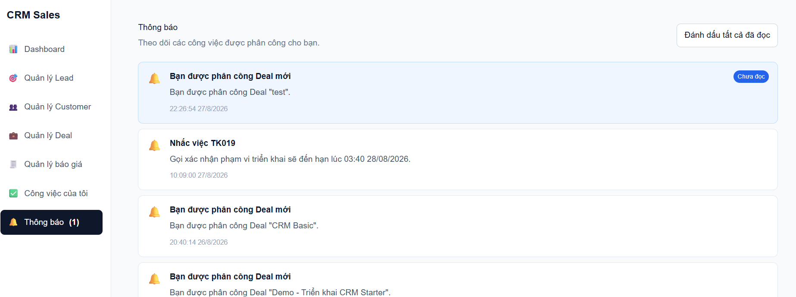

### Minh chứng TC-NOTIFICATION-002
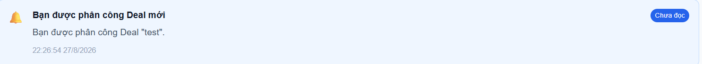

### Minh chứng TC-NOTIFICATION-003
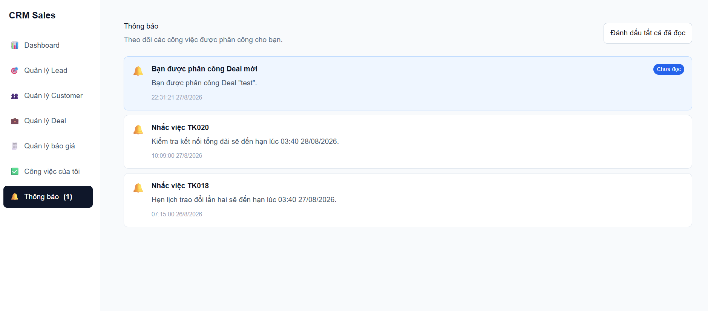

### Minh chứng TC-NOTIFICATION-004
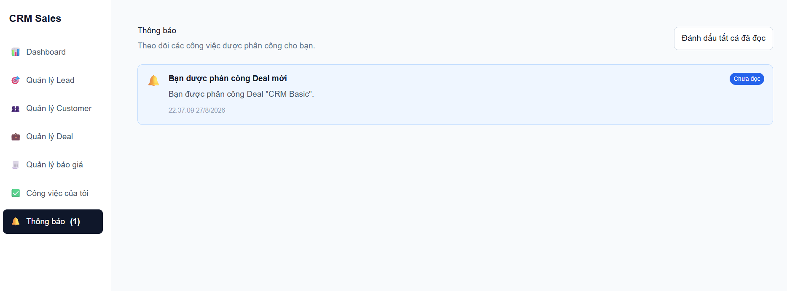

### Minh chứng TC-NOTIFICATION-005
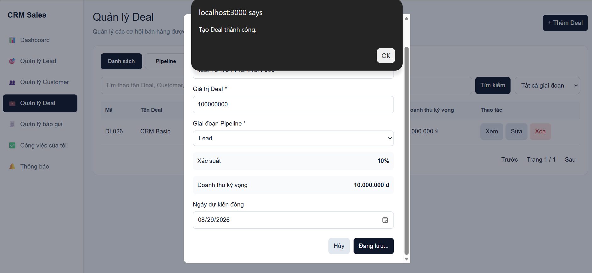
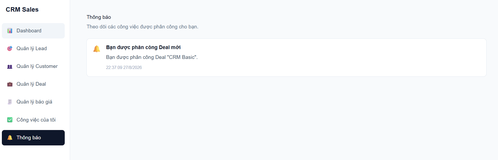

### Minh chứng TC-NOTIFICATION-006
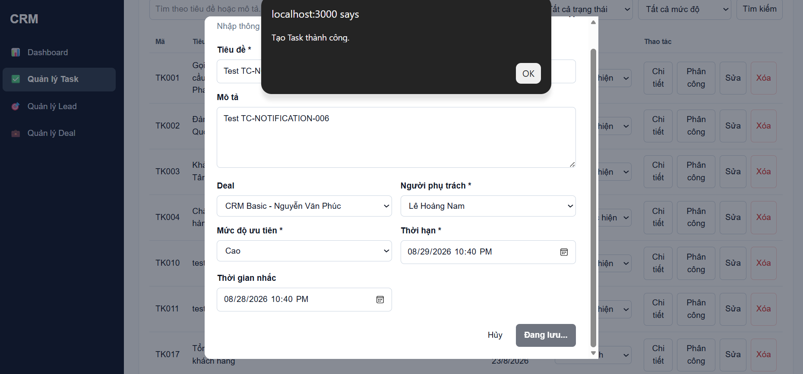
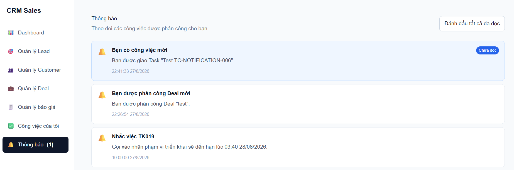

### Minh chứng TC-NOTIFICATION-007
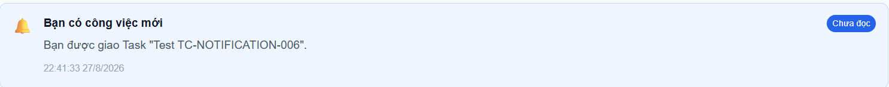

### Minh chứng TC-NOTIFICATION-008
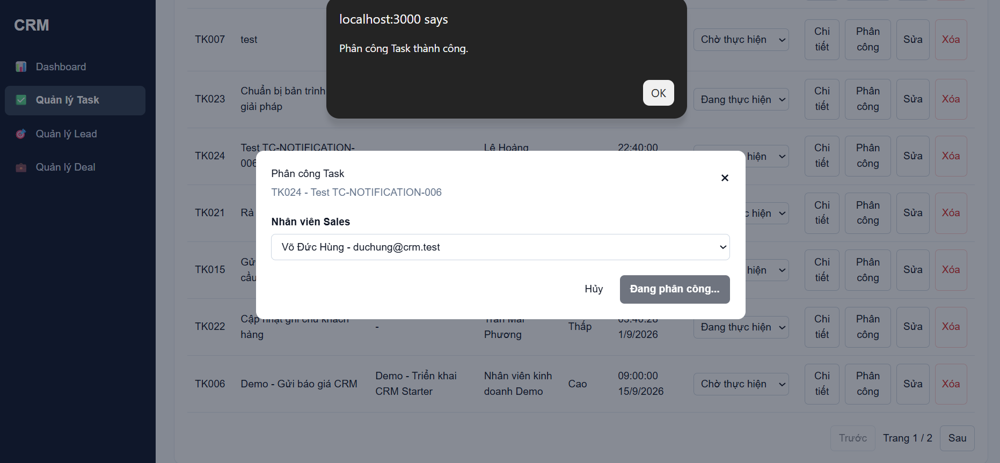
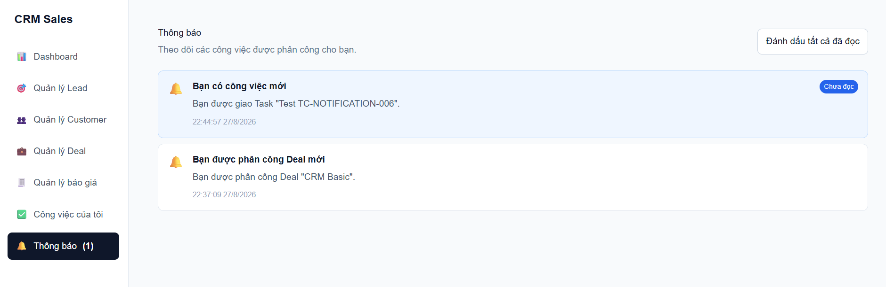

### Minh chứng TC-NOTIFICATION-009
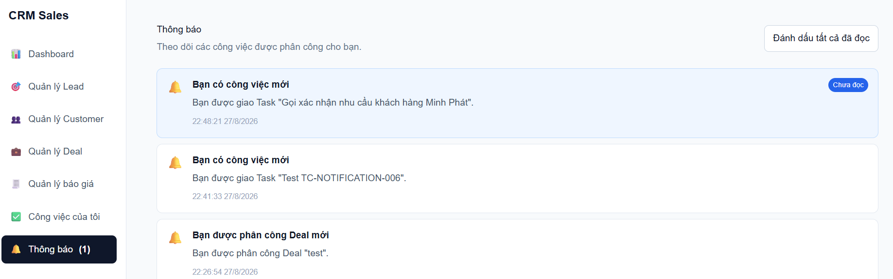

### Minh chứng TC-NOTIFICATION-010
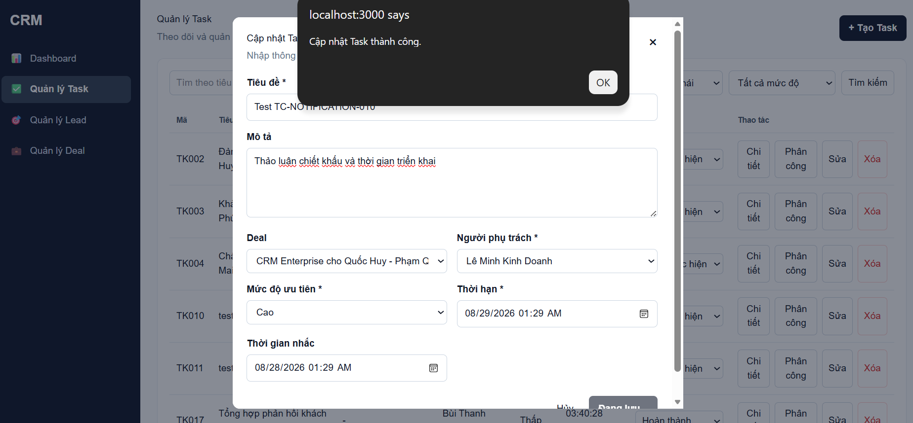
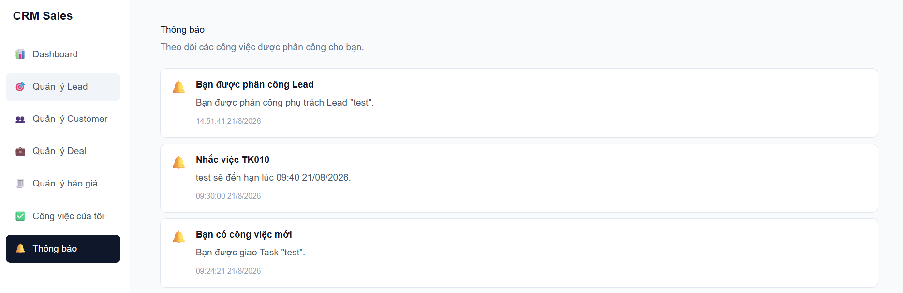

### Minh chứng TC-NOTIFICATION-011
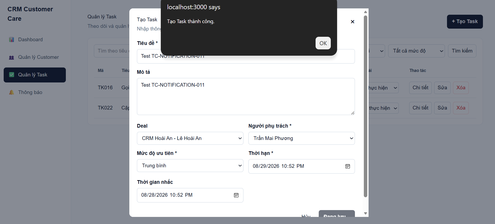
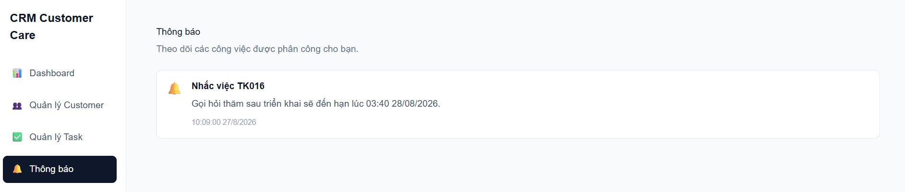

### Minh chứng TC-NOTIFICATION-012
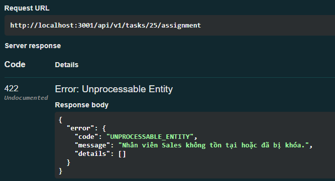

### Minh chứng TC-NOTIFICATION-013
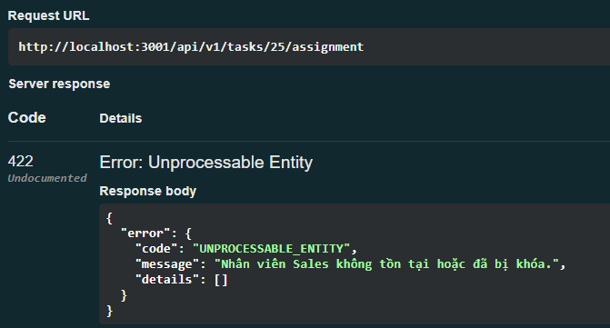

### Minh chứng TC-NOTIFICATION-014
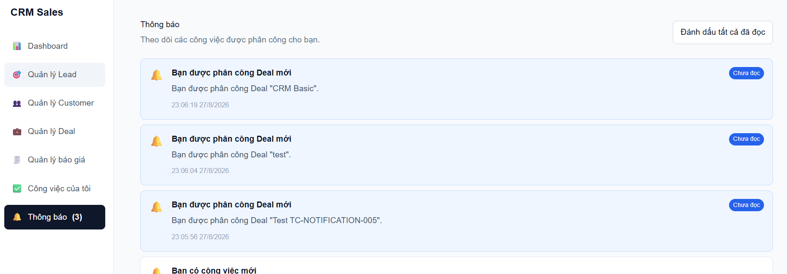

### Minh chứng TC-NOTIFICATION-015
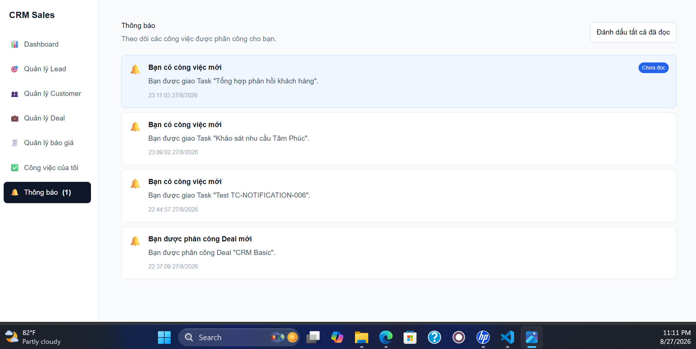